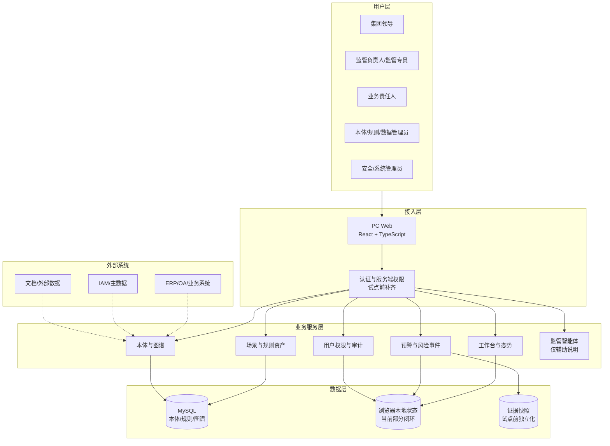
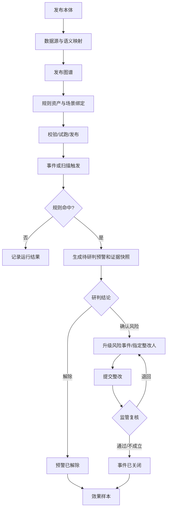
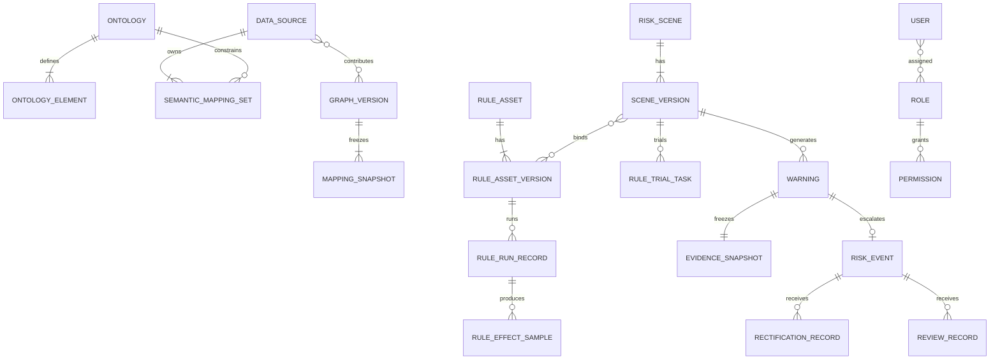
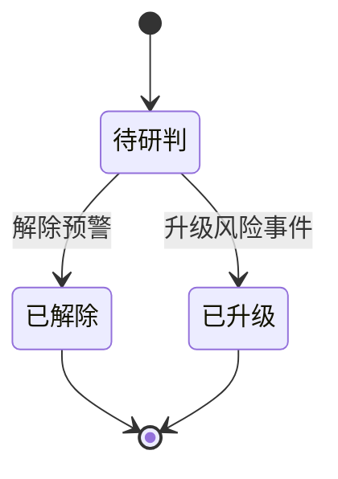
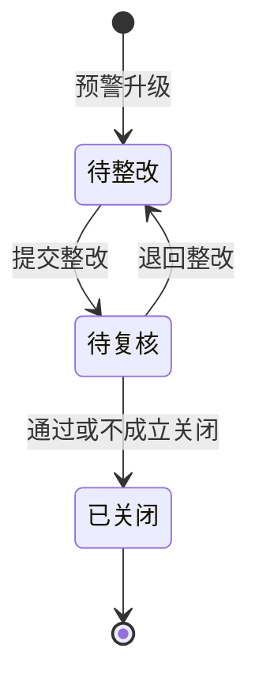

# 穿透式监管智能应用平台 PRD（v11.0 工程对齐正式版）

---

## 文档信息

| 项目 | 内容 |
| --- | --- |
| PRD审核人 | [TODO: 补充审核人] |
| 重要性 / 紧急性 | 高 / 高 |
| 需求方 | 集团监管、审计纪检、财务风控、法务合规、业务管理、信息化部门 |
| PRD编写人 | [TODO: 补充编写人] |
| 提交日期 | 2026-07-21 |
| 当前版本 | v11.0 工程对齐正式版 |
| 产品定型 | 商业化产品 × B端业务型管理软件 |
| 部署模式 | 私有化为主，支持混合部署；本期不建设共享多租户 |
| 客户端 | PC Web，最低适配宽度1366px |
| 工程基线 | React 19 + TypeScript + Vite + Node.js + MySQL + Zustand |

## 修改记录

| 日期 | 变更内容 | 变更原因 | 版本 |
| --- | --- | --- | --- |
| 2026-07-17 | 完成功能清单层级优化 | 区分一级菜单、二级菜单与页面 | v10.6 |
| 2026-07-21 | 按当前工程重构范围、路由、状态、数据模型、接口和验收口径 | 解决目标设计与代码实现混写问题 | v11.0 |

> 本文件是当前工程继续研发、联调、测试和试点验收的主基线。v10.6保留为上位产品目标参考。

---

## 0、版本定位

### 0.1 本版本解决的问题

1. 分开描述产品目标态、当前高保真工程和试点可用版本。
2. 对齐当前导航、页面路由、REST接口、MySQL表和前端状态对象。
3. 将预警状态收敛为“待研判、已解除、已升级”，风险事件收敛为“待整改、待复核、已关闭”。
4. 明确规则资产独立版本化，场景通过绑定关系组合规则版本。
5. 将服务端RBAC、风险闭环落库、真实数据接入、证据快照和统一审计列为试点门槛。
6. 明确监管智能体仅提供页面说明和操作建议，不直接执行业务操作。

### 0.2 能力成熟度

| 标识 | 定义 |
| --- | --- |
| L3 已实现 | 当前工程已有可操作页面、接口及MySQL持久化 |
| L2 部分实现 | 已有页面或逻辑，但仍使用模拟数据、浏览器本地状态或简化流程 |
| L1 已设计 | PRD已定义，当前工程尚未形成完整实现 |
| L0 不建设 | 明确排除，不计入当前版本 |

---

## 1、项目背景

### 1.1 业务现状

央国企和大型集团的采购、合同、付款、投资、产权、财务等数据分散在ERP、OA、采购、合同、财务、司库、主数据、文档及外部数据服务中。现有系统通常围绕单一业务流程建设，监管人员能够查看单据，却难以统一识别跨系统主体关联、审批缺失、资金异常和历史风险传导。

当前监管仍以报表、抽查、专项核查和事后审计为主。风险发现后，责任确认、整改材料、复核结论和规则优化样本可能散落在线下沟通中，导致风险发现、解释、整改和复盘相互脱节。

当前工程已形成高保真交互版本，覆盖工作台、监管态势、统一预警、风险事件、场景规则、本体图谱和系统管理，并为本体、场景规则、规则目录、数据源和图谱建立了Node.js + MySQL接口。但预警处置、风险整改、用户权限和部分审计仍由浏览器本地状态承载，尚未满足真实试点的服务端一致性要求。

### 1.2 核心问题

| 优先级 | 问题 | 产品应对 |
| --- | --- | --- |
| P0 | 跨系统语义不统一 | 用监管本体统一类、属性、关系和事件 |
| P0 | 风险事实难以穿透解释 | 固化证据子图、来源、时间轴和版本 |
| P0 | 风险处置不闭环 | 用预警和风险事件两级对象承载研判、整改和复核 |
| P0 | PRD与代码口径不一致 | 按真实路由、对象、状态和接口重写 |
| P0 | 生产级权限和持久化不足 | 试点前补齐服务端RBAC、事务和审计 |
| P1 | 规则复用和目录治理描述不足 | 明确规则资产、场景绑定和风险模式目录 |

### 1.3 解决思路

平台采用“监管本体 + 语义映射 + 图谱版本 + 规则资产 + 风险场景 + 预警证据 + 整改复核”的架构。本体定义语义，映射连接来源，图谱组织事实，规则执行确定性判断，场景组合规则与适用范围，预警承载人工研判，风险事件承载整改复核，处置结果形成效果样本。

### 1.4 核心闭环

> 发布本体 → 登记数据源 → 配置映射 → 发布图谱 → 配置规则资产与场景 → 校验试跑发布 → 事件/扫描触发 → 生成预警和证据快照 → 解除或升级 → 整改 → 复核关闭 → 效果样本。

---

## 2、需求基本情况

| 要素 | 内容 |
| --- | --- |
| 需求提出人 | 集团监管负责人、审计纪检负责人、财务风控和信息化负责人 |
| 功能使用人 | 集团领导、监管负责人、审计纪检人员、监管专员、业务责任人、本体/规则/数据管理员、安全/系统管理员 |
| 受影响人 | 业务部门、源系统责任人、数据责任人、整改协同人员 |
| 发生频率 | 监管查看为日常高频；预警整改随事件发生；本体规则配置按需发生 |
| 核心痛点 | 风险发现不及时、证据准备慢、过程不可追溯、规则难复用 |
| 需求价值 | 提升风险发现及时性、解释效率、整改闭环率和监管资产复用能力 |

### 2.1 核心场景

| 场景 | 人物与触发 | 主要过程 | 结果 |
| --- | --- | --- | --- |
| S1 预警研判 | 监管人员收到待办 | 查看规则、证据图和来源，选择解除或升级 | 预警终结并形成样本，或创建风险事件 |
| S2 整改复核 | 业务责任人收到风险事件 | 提交整改结果、措施和材料，监管人员复核 | 退回整改或关闭事件 |
| S3 能力发布 | 配置管理员因制度或数据变化发起配置 | 新建/复制草稿，校验、试跑、发布 | 生成不可变生产版本 |

### 2.2 角色诉求

| 类型 | 角色 | 核心诉求 |
| --- | --- | --- |
| 决策者 | 集团领导 | 查看重大风险、组织分布和处置进度 |
| 管理者 | 监管负责人 | 转派责任、控制高危操作、复核关闭 |
| 执行者 | 监管专员、业务责任人 | 快速定位证据并完成研判或整改 |
| 配置者 | 本体/规则/数据管理员 | 稳定配置、校验、试跑和版本发布 |
| 治理者 | 安全/系统管理员、审计人员 | 控制权限并追踪高危操作 |

---

## 3、商业分析与产品定位

### 3.1 产品定位

穿透式监管智能应用平台是一套面向央国企和大型集团的私有化监管软件，通过监管本体统一跨系统语义，以图谱版本组织关联事实，以确定性规则识别风险，并用可追溯证据和在线整改复核闭环降低监管发现与处置成本。

### 3.2 目标客户

| 维度 | 定位 |
| --- | --- |
| 行业 | 央企、地方国企、政务型集团及强监管大型企业 |
| 特征 | 多级组织、多业务域、多套异构系统、敏感数据多 |
| IT基础 | 已具备ERP/OA/采购/合同/财务/司库等系统和接口能力 |
| 典型买方 | 监管、审计纪检、数字化、风控和信息化负责人 |
| 购买关注点 | 私有化、安全、可解释、可配置、可审计、可实施 |

### 3.3 差异化定位

1. 不复制源系统流程，以只读接入降低实施侵入性。
2. 不止提供看板，强调规则事实、历史证据和整改复核闭环。
3. 本体、映射、图谱、规则和场景分别版本化，支持历史结论重现。
4. 共性能力产品化，客户特有阈值、制度和字段通过配置承载。

### 3.4 商业化待补充

市场规模、竞品份额、价格、收入目标和ROI由上位商业规划补充，本文件不虚构数据。商务评审前至少补充目标客户数量、客单价区间、实施投入、运维模式和回本周期。

---

## 4、项目收益目标

### 4.1 项目目标

| 目标 | 指标 | 目标值 | 时限 |
| --- | --- | --- | --- |
| 工程基线稳定 | 构建通过率、核心路由可访问率 | 100% | v11.0 |
| 风险闭环服务端化 | 状态流转事务成功率 | 100% | 试点前 |
| 预警可解释 | 规则、版本、证据来源完整率 | 100% | 试点前 |
| 权限安全 | 越权明文泄露次数 | 0 | 持续 |
| 异步预警时效 | 事件到达至预警生成P95 | ≤60秒 | 试运行 |
| 效果样本 | 解除/升级/关闭样本生成率 | 100% | 试运行 |

### 4.2 当前工程验收标准

1. `npm run build`通过。
2. 六个一级模块和当前路由均可访问。
3. 本体、场景、规则资产、数据源和图谱可通过Node API与MySQL交互。
4. 预警详情可展示风险事实、证据图、证据列表和来源数据。
5. 预警可解除或升级；风险事件可整改、复核、退回和关闭。
6. 操作可联动更新当前浏览器中的待办、消息和审计。
7. 已发布本体、场景和规则只读，修改通过复制新版本完成。

### 4.3 试点准入标准

1. 预警、风险事件、待办、消息、整改、复核和审计统一落库。
2. 服务端完成用户、角色、组织、按钮、字段、关系和证据权限校验。
3. 接入至少一个真实或脱敏源系统数据集。
4. 证据快照独立存储、具有内容哈希且不可覆盖。
5. 高危操作审计记录前后值、原因、IP和trace_id。
6. 通过安全、性能、备份恢复和并发状态测试。
7. 业务方确认试点规则、阈值、例外、制度和成功指标。

---

## 5、项目方案概述

### 5.1 模块和成熟度

| 一级模块 | 核心职责 | 成熟度 | 优先级 |
| --- | --- | --- | --- |
| 监管工作台 | 待办、统计、消息和快捷入口 | L2 | P0 |
| 监管态势 | 指标、趋势、分布和下钻 | L2 | P0 |
| 风险监管 | 预警研判、证据、整改和复核 | L2 | P0 |
| 场景与规则 | 场景版本、规则资产、绑定、试跑和发布 | L3 | P0 |
| 本体与图谱 | 本体、数据源、映射、图谱质量和治理 | L3 | P0 |
| 系统管理 | 用户、角色、权限和审计 | L2 | P0 |
| 监管智能体 | 页面说明和操作建议 | L1/L2演示 | P2 |

### 5.2 MVP包含范围

PC Web六大模块；本体、场景、规则资产、数据源和图谱版本治理；预警与风险事件两级闭环；证据图与来源展示；工作台待办与固定消息；用户角色配置页面；规则目录和风险模式后台接口。

### 5.3 不包含范围

共享多租户、同步阻断、复杂图算法、全量图谱探索、独立消息中心、多渠道通知、规则效果分析页面、AI自动决策、移动端、自助式BI。

### 5.4 演进路线

| 阶段 | 目标 | 主要内容 |
| --- | --- | --- |
| v11.0 | 工程对齐 | 统一PRD、路由、状态、接口和表结构口径 |
| v11.1 | 试点加固 | 闭环落库、服务端RBAC、真实数据源、审计和性能 |
| v11.2 | 运营闭环 | 效果样本、质量复盘、消息SLA和运营报表 |
| v12.0 | 能力扩展 | 证据导出、AI辅助、预检查和高级图谱按需引入 |

---

## 6、项目范围

### 6.1 涉及系统

| 系统 | 关系 | 数据方向 |
| --- | --- | --- |
| 穿透式监管平台 | 主体系统 | 内部读写 |
| ERP/OA/采购/合同/财务/司库 | 业务来源 | 来源系统 → 平台 |
| IAM/组织/主数据 | 基础数据来源 | 基础系统 → 平台 |
| 文档与外部数据服务 | 证据来源 | 来源 → 平台或授权跳转 |
| MySQL | 当前核心持久化 | 平台内部 |

### 6.2 当前工程边界

前端使用React、TypeScript、React Router和Zustand；Node服务器提供Vite中间件、静态文件和REST接口；本体、场景规则、规则目录、数据源和图谱使用MySQL；工作台、预警处置、风险事件、用户、角色和部分审计仍使用浏览器本地状态。

### 6.3 不在本期范围

不替代源业务系统，不要求客户维护固定流程模板，不自动定责，不自动阻断，不建设全量本体推理平台，不承诺AI自动监管。

---

## 7、前提、约束与风险

### 7.1 前提与约束

| 编号 | 内容 | 影响 |
| --- | --- | --- |
| A1 | 源系统提供稳定主键、业务时间和状态事件 | 否则实体识别和事前预警下降 |
| A2 | 业务专家确认规则、例外、制度和证据 | 否则场景不能可靠发布 |
| A3 | 客户允许部署MySQL和Node服务 | 否则当前架构需调整 |
| C1 | 首批PC Web | 不设计移动端流程 |
| C2 | 异步非阻断 | 不提供同步放行接口 |
| C3 | 发布版本不可覆盖 | 修改必须复制新版本 |
| C4 | 敏感数据最小化 | 服务端裁剪，凭据不回显 |

### 7.2 风险清单

| 编号 | 风险 | 概率/影响 | 应对 |
| --- | --- | --- | --- |
| R1 | 前端本地状态与MySQL不一致 | 高/高 | v11.1统一闭环落库 |
| R2 | 前端隐藏代替服务端权限 | 中/高 | 认证中间件、RBAC和数据权限 |
| R3 | 来源结构变化导致映射失效 | 中/高 | 元数据版本、差异任务和重新校验 |
| R4 | 关键事件无法提前获得 | 高/高 | 发布前验证时效并允许阶段降级 |
| R5 | 规则误报率高 | 中/高 | 试跑、人工复核、效果样本和新版本 |
| R6 | 实体错误合并 | 中/高 | 强标识优先、人工治理和拆分记录 |
| R7 | 敏感证据越权 | 低/高 | 脱敏、服务端授权、下载控制和审计 |
| R8 | 将演示版误判为生产完成 | 高/高 | 成熟度和试点门槛管理承诺 |

---

## 8、术语

| 术语 | 定义 |
| --- | --- |
| 监管本体 | 监管类、属性、关系、事件和约束的统一版本化定义 |
| 图谱版本 | 绑定本体、映射快照、来源范围和质量结果的实例数据版本 |
| 规则资产 | 可独立版本化、可被多个场景引用的确定性规则 |
| 风险场景 | 领域、主对象、目标事件、范围、证据、制度和规则的组合 |
| 风险模式 | 规则目录中的上位风险分类，可绑定场景和规则 |
| 预警 | 规则命中后产生的待人工研判风险信号 |
| 风险事件 | 预警确认后升级形成的整改对象 |
| 证据快照 | 预警生成时实际参与判断的事实、来源和版本集合 |
| RBAC | 基于角色的访问控制 |
| trace_id | 跨接口、规则和审计链路的追踪标识 |

---

## 9、参考依据

| 依据 | 位置 |
| --- | --- |
| v10.6 PRD | `D:/中国电子云/prd/穿透式监管产品PRD-v10.6-功能清单层级优化版.md` |
| 当前开发说明 | `DEVELOPMENT.md` |
| 路由与导航 | `src/App.tsx` |
| 前端状态 | `src/types.ts`、`src/store.ts` |
| 本体接口 | `server.js`、`src/ontologyApi.ts` |
| 场景规则 | `sceneRuleService.js`、`sceneRuleRouter.js` |
| 数据图谱 | `dataGraphApi.js`、`src/dataGraphApi.ts` |
| 规则目录 | `ruleCatalogService.js`、`ruleCatalogRouter.js` |

---

## 10、功能需求

### 10.1 应用架构

### 10.2 当前工程实现基线

| 能力 | 当前实现 | 持久化 | 成熟度 | 主要差距 |
| --- | --- | --- | --- | --- |
| 页面导航 | 六个一级模块和完整路由 | 代码 | L3 | 真实权限路由守卫 |
| 本体 | CRUD、元素、复制、校验、发布 | MySQL | L3 | 版本差异和引用影响 |
| 场景规则 | 场景、规则资产、绑定、试跑、发布 | MySQL | L3 | 联通真实规则运行和预警 |
| 规则目录 | 预览、导入、风险模式、AI能力目录 | MySQL/API | L2 | 无主导航页面 |
| 数据接入 | 来源、元数据、映射、校验、同步记录 | MySQL | L3 | 真实连接和同步适配器 |
| 图谱 | 版本、依赖、质量、治理、发布 | MySQL | L3 | 生产图数据库和快照存储 |
| 预警证据 | 演示数据、证据图、列表和来源接口 | 混合 | L2 | 处置和快照统一落库 |
| 风险整改 | 升级、整改、复核、退回、关闭 | 浏览器本地 | L2 | 服务端事务和附件 |
| 用户权限 | 用户、角色和角色切换演示 | 浏览器本地 | L2 | 认证、RBAC和数据权限 |
| 审计 | 前端日志和局部审计表 | 混合 | L2 | 统一不可篡改审计 |

### 10.3 页面路由

| 模块 | 页面 | 路由 |
| --- | --- | --- |
| 工作台/态势 | 工作台、监管态势 | `/workbench`、`/situation` |
| 风险监管 | 预警列表/详情 | `/risk/warnings`、`/risk/warnings/:id` |
| 风险监管 | 事件列表/详情 | `/risk/events`、`/risk/events/:id` |
| 场景规则 | 场景列表/编辑 | `/scenes`、`/scenes/:id` |
| 场景规则 | 规则列表/编辑 | `/rules`、`/rules/:id` |
| 本体图谱 | 本体列表/编辑 | `/ontology`、`/ontology/:id` |
| 本体图谱 | 数据接入/图谱 | `/data-access...`、`/graphs...` |
| 系统管理 | 用户/角色/审计 | `/system/users`、`/system/roles`、`/system/audit` |

### 10.4 核心流程

### 10.5 核心数据模型

### 10.6 状态机

| 对象 | 当前状态 | 操作 | 目标状态 | 约束 |
| --- | --- | --- | --- | --- |
| 预警 | 待研判 | 转派 | 待研判 | 只改变处理人 |
| 预警 | 待研判 | 解除 | 已解除 | 原因和证据必填；重大/高风险仅负责人 |
| 预警 | 待研判 | 升级 | 已升级 | 整改人、时限、要求和确认说明必填 |
| 事件 | 待整改 | 提交整改 | 待复核 | 措施至少10字，完成类结果需材料 |
| 事件 | 待复核 | 退回 | 待整改 | 恢复原整改责任人 |
| 事件 | 待复核 | 关闭 | 已关闭 | 复核说明和引用证据必填 |

### 10.7 通用交互规则

查询需点击执行；重置回到第1页；返回恢复列表上下文；轻量详情使用抽屉，复杂编辑使用独立页面；高危操作二次确认并审计；提交中防重复；失败提示原因、恢复动作和trace_id；并发使用乐观锁，不允许静默覆盖。

### 10.8 监管工作台与态势

工作台展示待研判、待整改、待复核和逾期统计，我的待办以及固定业务消息。消息不参与待办数量；用户只能看到本人或授权范围待办；状态变化关闭旧待办并生成下一环节待办。

监管态势按时间、组织、领域、等级和阶段筛选，展示预警总量、重大高风险、待处置、风险事件、逾期和闭环率，并支持趋势、分布和重点事项下钻。所有组件必须使用同一权限和统计快照。

### 10.9 风险监管

统一预警支持查询、详情、转派、解除和升级。预警详情必须打开生成时的证据快照，包含风险解释、证据子图、实际证据、时间线和详情抽屉。证据图首批限制2跳、30节点、50关系；快照失败不得用当前图谱替代。

风险事件支持查询、转派、整改、复核、退回和关闭。整改结果为已完成、部分完成、无法完成或无需整改；完成类结果至少上传一项材料。复核支持通过、退回整改和不成立关闭。

v11.1需将对象状态、待办、消息、审计和效果样本置于同一服务端事务，并通过乐观锁和幂等键避免重复升级、重复整改和重复关闭。

### 10.10 场景与规则

规则资产独立版本化，可被多个场景版本引用；从场景移出只删除绑定。场景支持新建、复制、选择已有规则、新建规则、校验、试跑、发布和停用。规则支持属性、字段比对、关系路径、时序和聚合五类判断，路径最多2跳。已发布场景和规则只读。

规则目录后台接口支持预览、导入、汇总和风险模式查询，本期不新增主导航页面。

### 10.11 本体与图谱

本体支持新建、复制、校验、发布以及类、属性、关系和事件维护。数据接入支持数据源、测试、元数据、语义映射、校验和同步记录；凭据不得回显。图谱支持依赖检查、版本创建、质量问题、实体治理和发布，发布时固化来源集合和映射快照。

### 10.12 系统管理与智能体

用户停用前必须转派未完成待办。权限覆盖菜单、按钮、组织、字段、关系、证据和高危操作，并在服务端裁剪。审计记录操作人、对象、前后值、原因、IP、结果和trace_id，只读不可删除。

监管智能体只解释页面和操作建议，不执行解除、升级、整改或复核，不绕过权限。后续接入模型时采用“辅助问答/辅助填充 + 人工确认”，AI不可用不影响核心业务。

### 10.13 API清单

| 分组 | 路径 | 状态 |
| --- | --- | --- |
| 健康检查 | `GET /api/health` | 已实现 |
| 本体 | `/api/ontologies...` | 已实现 |
| 场景规则 | `/api/scenes...`、`/api/rules...` | 已实现 |
| 数据图谱 | `/api/data-sources...`、`/api/graphs...` | 已实现 |
| 演示预警 | `/api/demo/summary`、`/api/demo/warnings...` | 演示用途 |
| 效果样本 | `POST /api/effect-samples` | 已实现，需生产化 |
| 规则目录 | `/api/rule-catalog...`、`/api/risk-patterns` | 已实现后台接口 |
| 预警处置 | `/api/warnings/:id/...` | v11.1待实现 |
| 风险整改 | `/api/risk-events/:id/...` | v11.1待实现 |
| 用户权限审计 | `/api/users`、`/api/roles`、`/api/audits` | v11.1待实现 |

### 10.14 异常处理

| 异常 | 处理 |
| --- | --- |
| 网络中断 | 保留表单，允许重试，以服务端回执为准 |
| 并发处理 | 乐观锁拦截，展示最新状态和操作人 |
| 重复请求 | 幂等键和唯一约束，返回已有结果 |
| 来源结构变化 | 暂停受影响映射，生成差异任务 |
| 图谱不可用 | 关系规则失败不产生无依据预警 |
| 快照失败 | 标记异常并补偿，不使用当前图谱替代 |
| 附件失效 | 保留元数据和哈希，允许补充材料 |
| 权限收回 | 清除敏感内容并终止写操作 |
| AI不可用 | 降级为静态帮助，不影响核心业务 |

### 10.15 非功能要求

| 类别 | 目标 |
| --- | --- |
| 普通列表 | 默认范围P95 ≤2秒 |
| 态势首屏 | P95 ≤5秒 |
| 预警详情非图谱 | P95 ≤3秒 |
| 证据图 | 30节点/50关系P95 ≤5秒 |
| 预警时效 | 事件到达后P95 ≤60秒 |
| 可用性 | 试点核心服务≥99.5% |
| 并发 | [TODO: 建议至少100并发在线用户] |
| 安全 | HTTPS、凭据加密、脱敏、服务端授权 |
| 审计 | 高危操作和敏感访问100%记录 |
| 备份恢复 | RPO≤24小时，RTO≤4小时，最终由安全评审确认 |

---

## 11、数据埋点

| 页面/操作 | 事件 | 参数 |
| --- | --- | --- |
| 工作台曝光/消息点击 | workbench_view/message_click | role、todo_count、message_type、permission_result |
| 态势曝光/下钻 | situation_view/drill | scope、time_range、widget、target |
| 预警详情/证据图 | warning_view/evidence_graph_view | stage、level、scene、load_time |
| 解除/升级 | warning_release/escalate | level、scene、reason_type |
| 整改/复核 | rectification_submit/risk_review | result、duration、material_count |
| 发布版本 | version_publish | version_type、result、duration |
| 智能体使用 | agent_question | page、question_type、resolved |

业务指标包括预警有效率、误报率、平均提前量、平均研判耗时、平均整改耗时、闭环完成率、逾期率、证据图使用率、态势下钻率和消息跳转成功率。

---

## 12、角色和权限

### 12.1 角色定义

| 角色 | 职责 | 数据范围 |
| --- | --- | --- |
| 集团领导 | 查看态势和重大事项 | 授权汇总范围 |
| 监管负责人 | 转派、重大解除、升级和复核 | 授权组织和领域 |
| 审计纪检 | 查看证据并参与复核 | 授权审计范围 |
| 领域监管专员 | 处理本领域预警和整改跟踪 | 授权领域/场景 |
| 业务责任人 | 提交整改结果和材料 | 本人任务必要数据 |
| 本体/规则/数据管理员 | 管理对应配置资产 | 授权资产范围 |
| 安全/系统管理员 | 用户、权限和审计 | 管理范围，不默认查看业务明文 |

### 12.2 元素级权限

| 操作 | 领导 | 监管负责人 | 审计纪检 | 监管专员 | 业务责任人 | 配置管理员 |
| --- | --- | --- | --- | --- | --- | --- |
| 查看态势 | 是 | 是 | 是 | 按授权 | 否 | 否 |
| 查看预警证据 | 下钻只读 | 是 | 是 | 是 | 任务必要 | 依赖只读 |
| 转派预警/事件 | 否 | 是 | 按授权 | 按授权 | 否 | 否 |
| 解除重大/高预警 | 否 | 是 | 否 | 否 | 否 | 否 |
| 升级风险事件 | 否 | 是 | 按授权 | 按授权 | 否 | 否 |
| 提交整改 | 否 | 否 | 否 | 否 | 是 | 否 |
| 复核关闭 | 否 | 是 | 按授权 | 按授权 | 否 | 否 |
| 发布配置版本 | 否 | 审批/查看 | 查看 | 查看 | 否 | 对应管理员 |

组织权限按组织树控制；字段支持明文、脱敏、隐藏；关系权限独立于实体；证据权限区分摘要、详情、预览和下载。权限裁剪必须在服务端完成。

---

## 13、运营计划

### 13.1 上线计划

| 阶段 | 范围 | 目标 | 回滚 |
| --- | --- | --- | --- |
| 工程内测 | 产品研发测试 | 跑通当前工程和接口 | 恢复演示数据 |
| 业务验证 | 业务专家+脱敏数据 | 验证规则、证据和状态 | 停用场景版本 |
| 种子客户试点 | 1个单位、1至3个场景 | 验证真实数据、权限、闭环和性能 | 回退上一规则/图谱版本 |
| 扩大验证 | 更多组织和场景 | 验证复用、运营和容量 | 按组织停用场景 |

### 13.2 运营动作

| 动作 | 频率 | 负责人 | 产出 |
| --- | --- | --- | --- |
| 未处理和逾期跟踪 | 每日 | 监管负责人 | 催办和转派 |
| 预警效果复盘 | 每周 | 监管负责人、规则管理员 | 有效/误报/提前量样本 |
| 数据质量复盘 | 每周 | 数据管理员 | 来源、映射和治理问题 |
| 本体规则变更评审 | 双周/按需 | 业务专家和配置管理员 | 版本变更说明 |
| 权限和审计抽查 | 每月 | 安全管理员 | 越权和高危操作报告 |
| 产品效果复盘 | 月度 | 业产研 | 使用、业务和技术指标 |

培训分别面向监管人员、业务责任人、配置管理员和安全管理员。问题统一进入项目支持入口；P0闭环阻断问题建议4小时内响应，最终SLA由合同确认。

---

## 14、待决事项

| 编号 | 待决事项 | 负责人 | 时限 |
| --- | --- | --- | --- |
| TBD-1 | 确认试点单位、组织、角色和用户范围 | [TODO] | 研发评审前 |
| TBD-2 | 选择1至3个试点场景及目标事件 | [TODO] | 数据联调前 |
| TBD-3 | 确认本体、主标识、敏感等级和映射范围 | [TODO] | 本体开发前 |
| TBD-4 | 确认规则、阈值、例外、制度和证据 | [TODO] | 试跑前 |
| TBD-5 | 确认真实来源接入方式、频率和责任人 | [TODO] | 联调前 |
| TBD-6 | 确认服务端认证、RBAC和组织权限方案 | [TODO] | v11.1开发前 |
| TBD-7 | 确认证据快照和附件存储方案 | [TODO] | v11.1开发前 |
| TBD-8 | 确认并发、可用性、RPO/RTO和数据保留期 | [TODO] | 上线前 |
| TBD-9 | 确认商业目标、价格和试运行指标目标值 | [TODO] | 试点启动前 |

---

## 附录A、验收用例

| 编号 | 验收链路 | 通过标准 |
| --- | --- | --- |
| AC-01 | 工程构建与路由 | 构建通过，六大模块和详情编辑路由可访问 |
| AC-02 | 本体发布 | 草稿、校验、发布和复制版本正确 |
| AC-03 | 数据与图谱 | 来源、映射、质量、治理和发布可追溯 |
| AC-04 | 场景规则 | 规则资产可复用绑定，场景可校验试跑发布 |
| AC-05 | 预警详情 | 规则、证据图、来源和版本联动正确 |
| AC-06 | 预警解除/升级 | 权限、原因、证据、唯一事件和样本正确 |
| AC-07 | 整改复核 | 提交、退回、关闭、责任人和材料规则正确 |
| AC-08 | 权限安全 | 未授权字段、关系和证据不出现在响应中 |
| AC-09 | 并发幂等 | 重复请求不产生重复事件或记录 |
| AC-10 | 快照一致性 | 历史预警不被当前图谱覆盖 |
| AC-11 | 异常降级 | 来源、图谱、附件或AI异常不产生无依据结论 |
| AC-12 | 试点准入 | 第4.3节全部满足后才允许真实数据试运行 |

## 附录B、质量自检与待完善清单

### B.1 重大风险项

| 风险项 | 状态 | 说明 |
| --- | --- | --- |
| 产品定位 | 已覆盖 | 客户、问题和价值明确 |
| 核心流程 | 已覆盖 | 配置、预警、整改、复核和样本闭环完整 |
| ER模型 | 已覆盖 | 目标模型与当前已落库模型已区分 |
| 角色权限 | 已设计待实现 | 服务端RBAC尚未完成 |
| 功能断裂 | 演示可闭环 | 真实试点需服务端持久化 |
| 业务适配 | 待验证 | 需确认真实事件、规则和证据 |
| 合规风险 | 待确认 | 安全等级、法规和保留期未定 |
| 多租户 | 不适用 | 本期私有化/混合部署 |

### B.2 优先补齐

P0：风险闭环落库、服务端RBAC、证据快照、统一审计、真实数据适配器。

P1：版本差异与引用影响、运营效果查询、数据质量复盘、消息持久化和SLA。

P2：AI辅助、证据导出、同步预检查和高级图谱能力，仅在试点验证后立项。

## 附录C、相对v10.6的主要优化

1. 修复验收标准编号重复。
2. 状态机与当前代码保持一致。
3. 取消当前版本独立核查任务对象。
4. 将规则升级为可复用规则资产并补充场景绑定。
5. 明确MySQL能力与浏览器本地状态的边界。
6. 补充规则目录、风险模式和AI能力目录等已有后端能力。
7. 将监管智能体定义为辅助交互，不作为P0和监管决策依赖。
8. 新增试点准入标准，防止演示能力被误判为生产能力。

