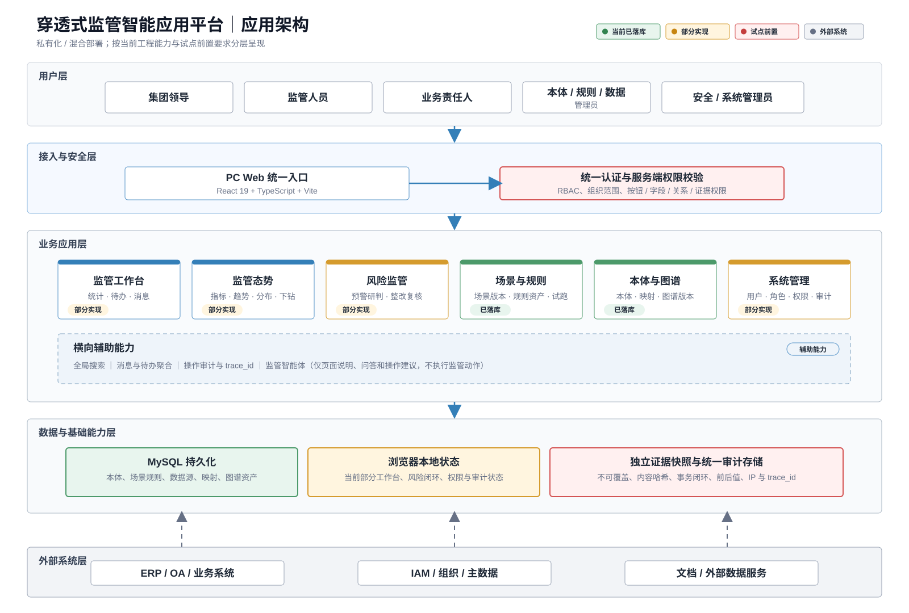
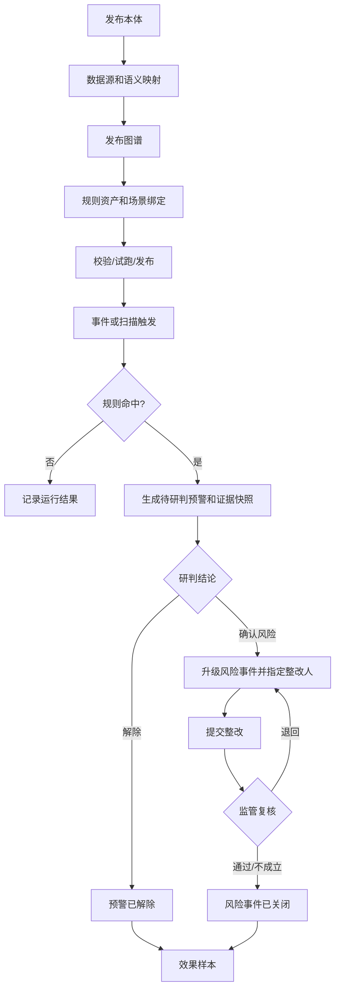
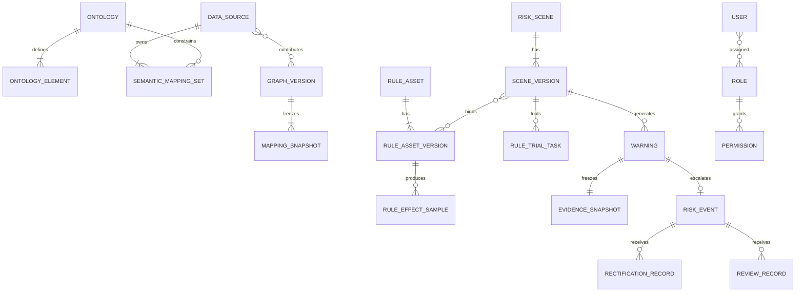
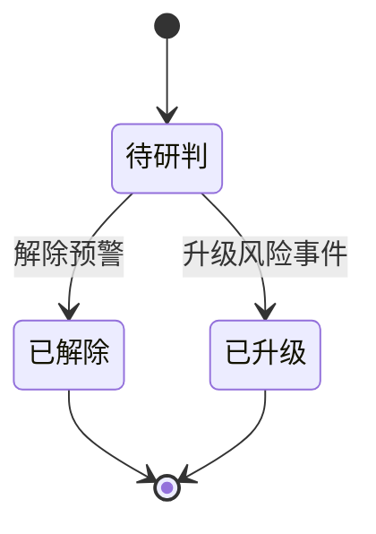
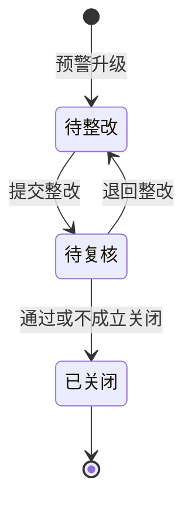
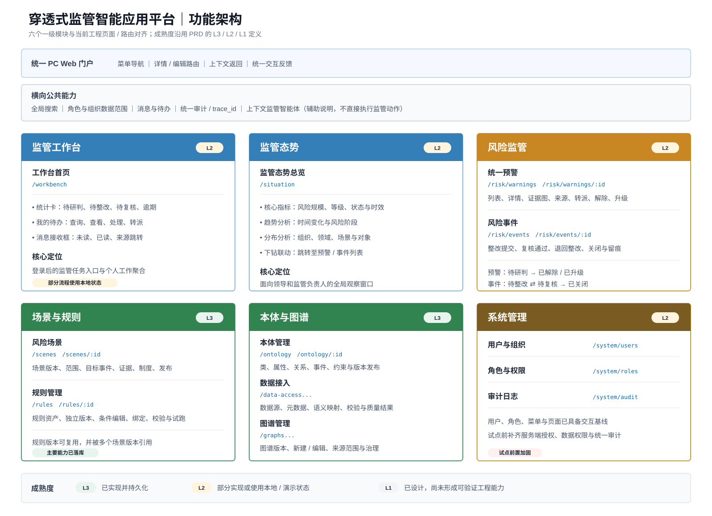

# 穿透式监管智能应用平台 PRD（v11.3 应用操作补充版）

---

## 文档信息

| 项目 | 内容 |
| --- | --- |
| PRD审核人 | [TODO: 补充审核人] |
| 重要性 | 高 |
| 紧急性 | 高 |
| 需求方 | 集团监管、审计纪检、财务风控、法务合规、业务管理、信息化部门 |
| PRD编写人 | [TODO: 补充编写人] |
| PRD提交日期 | 2026-07-21 |
| 当前版本 | v11.3 应用操作补充版 |
| 产品类型 | 商业化产品 × B端业务型管理软件 |
| 默认部署 | 私有化或混合部署 |
| 工程基线 | React 19 + TypeScript + Vite + Node.js + MySQL + Zustand |

## PRD修改记录

| 变更时间 | 变更内容 | 变更原因 | 修改人 | 审核人 | 版本号 |
| --- | --- | --- | --- | --- | --- |
| 2026-07-17 | 优化一级菜单、二级菜单与页面层级 | 降低菜单与页面理解成本 | [TODO] | [TODO] | v10.6 |
| 2026-07-21 | 对齐当前工程路由、状态、接口、数据表和交付成熟度 | 解决产品目标态与当前实现混写 | [TODO] | [TODO] | v11.0 |
| 2026-07-22 | 在10.3每个功能节点下新增应用操作章节，补充用户路径、原型、产品逻辑、文案和评审字段 | 形成页面级操作设计与评审基线 | [TODO] | [TODO] | v11.3 |
| 2026-07-22 | 重新生成应用架构图和功能架构图，并以SVG格式插入对应章节 | 提升架构表达清晰度和文档可维护性 | [TODO] | [TODO] | v11.2 |
| 2026-07-21 | 恢复与v10.6完全一致的章节结构，将工程增强内容嵌入原章节 | 保持既有评审模板和目录习惯 | [TODO] | [TODO] | v11.1 |

---

## 1、项目背景

### 1.1 业务现状

央国企和大型集团的采购、合同、付款、投资、产权、财务等数据分散在ERP、OA、采购、合同、财务、司库、主数据、文档及外部数据服务中。现有系统通常围绕单一业务流程建设，监管人员能够查看单据，却难以统一识别跨系统主体关联、审批缺失、资金异常和历史风险传导。

当前监管仍以报表、抽查、专项核查和事后审计为主。风险发现后，责任确认、整改材料、复核结论和规则优化样本可能散落在线下沟通中，导致风险发现、解释、整改和复盘相互脱节。

当前工程已形成高保真交互版本，覆盖监管工作台、监管态势、统一预警、风险事件、场景规则、本体图谱和系统管理。本体、场景规则、规则目录、数据源和图谱已建立Node.js + MySQL接口；预警处置、风险整改、用户权限和部分审计仍使用浏览器本地状态，尚未达到真实试点的服务端一致性要求。

### 1.2 核心问题

| 优先级 | 问题 | 具体表现 | 产品应对 |
| --- | --- | --- | --- |
| P0 | 业务语义不统一 | 同一主体、合同和事件在不同系统中口径不同 | 用监管本体统一类、属性、关系和事件 |
| P0 | 风险解释成本高 | 规则命中后仍需跨系统人工找证据 | 固化证据子图、来源、时间轴和版本 |
| P0 | 风险处置不闭环 | 研判、整改和复核依赖线下沟通 | 用预警和风险事件两级对象承载闭环 |
| P0 | 产品文档与工程偏差 | 原文部分状态和对象尚未在代码中实现 | 按真实路由、状态、接口和表结构对齐 |
| P0 | 生产权限与持久化不足 | 部分业务只保存在浏览器 | 试点前补齐服务端RBAC、事务和审计 |
| P1 | 规则资产复用不足 | 场景与规则关系容易被理解为一对一 | 规则独立版本化，场景绑定规则版本 |

### 1.3 解决思路

平台采用“监管本体 + 语义映射 + 图谱版本 + 规则资产 + 风险场景 + 预警证据 + 整改复核”的架构。本体定义语义，映射连接来源，图谱组织事实，规则执行确定性判断，场景组合规则与适用范围，预警承载人工研判，风险事件承载整改复核，处置结果形成效果样本。

核心闭环为：

> 本体发布 → 数据映射 → 图谱发布 → 规则资产与场景发布 → 事件/扫描触发 → 预警与证据快照 → 解除或升级 → 整改 → 复核关闭 → 规则效果样本。

### 1.4 决策依据

1. 首批采用异步非阻断监管，不修改源系统业务状态。
2. 本体负责统一语义，图谱负责组织事实，规则负责确定性判断。
3. 已发布本体、图谱、规则和场景版本不可原地修改。
4. 预警生成时使用的证据快照不可被当前图谱覆盖。
5. 当前预警状态采用“待研判、已解除、已升级”；风险事件采用“待整改、待复核、已关闭”。
6. AI不替代确定性规则和人工复核；当前智能体只提供页面说明和操作建议。

---

## 2、需求基本情况

| 要素 | 内容 |
| --- | --- |
| 需求提出方 | 集团监管、审计纪检、财务风控、法务合规和信息化部门 |
| 功能使用人 | 集团领导、监管负责人、审计纪检人员、监管专员、业务责任人、本体/规则/数据管理员、安全/系统管理员 |
| 受影响人 | 业务部门、源系统责任人、数据责任人和整改协同人员 |
| 核心需求 | 统一监管语义、数据接入、图谱组织、规则配置、风险预警、证据穿透、整改复核和运营复盘 |
| 需求触发 | 新领域接入、制度变化、数据变化、业务事件和日常监管运营 |
| 核心痛点 | 风险发现不及时、证据准备慢、过程不可追溯、规则难复用 |
| 需求价值 | 提升风险发现及时性、解释效率、整改闭环率和监管资产复用能力 |
| 当前工程边界 | 配置类能力主要落库；风险闭环和权限类能力仍部分使用浏览器状态 |
| 试点门槛 | 闭环落库、服务端权限、真实数据源、证据快照、统一审计和性能测试 |

---

## 3、商业分析与产品定位

### 3.1 产品定位

穿透式监管智能应用平台是一套面向央国企和大型集团的私有化监管软件，通过监管本体统一跨系统语义，以图谱版本组织关联事实，以确定性规则识别风险，并用可追溯证据和在线整改复核闭环降低监管发现与处置成本。

### 3.2 目标客户

| 维度 | 定位 |
| --- | --- |
| 行业 | 央企、地方国企、政务型集团及强监管大型企业 |
| 典型特征 | 多级组织、多业务域、多套异构系统、敏感数据多 |
| IT基础 | 已具备ERP、OA、采购、合同、财务、司库等系统和接口能力 |
| 典型买方 | 监管、审计纪检、数字化、风控和信息化负责人 |
| 购买关注点 | 私有化、安全、可解释、可配置、可审计、可实施 |

### 3.3 产品边界

| 平台做什么 | 平台不做什么 |
| --- | --- |
| 定义和发布监管本体 | 不建设复杂RDF/OWL公理编辑平台 |
| 将来源数据映射为图谱事实 | 不要求客户维护固定业务流程模板 |
| 使用确定性规则识别风险 | 不由AI自动做监管结论 |
| 生成预警、证据和整改闭环 | 首批不自动阻断或回写源系统 |
| 固化历史证据快照 | 首批不提供企业全量图谱自由探索 |
| 提供页面级智能说明 | 智能体不直接执行业务操作 |

### 3.4 商业化说明

产品采用私有化许可或年度订阅加实施服务的商业模式。市场规模、竞品份额、价格、收入目标和ROI需由上位商业规划补充，本版本不虚构数据。商务评审前至少补充目标客户数量、客单价区间、实施投入、年度运维模式和回本周期。

---

## 4、项目收益目标

### 4.1 平台建设目标

| 目标 | 指标 | 目标值 | 时限 |
| --- | --- | --- | --- |
| 工程基线稳定 | 构建通过率、核心路由可访问率 | 100% | v11.1评审前 |
| 风险闭环服务端化 | 状态流转事务成功率 | 100% | 试点前 |
| 预警可解释 | 规则、版本和证据来源完整率 | 100% | 试点前 |
| 权限安全 | 越权明文泄露次数 | 0 | 持续 |
| 异步预警时效 | 事件到达至预警生成P95 | 不超过60秒 | 试运行 |
| 效果样本 | 解除、升级和关闭样本生成率 | 100% | 试运行 |

### 4.2 交付验收标准

1. 工程构建通过，六大一级模块和详情/编辑路由可访问。
2. 本体、场景、规则资产、数据源和图谱可通过Node API与MySQL交互。
3. 已发布本体、场景、规则和图谱版本只读，修改通过复制新版本完成。
4. 预警详情可展示规则、证据图、实际证据、来源数据和版本信息。
5. 预警可转派、解除和升级；同一预警最多创建一个主风险事件。
6. 风险事件可完成整改、复核、退回和关闭。
7. 试点前将预警、风险事件、待办、消息、整改、复核和审计统一落库。
8. 试点前由服务端校验用户、组织、按钮、字段、关系和证据权限。
9. 证据快照具有独立存储、内容哈希和不可覆盖约束。
10. 高危操作记录操作人、对象、前后值、原因、IP和trace_id。

### 4.3 试运行成功标准

试运行期至少完成一轮真实或脱敏样本闭环，并计算预警有效率、误报率、平均提前量、平均研判耗时、平均整改耗时、闭环完成率和逾期率。具体业务目标值在试点启动前确认。

---

## 5、项目方案概述

### 5.1 核心模块

| 一级模块 | 核心职责 | 当前成熟度 | 优先级 |
| --- | --- | --- | --- |
| 监管工作台 | 待办、统计、消息和快捷入口 | L2 | P0 |
| 监管态势 | 指标、趋势、分布和下钻 | L2 | P0 |
| 风险监管 | 预警研判、证据、整改和复核 | L2 | P0 |
| 场景与规则 | 场景版本、规则资产、绑定、试跑和发布 | L3 | P0 |
| 本体与图谱 | 本体、数据源、映射、图谱质量和治理 | L3 | P0 |
| 系统管理 | 用户、角色、权限和审计 | L2 | P0 |

### 5.2 方案原则

1. 六个一级模块和现有页面路由保持稳定。
2. 配置类能力优先复用当前MySQL服务；闭环类能力在v11.2前完成服务端化。
3. 规则资产独立版本化，可被多个场景版本引用。
4. 预警和风险事件是两个独立对象，使用当前工程简化状态机。
5. 当前智能体属于辅助交互，不作为P0业务依赖。
6. 用L3已实现、L2部分实现、L1已设计标识交付成熟度。

### 5.3 MVP包含范围

PC Web六大模块；本体、场景、规则资产、数据源和图谱版本治理；预警与风险事件两级闭环；证据图与来源展示；工作台待办和固定消息；用户角色配置页面；规则目录和风险模式后台接口。

### 5.4 MVP暂不包含范围

共享多租户、同步阻断、复杂图算法、全量图谱自由探索、独立消息中心、多渠道通知、规则效果分析页面、AI自动决策、移动端和自助式BI。

### 5.5 核心验证假设

1. 本体、映射和图谱版本能够支撑多领域共性数据组织。
2. 规则资产复用和场景绑定能够降低重复配置成本。
3. 有限证据子图能够降低监管人员核查准备成本。
4. 两级简化状态足以支撑首个试点闭环。
5. 当前高保真工程可通过服务端加固演进为试点版，无需重建前端信息架构。

---

## 6、项目范围

### 6.1 涉及系统

| 系统 | 关系 | 数据方向 |
| --- | --- | --- |
| 穿透式监管平台 | 主体系统 | 内部读写 |
| ERP/OA/采购/合同/财务/司库 | 业务数据来源 | 来源系统 → 平台 |
| IAM/组织/主数据 | 基础数据来源 | 基础系统 → 平台 |
| 文档与外部数据服务 | 证据来源 | 来源 → 平台或授权跳转 |
| MySQL | 当前核心持久化 | 平台内部 |

### 6.2 影响范围

- 用户：监管人员和业务责任人增加在线研判、整改和复核操作。
- 流程：不改变源系统审批和执行流程，只增加异步监管链路。
- 数据：来源数据形成语义映射、图谱版本和证据快照。
- 工程：配置能力已主要落库；风险闭环、权限和统一审计需继续服务端化。
- 运维：新增Node服务、MySQL、日志、备份、监控和安全配置要求。

### 6.3 不在本期范围

本期不替代源业务系统，不自动定责，不自动阻断，不建设全量本体推理平台，不承诺AI自动执行监管决策。

---

## 7、项目风险

### 7.1 前提假设

| 编号 | 假设 | 不成立影响 |
| --- | --- | --- |
| A1 | 源系统提供稳定主键、业务时间和状态事件 | 实体识别和事前预警能力下降 |
| A2 | 业务专家确认规则、例外、制度和证据 | 场景无法可靠发布 |
| A3 | 客户允许部署MySQL和Node服务 | 当前工程架构需调整 |
| A4 | 责任人愿意在线提交整改材料 | 闭环仍依赖线下 |

### 7.2 约束条件

| 编号 | 约束 | 设计影响 |
| --- | --- | --- |
| C1 | 首批PC Web | 不设计移动端独立流程 |
| C2 | 异步非阻断 | 不提供同步放行接口 |
| C3 | 发布版本不可覆盖 | 修改必须复制新版本 |
| C4 | 敏感数据最小化 | 服务端裁剪，凭据不回显 |
| C5 | 延续现有技术栈 | 优先复用React、Node和MySQL模式 |

### 7.3 风险清单

| 编号 | 类别 | 风险 | 概率 | 影响 | 应对 |
| --- | --- | --- | --- | --- | --- |
| R1 | 工程 | 浏览器状态与MySQL不一致 | 高 | 高 | 风险闭环统一落库并使用事务 |
| R2 | 安全 | 前端隐藏代替服务端权限 | 中 | 高 | 建立认证中间件、RBAC和数据权限 |
| R3 | 数据 | 来源结构变化导致映射失效 | 中 | 高 | 元数据版本、差异任务和重新校验 |
| R4 | 业务 | 关键事件无法提前获得 | 高 | 高 | 发布前验证事件时效并允许阶段降级 |
| R5 | 规则 | 误报率过高 | 中 | 高 | 试跑、人工复核、效果样本和新版本 |
| R6 | 图谱 | 实体错误合并 | 中 | 高 | 强标识优先、人工治理和拆分记录 |
| R7 | 合规 | 敏感证据越权 | 低 | 高 | 脱敏、服务端授权、下载控制和审计 |
| R8 | 交付 | 演示能力被误判为生产完成 | 高 | 高 | 使用成熟度和试点准入标准管理承诺 |

---

## 8、术语和缩略语

| 术语 | 定义 |
| --- | --- |
| 监管本体 | 监管类、属性、关系、事件和约束的统一版本化定义 |
| 图谱版本 | 绑定本体、映射快照、来源范围和质量结果的实例数据版本 |
| 规则资产 | 可独立版本化、可被多个场景版本引用的确定性规则 |
| 风险场景 | 领域、主对象、目标事件、范围、证据、制度和规则的组合 |
| 风险模式 | 规则目录中的上位风险分类，可绑定场景和规则 |
| 预警 | 规则命中后产生的待人工研判风险信号 |
| 风险事件 | 预警确认后升级形成的整改对象 |
| 证据快照 | 预警生成时实际参与判断的事实、来源和版本集合 |
| RBAC | 基于角色的访问控制 |
| trace_id | 跨接口、规则和审计链路的追踪标识 |

---

## 9、参考文献和引用文档

| 文档/代码 | 位置 | 用途 |
| --- | --- | --- |
| v10.6 PRD | `D:/中国电子云/prd/穿透式监管产品PRD-v10.6-功能清单层级优化版.md` | 原始结构和产品目标来源 |
| 开发说明 | `DEVELOPMENT.md` | 当前页面实现范围 |
| 路由与导航 | `src/App.tsx` | 菜单和路由基线 |
| 前端状态 | `src/types.ts`、`src/store.ts` | 状态机和操作逻辑 |
| 本体服务 | `server.js`、`src/ontologyApi.ts` | 本体接口基线 |
| 场景规则服务 | `sceneRuleService.js`、`sceneRuleRouter.js` | 场景、规则和试跑基线 |
| 数据图谱服务 | `dataGraphApi.js`、`src/dataGraphApi.ts` | 数据源、映射和图谱基线 |
| 客户制度和数据字典 | [TODO: 试点确认] | 规则、证据和映射依据 |

---

## 10、功能需求

### 10.1 功能总体介绍

当前工程采用六个一级模块。场景规则、本体和数据图谱主要使用MySQL持久化；工作台、风险处置、用户权限和部分审计仍为前端本地状态。试点前必须完成风险闭环、权限、证据快照和统一审计的服务端化。

#### 10.1.1 应用架构

> 图10-1 应用架构图。绿色表示当前主要能力已落库，黄色表示当前部分实现，红色表示试点前置加固项。

#### 10.1.2 核心业务流程

#### 10.1.3 核心数据模型

#### 10.1.4 核心状态机

转派只改变处理人，不改变状态；事前、事中、事后是预警阶段字段；逾期由截止时间计算，不建立独立状态。

### 10.2 功能清单

> 图10-2 功能架构图。六个一级模块、页面和路由均与当前工程保持一致。

| 一级菜单 | 二级菜单 | 页面 | 路由 | 当前成熟度 |
| --- | --- | --- | --- | --- |
| 监管工作台 | — | 工作台首页 | `/workbench` | L2 |
| 监管态势 | — | 监管态势 | `/situation` | L2 |
| 风险监管 | 统一预警 | 预警列表、预警详情 | `/risk/warnings...` | L2 |
| 风险监管 | 风险事件 | 事件列表、事件详情 | `/risk/events...` | L2 |
| 场景与规则 | 风险场景 | 场景列表、场景编辑 | `/scenes...` | L3 |
| 场景与规则 | 规则管理 | 规则资产列表、规则编辑器 | `/rules...` | L3 |
| 本体与图谱 | 本体管理 | 本体列表、本体编辑 | `/ontology...` | L3 |
| 本体与图谱 | 数据接入 | 数据源与语义映射 | `/data-access...` | L3 |
| 本体与图谱 | 图谱管理 | 图谱列表、新建和编辑 | `/graphs...` | L3 |
| 系统管理 | 用户与组织 | 用户页 | `/system/users` | L2 |
| 系统管理 | 角色与权限 | 角色页 | `/system/roles` | L2 |
| 系统管理 | 审计日志 | 审计页 | `/system/audit` | L2 |

### 10.3 功能详细设计

#### 10.3.1 监管工作台

##### 10.3.1.1 功能介绍

作为多数用户登录后的默认入口，展示待研判、待整改、待复核和逾期统计，聚合本人或授权范围待办及固定业务消息。

##### 10.3.1.2 功能清单

| 区域 | 功能 | 优先级 |
| --- | --- | --- |
| 统计卡 | 展示各环节数量并筛选待办 | P0 |
| 我的待办 | 查询、查看、处理和转派 | P0 |
| 消息接收框 | 未读、已读和来源跳转 | P0 |

##### 10.3.1.3 功能详细设计

查询条件包括关键词、对象类型、等级、当前环节和时限状态。列表展示编号/标题、对象类型、等级、状态、截止时间、处理人和操作。

消息不参与待办数量；用户只能看本人或授权范围待办；对象状态变化关闭旧待办并生成下一环节待办。当前联动使用浏览器状态，试点前改为服务端统计快照和事务。
##### 10.3.1.4 应用操作

| 功能名称 | 位置/用户路径 | 原型 | 产品逻辑（页面结构/交互/策略设计） | 对应文案 | 优先级 | 评审意见 | 备注 |
| --- | --- | --- | --- | --- | --- | --- | --- |
| 监管工作台 | 一级菜单“监管工作台” | [图片] | <strong>页面结构：</strong> 工作台采用“顶部统计卡 + 下方左右分栏”布局。顶部横向展示6张统计卡；下方左侧为我的待办主列表，占主体宽度约65%-70%；右侧为监管通知区，占主体宽度约30%-35%。页面右上角展示刷新按钮和最近刷新时间。  <strong>交互逻辑：</strong> 进入页面后系统一次性加载统计卡、待办列表和监管通知；点击刷新重新拉取三类数据；点击统计卡按对应环节筛选待办；点击待办或通知进入来源对象；待办或通知为空时显示空状态。  <strong>策略设计：</strong> 页面继承当前用户组织、领域、角色和数据权限，只展示本人可查看或可处理事项；统计卡和待办列表基于统一待办任务对象统计；消息不计入待办数量。  <strong>异常处理：</strong> 任一区域加载失败时该区域展示重试，不阻塞其他区域展示；刷新失败保留上次成功数据并提示失败原因。 | 页面标题：监管工作台； 空状态：暂无待办事项 / 暂无监管通知； 刷新提示：已刷新； 失败提示：数据加载失败，请重试。 | P0 | 待评审 | 工作台是个人任务入口，不承载全量风险分析；试点前统计卡、待办和消息需改为服务端统一统计与事务联动。 |

#### 10.3.2 监管态势

##### 10.3.2.1 功能介绍

面向集团领导和监管管理者展示风险数量、趋势、组织/领域分布、处置进度和重点事项。

##### 10.3.2.2 功能清单

| 区域 | 功能 | 优先级 |
| --- | --- | --- |
| 全局筛选 | 时间、组织、领域、等级、阶段 | P0 |
| 指标区 | 预警、重大高风险、待处置、事件、逾期、闭环率 | P0 |
| 分析区 | 趋势、等级、组织/领域和处置状态 | P0 |
| 下钻 | 进入预警或风险事件列表 | P0 |

##### 10.3.2.3 功能详细设计

所有指标、图表和重点事项使用同一筛选、数据权限和统计快照。当前为高保真展示，试点前改为真实服务端聚合接口，并返回指标口径时间、来源延迟和下钻筛选条件。
##### 10.3.2.4 应用操作

| 功能名称 | 位置/用户路径 | 原型 | 产品逻辑（页面结构/交互/策略设计） | 对应文案 | 优先级 | 评审意见 | 备注 |
| --- | --- | --- | --- | --- | --- | --- | --- |
| 监管态势 | 一级菜单“监管态势” | [图片] | <strong>页面结构：</strong> 页面采用“全局筛选 + 核心指标 + 图表分析 + 重点事项”纵向布局。顶部提供时间、组织、领域、风险等级和监管阶段筛选；指标区展示预警总量、重大高风险、待处置、风险事件、逾期和闭环率；分析区展示趋势、等级、组织/领域和处置状态；底部展示重点事项。  <strong>交互逻辑：</strong> 修改筛选条件后统一刷新指标、图表和重点事项；点击指标卡、图例、柱线或重点事项时携带当前筛选条件下钻至预警或风险事件列表；点击重置恢复默认统计周期和权限范围。  <strong>策略设计：</strong> 所有区域使用同一统计快照、指标口径和数据权限；页面展示统计截止时间、数据来源延迟和当前筛选摘要；闭环率仅统计进入风险事件闭环的有效样本。  <strong>异常处理：</strong> 单个图表加载失败时局部展示重试；统计口径或来源延迟不可用时展示数据说明，不使用0替代未知值。 | 页面标题：监管态势； 空状态：当前筛选范围暂无监管数据； 更新时间：数据更新至 {时间}； 失败提示：该分析模块加载失败，请重试。 | P0 | 待评审 | 面向集团领导和监管管理者，提供固定口径分析与下钻，不替代自助式BI。 |

#### 10.3.3 风险监管

##### 10.3.3.1 功能介绍

完成预警研判、证据查看、风险升级、整改提交、复核退回和关闭。预警与风险事件保持独立编号、状态和追溯关系。

##### 10.3.3.2 功能清单

| 二级菜单 | 页面 | 功能 | 优先级 |
| --- | --- | --- | --- |
| 统一预警 | 预警列表 | 查询、转派、解除和升级 | P0 |
| 统一预警 | 预警详情 | 风险解释、证据子图、证据和时间线 | P0 |
| 风险事件 | 事件列表 | 查询、转派、整改和复核 | P0 |
| 风险事件 | 事件详情 | 风险事实、整改反馈和复核记录 | P0 |

##### 10.3.3.3 功能详细设计

预警查询条件包括关键词、阶段、状态、等级、场景、组织、时间和证据状态。预警详情必须打开生成时快照，包含风险解释、证据图、实际证据、时间线和详情抽屉。证据图首批限制2跳、30节点、50关系。

解除需填写原因和证据；重大/高风险仅监管负责人操作。升级需指定整改人、时限和要求；同一预警最多创建一个主风险事件。

风险事件支持待整改、待复核、已关闭。完成或部分完成整改时至少一项材料；复核支持通过、退回整改和不成立关闭。试点前将状态、待办、消息、审计和效果样本置于同一服务端事务，并使用乐观锁和幂等键。
##### 10.3.3.4 应用操作

| 功能名称 | 位置/用户路径 | 原型 | 产品逻辑（页面结构/交互/策略设计） | 对应文案 | 优先级 | 评审意见 | 备注 |
| --- | --- | --- | --- | --- | --- | --- | --- |
| 统一预警 | 一级菜单“风险监管” → 二级菜单“统一预警” → 预警列表 / 预警详情 | [图片] | <strong>页面结构：</strong> 列表页由查询区、预警表格和分页区组成；详情页由风险摘要、命中规则、证据子图、实际证据、来源信息、处置时间线和底部操作区组成，节点详情通过抽屉展示。  <strong>交互逻辑：</strong> 列表支持查询、重置、分页、进入详情和按权限转派；详情支持点击图节点查看证据，执行转派、解除或升级时打开确认弹窗并校验必填项。解除需填写原因和证据；升级需指定整改人、完成时限和整改要求。  <strong>策略设计：</strong> 预警详情始终读取生成时固化的证据快照；重大/高风险解除仅监管负责人可操作；同一预警最多生成一个主风险事件；转派不改变预警状态。  <strong>异常处理：</strong> 证据图加载失败时仍展示风险摘要和来源清单；重复提交通过幂等键拦截；对象已被他人处理时刷新最新状态并禁止旧操作。 | 页面标题：统一预警 / 预警详情； 空状态：没有符合条件的预警； 解除成功：预警已解除； 升级成功：已升级为风险事件； 冲突提示：当前预警状态已变化，请刷新后重试。 | P0 | 待评审 | 预警仅承载研判，状态为待研判、已解除、已升级；证据图首批限制2跳、30节点、50关系。 |
| 风险事件 | 一级菜单“风险监管” → 二级菜单“风险事件” → 事件列表 / 事件详情 | [图片] | <strong>页面结构：</strong> 列表页展示查询条件、事件表格和分页；详情页展示风险事实、责任与时限、来源预警快照、整改记录、材料附件、复核记录和底部操作区。  <strong>交互逻辑：</strong> 责任人可提交整改说明和材料；监管人员在待复核状态下执行通过、退回整改或不成立关闭；转派需选择新责任人并记录原因；各操作成功后刷新事件、待办和时间线。  <strong>策略设计：</strong> 状态限定为待整改、待复核、已关闭；完成或部分完成整改时至少上传一项材料；退回后重新进入待整改；关闭后只读；整改、复核、待办、消息和审计在同一服务端事务中完成。  <strong>异常处理：</strong> 附件上传失败不提交整改；并发更新使用版本号校验；重复复核或关闭请求返回当前最终状态，不重复生成记录。 | 页面标题：风险事件 / 风险事件详情； 空状态：没有符合条件的风险事件； 整改提示：整改已提交，等待监管复核； 退回提示：已退回整改； 关闭提示：风险事件已关闭。 | P0 | 待评审 | 风险事件承载整改复核闭环；关闭后不得直接修改，补充说明需形成独立留痕记录。 |

#### 10.3.4 场景与规则

##### 10.3.4.1 功能介绍

配置风险场景并组合可复用的确定性规则资产。规则独立版本化，可被多个场景版本引用。

##### 10.3.4.2 功能清单

| 二级菜单 | 页面 | 功能 | 优先级 |
| --- | --- | --- | --- |
| 风险场景 | 场景列表/编辑 | 新建、复制、绑定规则、校验、试跑、发布、停用 | P0 |
| 规则管理 | 规则资产列表 | 查询、复用、查看引用和删除无引用草稿 | P0 |
| 规则管理 | 规则编辑器 | 属性、比对、路径、时序和聚合规则 | P0 |

##### 10.3.4.3 功能详细设计

已发布或停用场景只读，修改时复制新版本。场景发布前必须完成依赖校验和试跑。规则路径最多2跳，条件支持AND/OR，保存配置哈希和试跑样本结果。从场景移出规则只删除绑定，不删除规则资产。

规则目录后台接口已支持预览、导入、汇总和风险模式查询，本期不新增主导航页面。
##### 10.3.4.4 应用操作

| 功能名称 | 位置/用户路径 | 原型 | 产品逻辑（页面结构/交互/策略设计） | 对应文案 | 优先级 | 评审意见 | 备注 |
| --- | --- | --- | --- | --- | --- | --- | --- |
| 风险场景 | 一级菜单“场景与规则” → 二级菜单“风险场景” → 场景列表 / 场景编辑 | [图片] | <strong>页面结构：</strong> 列表页提供查询区、场景表格和新增入口；编辑页采用页头信息区与页签布局，包含基本信息、规则绑定、版本记录、校验/试跑和发布信息。  <strong>交互逻辑：</strong> 支持新建草稿、编辑、复制版本、绑定或移出规则、校验、试跑、发布和停用；离开未保存页面前二次确认；从已发布版本修改时先复制新草稿。  <strong>策略设计：</strong> 已发布和已停用场景只读；发布前必须通过依赖校验和试跑；移出规则只删除当前场景版本绑定，不删除规则资产；发布时固化规则版本引用。  <strong>异常处理：</strong> 校验不通过时按阻断项和提醒项展示；试跑失败保留参数与日志；版本已变化时拒绝覆盖并提示刷新。 | 页面标题：风险场景 / 场景配置； 新建提示：场景草稿已创建； 发布成功：场景版本已发布； 阻断提示：存在未完成的发布前置项。 | P0 | 待评审 | 场景负责组合适用范围、目标事件、证据、制度和规则，不在场景内复制规则资产。 |
| 规则管理 | 一级菜单“场景与规则” → 二级菜单“规则管理” → 规则列表 / 规则编辑器 | [图片] | <strong>页面结构：</strong> 列表页展示查询筛选、规则资产表格、场景引用和状态；编辑器按基本信息、数据与语义、判断逻辑、依据与证据、运行策略和校验结果分区。  <strong>交互逻辑：</strong> 支持新建独立规则草稿、从场景进入并自动关联、编辑条件组、配置属性/比对/路径/时序/聚合逻辑、保存草稿、校验和返回场景；删除仅对无引用草稿开放。  <strong>策略设计：</strong> 规则资产独立版本化并可被多个场景版本引用；已发布或已停用规则只读；条件支持AND/OR，关系路径最多2跳；保存配置哈希用于差异识别。  <strong>异常处理：</strong> 未完成必要数据语义配置时禁止完成配置；删除被引用规则时提示引用场景；保存失败保留本地编辑状态并允许重试。 | 页面标题：规则管理 / 规则配置； 空状态：暂无规则资产； 保存提示：规则草稿已保存； 完成提示：规则配置已完成，返回场景进行统一校验。 | P0 | 待评审 | 规则目录后台接口不新增主导航；规则编辑入口与当前场景上下文保持关联。 |

#### 10.3.5 本体与图谱

##### 10.3.5.1 功能介绍

完成本体定义、数据源登记、语义映射、图谱质量治理和版本发布。

##### 10.3.5.2 功能清单

| 二级菜单 | 页面 | 功能 | 优先级 |
| --- | --- | --- | --- |
| 本体管理 | 本体列表/编辑 | 新建、复制、元素维护、校验和发布 | P0 |
| 数据接入 | 数据源/映射 | 测试、元数据、映射、校验和同步记录 | P0 |
| 图谱管理 | 图谱列表/编辑 | 依赖、质量问题、实体治理和发布 | P0 |

##### 10.3.5.3 功能详细设计

本体包含类、属性、关系和事件，已发布版本只读。数据源凭据不得回显；试点前连接测试和同步需由真实适配器实现。图谱发布时固化本体、来源集合和映射快照，阻断问题未解决不得发布。

当前主要接口包括 `/api/ontologies...`、`/api/data-sources...`、`/api/graphs...`，均已实现MySQL持久化。
##### 10.3.5.4 应用操作

| 功能名称 | 位置/用户路径 | 原型 | 产品逻辑（页面结构/交互/策略设计） | 对应文案 | 优先级 | 评审意见 | 备注 |
| --- | --- | --- | --- | --- | --- | --- | --- |
| 本体管理 | 一级菜单“本体与图谱” → 二级菜单“本体管理” → 本体列表 / 本体编辑 | [图片] | <strong>页面结构：</strong> 列表页展示本体名称、编码、版本、状态、元素数量和更新时间；编辑页由版本信息、类、属性、关系、事件和校验结果组成，元素编辑通过主工作区或抽屉完成。  <strong>交互逻辑：</strong> 支持新建、复制版本、维护元素、校验、发布和停用；已发布版本进入查看态；删除元素前展示对映射、图谱和规则的引用影响。  <strong>策略设计：</strong> 已发布本体不可原地修改；元素编码在版本范围内唯一；发布前校验必填属性、关系端点和事件主体，并输出影响范围。  <strong>异常处理：</strong> 存在引用或校验阻断项时禁止删除/发布；保存冲突时提示重新加载；局部元素加载失败不覆盖已保存版本。 | 页面标题：本体管理 / 本体编辑； 新建提示：本体草稿已创建； 校验提示：校验完成，共发现 {数量} 项问题； 发布成功：本体版本已发布。 | P0 | 待评审 | 本体负责统一监管语义，不建设复杂RDF/OWL公理编辑平台。 |
| 数据接入 | 一级菜单“本体与图谱” → 二级菜单“数据接入” → 数据源列表 / 数据源详情 | [图片] | <strong>页面结构：</strong> 数据接入入口定位到图谱管理的数据源页签；列表展示来源类型、连接状态、元数据状态、映射状态和最近同步；详情页包含连接配置、元数据、语义映射、校验结果和同步记录。  <strong>交互逻辑：</strong> 支持登记数据源、测试连接、拉取元数据、配置字段映射、校验、触发同步和查看记录；凭据编辑后仅显示掩码，不提供明文回显。  <strong>策略设计：</strong> 连接信息按环境隔离并加密存储；映射绑定本体版本；元数据结构变化生成差异任务，不自动覆盖已发布映射；同步使用来源主键和业务时间保证幂等。  <strong>异常处理：</strong> 连接失败展示可诊断原因；同步失败保留批次和断点；来源结构变化时暂停受影响映射并提示重新校验。 | 页面标题：数据接入 / 数据源详情； 连接成功：连接测试通过； 连接失败：连接测试失败，请检查配置； 同步提示：同步任务已提交； 空状态：暂无数据源。 | P0 | 待评审 | 当前页面和MySQL接口已具备基线，试点前连接测试与同步必须接入真实适配器。 |
| 图谱管理 | 一级菜单“本体与图谱” → 二级菜单“图谱管理” → 图谱列表 / 新建或编辑图谱 | [图片] | <strong>页面结构：</strong> 列表页展示图谱名称、版本、本体、来源范围、质量状态和发布状态；新建/编辑页按基本信息、依赖选择、数据源与映射、质量检查、实体治理和发布确认组织。  <strong>交互逻辑：</strong> 支持新建图谱草稿、选择本体和数据源、执行构建、查看质量问题、处理实体合并/拆分、重新校验和发布；发布前展示依赖快照摘要。  <strong>策略设计：</strong> 图谱版本固化本体、来源集合和映射快照；阻断级质量问题未解决不得发布；发布版本只读；证据快照引用具体图谱版本，不随当前图谱更新。  <strong>异常处理：</strong> 构建失败保留任务日志；质量任务超时可重试；实体治理冲突进入人工处理队列；发布过程中任一步失败则整体回滚。 | 页面标题：图谱管理 / 新建图谱； 构建提示：图谱构建任务已提交； 阻断提示：存在未解决的质量问题，暂不能发布； 发布成功：图谱版本已发布。 | P0 | 待评审 | 首批用于规则运行和有限证据穿透，不提供企业全量图谱自由探索。 |

#### 10.3.6 系统管理

##### 10.3.6.1 功能介绍

提供用户组织、角色权限、审计日志和监管智能体辅助说明能力。

##### 10.3.6.2 功能清单

| 二级菜单 | 页面 | 功能 | 优先级 |
| --- | --- | --- | --- |
| 用户与组织 | 用户页 | 用户、组织、状态、角色和待办转派 | P0 |
| 角色与权限 | 角色页 | 菜单、按钮、组织、字段、关系和证据权限 | P0 |
| 审计日志 | 审计页 | 高危操作和敏感访问追踪 | P0 |

##### 10.3.6.3 功能详细设计

停用用户前必须转派未完成待办。权限覆盖菜单、按钮、组织、字段、关系、证据和高危操作，并在服务端裁剪。审计记录操作人、对象、前后值、原因、IP、结果和trace_id，只读不可删除。

当前角色切换和部分审计属于前端演示；试点前需实现真实认证、RBAC和统一审计。监管智能体只解释页面和操作建议，不执行解除、升级、整改或复核，不绕过权限。
##### 10.3.6.4 应用操作

| 功能名称 | 位置/用户路径 | 原型 | 产品逻辑（页面结构/交互/策略设计） | 对应文案 | 优先级 | 评审意见 | 备注 |
| --- | --- | --- | --- | --- | --- | --- | --- |
| 用户与组织 | 一级菜单“系统管理” → 二级菜单“用户与组织” | [图片] | <strong>页面结构：</strong> 页面由查询区、用户表格、分页和新增/编辑抽屉组成；表格展示账号、姓名、组织、角色、状态、未完成待办和更新时间。  <strong>交互逻辑：</strong> 支持查询、新增、编辑、启用、停用、分配角色和查看待办；停用存在未完成待办的用户时进入转派流程，完成转派后方可停用。  <strong>策略设计：</strong> 账号唯一；组织和角色决定菜单、数据范围与可执行操作；停用不删除历史记录；高危变更必须填写原因并记录审计。  <strong>异常处理：</strong> 账号重复、组织失效或角色不可用时禁止保存；待办转派部分失败时不执行停用；并发编辑提示刷新。 | 页面标题：用户与组织； 空状态：暂无用户； 保存提示：用户信息已保存； 停用提示：该用户存在未完成待办，请先完成转派。 | P0 | 待评审 | 试点前需对接真实身份认证和组织主数据；当前角色切换仅用于演示。 |
| 角色与权限 | 一级菜单“系统管理” → 二级菜单“角色与权限” | [图片] | <strong>页面结构：</strong> 左侧为角色列表，右侧为角色基本信息、菜单权限、按钮权限、组织数据范围、字段/关系/证据权限和高危操作权限配置区。  <strong>交互逻辑：</strong> 选择角色后加载权限快照；编辑时按权限类别勾选并展示影响用户数；保存前进行冲突和越权校验；系统内置角色限制删除。  <strong>策略设计：</strong> 权限由服务端强制执行，前端隐藏仅作为体验控制；敏感字段、关系和证据默认最小授权；高危权限单独配置并纳入审计。  <strong>异常处理：</strong> 权限冲突时指出冲突项；角色已被删除或版本变化时禁止覆盖；保存失败保留当前配置并支持重试。 | 页面标题：角色与权限； 保存提示：角色权限已更新； 冲突提示：当前权限配置存在冲突，请处理后保存； 删除提示：该角色正在使用，无法删除。 | P0 | 待评审 | 试点前必须完成服务端RBAC及组织、按钮、字段、关系和证据权限校验。 |
| 审计日志 | 一级菜单“系统管理” → 二级菜单“审计日志” | [图片] | <strong>页面结构：</strong> 页面由查询区、审计表格、分页和日志详情抽屉组成；查询支持时间、操作人、对象类型、操作类型、风险级别、结果和trace_id。  <strong>交互逻辑：</strong> 查询后展示操作摘要；点击记录查看对象、前后值、原因、IP、结果和追踪链路；敏感字段根据当前权限脱敏；日志仅查看和受控导出。  <strong>策略设计：</strong> 审计记录只读不可删除；高危操作和敏感证据访问必须记录；统一trace_id关联配置、规则运行、预警和处置链路；导出行为本身也记录审计。  <strong>异常处理：</strong> 详情不存在时提示记录已归档并提供归档编号；查询超时缩小范围后重试；无导出权限时隐藏或禁用导出入口。 | 页面标题：审计日志； 空状态：暂无符合条件的审计记录； 导出提示：审计日志导出任务已提交； 权限提示：你没有查看该敏感信息的权限。 | P0 | 待评审 | 普通业务用户不可修改或删除审计记录；当前部分审计为前端演示，试点前统一服务端落库。 |

### 10.4 平台监管本体框架

平台采用“监管基础本体 + 领域扩展本体”。基础本体定义跨领域共享对象，领域扩展本体按采购、合同、财务、投资和产权等场景增加专业语义。

#### 10.4.1 监管基础本体类

| 本体类 | 主识别属性 | 说明 |
| --- | --- | --- |
| 组织 | 组织编码/统一社会信用代码 | 集团、企业和部门 |
| 人员 | 员工编码/证件哈希 | 经办、审批和责任人员 |
| 主体 | 统一社会信用代码/主体编码 | 供应商、客户和相对方 |
| 业务事项 | 事项编号/项目编号 | 采购、投资、产权等事项 |
| 合同/单据 | 合同编号/单据编号 | 合同、申请、发票和凭证 |
| 资金/账户 | 流水号/账户哈希 | 支付、收款、融资和担保 |
| 文档/证据 | 文件ID/内容哈希 | 制度、合同和证明材料 |
| 预警/风险事件 | 业务编号 | 风险研判和整改对象 |

#### 10.4.2 基础关系类型

组织关系、人员关系、主体控制关系、业务参与关系、资金支付关系、资产持有关系、证据来源关系和风险升级/整改关系。

#### 10.4.3 基础事件类型

对象创建和状态变化、提交审批、合同签订变更、履约验收、支付收款、融资担保、投资产权变化、人员组织变化和外部主体状态变化。

### 10.5 演示验证场景候选

| 候选场景 | 目标事件 | 验证能力 |
| --- | --- | --- |
| 供应商异常关联 | 入围或中标确认 | 主体关系、路径规则和证据子图 |
| 合同签订风险 | 合同签订 | 审批、主体风险和事前预警 |
| 付款执行风险 | 付款执行 | 合同、验收、账户和金额比对 |
| 担保链风险 | 担保生效或债务到期 | 关系传导、时序和聚合 |
| 投资决策合规 | 投资立项或审批 | 授权、决策记录和跨域证据 |

### 10.6 异常处理

| 异常 | 处理 |
| --- | --- |
| 网络中断 | 保留表单，允许重试，以服务端回执为准 |
| 并发处理 | 乐观锁拦截，展示最新状态和操作人 |
| 重复请求 | 幂等键和唯一约束，返回已有结果 |
| 来源结构变化 | 暂停受影响映射并生成差异任务 |
| 图谱不可用 | 关系规则失败不产生无依据预警 |
| 快照失败 | 标记异常并补偿，不用当前图谱替代 |
| 附件失效 | 保留元数据和哈希，允许补充材料 |
| 权限收回 | 清除敏感内容并终止写操作 |
| AI不可用 | 降级为静态帮助，不影响核心业务 |

### 10.7 非功能要求

| 类别 | 目标 |
| --- | --- |
| 普通列表 | 默认范围P95不超过2秒 |
| 监管态势首屏 | P95不超过5秒 |
| 预警详情非图谱 | P95不超过3秒 |
| 证据子图 | 30节点/50关系P95不超过5秒 |
| 异步预警 | 事件到达后P95不超过60秒 |
| 可用性 | 试点核心服务不低于99.5% |
| 并发 | [TODO: 建议至少100并发在线用户] |
| 安全 | HTTPS、凭据加密、脱敏和服务端授权 |
| 审计 | 高危操作和敏感访问100%记录 |
| 备份恢复 | RPO不超过24小时，RTO不超过4小时 |

---

## 11、数据埋点

### 11.1 埋点目标

监控核心页面采纳率、风险闭环效率、证据图使用情况、版本发布质量和智能体辅助效果。埋点工具沿用客户或公司统一方案。

### 11.2 核心页面与行为埋点

| 页面/操作 | 事件 | 参数 |
| --- | --- | --- |
| 工作台曝光/消息点击 | workbench_view/message_click | role、todo_count、message_type |
| 态势曝光/下钻 | situation_view/drill | scope、time_range、widget、target |
| 预警详情/证据图 | warning_view/evidence_graph_view | stage、level、scene、load_time |
| 解除/升级 | warning_release/escalate | level、scene、reason_type |
| 整改/复核 | rectification_submit/risk_review | result、duration、material_count |
| 发布版本 | version_publish | version_type、result、duration |
| 智能体使用 | agent_question | page、question_type、resolved |

### 11.3 业务指标

预警有效率、误报率、平均提前量、平均研判耗时、平均整改耗时、闭环完成率、逾期率、证据图使用率、态势下钻率和消息跳转成功率。

---

## 12、角色和权限

### 12.1 角色定义

| 角色 | 职责 | 数据范围 |
| --- | --- | --- |
| 集团领导 | 查看态势和重大事项 | 授权汇总范围 |
| 监管负责人 | 转派、重大解除、升级和复核 | 授权组织和领域 |
| 审计纪检 | 查看证据并参与复核 | 授权审计范围 |
| 领域监管专员 | 处理本领域预警和整改跟踪 | 授权领域/场景 |
| 业务责任人 | 提交整改结果和材料 | 本人任务必要数据 |
| 本体/规则/数据管理员 | 管理对应配置资产 | 授权资产范围 |
| 安全/系统管理员 | 用户、权限和审计 | 管理范围，不默认看业务明文 |

### 12.2 功能权限矩阵

| 操作 | 领导 | 监管负责人 | 审计纪检 | 监管专员 | 业务责任人 | 配置管理员 |
| --- | --- | --- | --- | --- | --- | --- |
| 查看态势 | 是 | 是 | 是 | 按授权 | 否 | 否 |
| 查看预警证据 | 下钻只读 | 是 | 是 | 是 | 任务必要 | 依赖只读 |
| 转派预警/事件 | 否 | 是 | 按授权 | 按授权 | 否 | 否 |
| 解除重大/高预警 | 否 | 是 | 否 | 否 | 否 | 否 |
| 升级风险事件 | 否 | 是 | 按授权 | 按授权 | 否 | 否 |
| 提交整改 | 否 | 否 | 否 | 否 | 是 | 否 |
| 复核关闭 | 否 | 是 | 按授权 | 按授权 | 否 | 否 |
| 发布配置版本 | 否 | 审批/查看 | 查看 | 查看 | 否 | 对应管理员 |

### 12.3 数据权限

组织权限按组织树控制；字段支持明文、脱敏、隐藏；关系权限独立于实体；证据权限区分摘要、详情、预览和下载。权限裁剪必须在服务端完成。

---

## 13、运营计划

### 13.1 上线计划

| 阶段 | 范围 | 目标 | 回滚 |
| --- | --- | --- | --- |
| 工程内测 | 产品研发测试 | 跑通当前工程和接口 | 恢复演示数据 |
| 业务验证 | 业务专家+脱敏数据 | 验证规则、证据和状态 | 停用场景版本 |
| 种子客户试点 | 1个单位、1至3个场景 | 验证真实数据、权限、闭环和性能 | 回退上一规则/图谱版本 |
| 扩大验证 | 更多组织和场景 | 验证复用、运营和容量 | 按组织停用场景 |

### 13.2 基础运营闭环

| 动作 | 频率 | 负责人 | 产出 |
| --- | --- | --- | --- |
| 未处理和逾期跟踪 | 每日 | 监管负责人 | 催办和转派 |
| 预警效果复盘 | 每周 | 监管负责人、规则管理员 | 有效、误报和提前量样本 |
| 数据质量复盘 | 每周 | 数据管理员 | 来源、映射和治理问题 |
| 本体规则变更评审 | 双周/按需 | 业务专家和配置管理员 | 版本变更说明 |
| 权限和审计抽查 | 每月 | 安全管理员 | 越权和高危操作报告 |

### 13.3 规则优化流程

解除、升级和关闭结果形成规则效果样本。规则管理员基于复盘结论复制规则或场景新版本，完成编辑、校验、试跑和发布，不直接修改生产版本。

### 13.4 培训与支持

培训分别面向监管人员、业务责任人、配置管理员和安全管理员。问题统一进入项目支持入口；P0闭环阻断问题建议4小时内响应，最终SLA由合同确认。

---

## 14、待决事项

| 编号 | 待决事项 | 负责人 | 时限 |
| --- | --- | --- | --- |
| TBD-1 | 确认试点单位、组织、角色和用户范围 | [TODO] | 研发评审前 |
| TBD-2 | 选择1至3个试点场景及目标事件 | [TODO] | 数据联调前 |
| TBD-3 | 确认本体、主标识、敏感等级和映射范围 | [TODO] | 本体开发前 |
| TBD-4 | 确认规则、阈值、例外、制度和证据 | [TODO] | 试跑前 |
| TBD-5 | 确认真实来源接入方式、频率和责任人 | [TODO] | 联调前 |
| TBD-6 | 确认服务端认证、RBAC和组织权限方案 | [TODO] | 试点开发前 |
| TBD-7 | 确认证据快照和附件存储方案 | [TODO] | 试点开发前 |
| TBD-8 | 确认并发、可用性、RPO/RTO和数据保留期 | [TODO] | 上线前 |
| TBD-9 | 确认商业目标、价格和试运行指标目标值 | [TODO] | 试点启动前 |

---

## 附录A、首批闭环验收用例

| 编号 | 验收链路 | 通过标准 |
| --- | --- | --- |
| AC-01 | 工程构建与路由 | 构建通过，六大模块和详情编辑路由可访问 |
| AC-02 | 本体发布 | 草稿、校验、发布和复制版本正确 |
| AC-03 | 数据与图谱 | 来源、映射、质量、治理和发布可追溯 |
| AC-04 | 场景规则 | 规则资产可复用绑定，场景可校验试跑发布 |
| AC-05 | 预警详情 | 规则、证据图、来源和版本联动正确 |
| AC-06 | 预警解除/升级 | 权限、原因、证据、唯一事件和样本正确 |
| AC-07 | 整改复核 | 提交、退回、关闭、责任人和材料规则正确 |
| AC-08 | 权限安全 | 未授权字段、关系和证据不出现在响应中 |
| AC-09 | 并发幂等 | 重复请求不产生重复事件或记录 |
| AC-10 | 快照一致性 | 历史预警不被当前图谱覆盖 |
| AC-11 | 异常降级 | 来源、图谱、附件或AI异常不产生无依据结论 |
| AC-12 | 试点准入 | 第4.2节试点条件满足后方可真实数据试运行 |

## 附录B、自检与待完善清单

### 重大风险项快扫

| 风险项 | 状态 | 说明 |
| --- | --- | --- |
| 产品定位 | 已覆盖 | 客户、问题和价值明确 |
| 核心流程 | 已覆盖 | 配置、预警、整改、复核和样本闭环完整 |
| ER模型 | 已覆盖 | 目标模型与已落库模型已区分 |
| 角色权限 | 已设计待实现 | 服务端RBAC尚未完成 |
| 功能断裂 | 演示可闭环 | 真实试点需服务端持久化 |
| 业务适配 | 待验证 | 需确认真实事件、规则和证据 |
| 合规风险 | 待确认 | 安全等级、法规和保留期未定 |
| 多租户 | 不适用 | 本期私有化/混合部署 |

### 必须补充

1. 风险闭环、待办、消息和统一审计的服务端模型及接口。
2. 服务端RBAC、字段/关系/证据权限和真实认证方案。
3. 证据快照、附件存储、内容哈希和不可覆盖机制。
4. 真实数据源适配器、事件时效、规则阈值和制度依据。
5. 商业目标、试运行指标、安全等级和数据保留周期。

### 后续版本建议

1. P1：版本差异与引用影响、效果样本查询、数据质量复盘和消息SLA。
2. P1：证据导出、同步预检查和多渠道通知。
3. P2：AI辅助填充、当前图谱对比和高级图谱算法，仅在试点验证后立项。

