# 穿透式监管智能应用平台 PRD（v11.7 工程功能对齐应用操作版）

---

## 文档信息

| 项目 | 内容 |
| --- | --- |
| PRD审核人 | [TODO: 补充审核人] |
| 重要性 | 高 |
| 紧急性 | 高 |
| 需求方 | 集团监管、审计纪检、财务风控、法务合规、业务管理、信息化部门 |
| PRD编写人 | [TODO: 补充编写人] |
| PRD提交日期 | 2026-07-22 |
| 当前版本 | v11.7 工程功能对齐应用操作版 |
| 产品类型 | 商业化产品 × B端业务型管理软件 |
| 默认部署 | 私有化或混合部署 |
| 工程基线 | React 19 + TypeScript + Vite + Node.js + MySQL + Zustand |

## PRD修改记录

| 变更时间 | 变更内容 | 变更原因 | 修改人 | 审核人 | 版本号 |
| --- | --- | --- | --- | --- | --- |
| 2026-07-22 | 按当前工程19个活动页面重写六个模块应用操作，纠正页面字段、入口、按钮、状态流转和删除约束 | 解决应用操作与工程实现不一致，并采用页面级编号交互描述 | [TODO] | [TODO] | v11.7 |
| 2026-07-17 | 优化一级菜单、二级菜单与页面层级 | 降低菜单与页面理解成本 | [TODO] | [TODO] | v10.6 |
| 2026-07-21 | 对齐当前工程路由、状态、接口、数据表和交付成熟度 | 解决产品目标态与当前实现混写 | [TODO] | [TODO] | v11.0 |
| 2026-07-22 | 将核心业务流程及六个模块主要流程重绘为SVG流程图并插入对应章节 | 使用图形节点、连线、判断分支和回路替代文字箭头流程 | [TODO] | [TODO] | v11.6 |
| 2026-07-22 | 将125条应用操作的交互逻辑改写为编号步骤，补充默认范围、筛选定位、点击入口、表单校验、结果反馈和失败恢复 | 提升页面级交互说明的可执行性和原型对应性 | [TODO] | [TODO] | v11.5 |
| 2026-07-22 | 合并原始v10.6完整功能详细设计，并将页面操作交互拆分为独立应用操作记录 | 恢复原PRD页面级细节并与当前工程状态机、路由和数据边界对齐 | [TODO] | [TODO] | v11.4 |
| 2026-07-22 | 在10.3每个功能节点下新增应用操作章节，补充用户路径、原型、产品逻辑、文案和评审字段 | 形成页面级操作设计与评审基线 | [TODO] | [TODO] | v11.3 |
| 2026-07-22 | 重新生成应用架构图和功能架构图，并以SVG格式插入对应章节 | 提升架构表达清晰度和文档可维护性 | [TODO] | [TODO] | v11.2 |
| 2026-07-21 | 恢复与v10.6完全一致的章节结构，将工程增强内容嵌入原章节 | 保持既有评审模板和目录习惯 | [TODO] | [TODO] | v11.1 |

---

## 1、项目背景

### 1.1 业务现状

央国企和大型集团的采购、合同、付款、投资、产权、财务等数据分散在ERP、OA、采购、合同、财务、司库、主数据、文档及外部数据服务中。现有系统通常围绕单一业务流程建设，监管人员能够查看单据，却难以统一识别跨系统主体关联、审批缺失、资金异常和历史风险传导。

当前监管仍以报表、抽查、专项核查和事后审计为主。风险发现后，责任确认、整改材料、复核结论和规则优化样本可能散落在线下沟通中，导致风险发现、解释、整改和复盘相互脱节。

当前工程已形成高保真交互版本，覆盖监管工作台、监管态势、统一预警、风险事件、场景规则、本体图谱和系统管理。本体、场景规则、规则目录、数据源和图谱已建立Node.js + MySQL接口；预警处置、风险整改、用户权限和部分审计仍使用浏览器本地状态，尚未达到真实试点的服务端一致性要求。

### 1.2 核心问题

| 优先级 | 问题 | 具体表现 | 产品应对 |
| --- | --- | --- | --- |
| P0 | 业务语义不统一 | 同一主体、合同和事件在不同系统中口径不同 | 用监管本体统一类、属性、关系和事件 |
| P0 | 风险解释成本高 | 规则命中后仍需跨系统人工找证据 | 固化证据子图、来源、时间轴和版本 |
| P0 | 风险处置不闭环 | 研判、整改和复核依赖线下沟通 | 用预警和风险事件两级对象承载闭环 |
| P0 | 产品文档与工程偏差 | 原文部分状态和对象尚未在代码中实现 | 按真实路由、状态、接口和表结构对齐 |
| P0 | 生产权限与持久化不足 | 部分业务只保存在浏览器 | 试点前补齐服务端RBAC、事务和审计 |
| P1 | 规则资产复用不足 | 场景与规则关系容易被理解为一对一 | 规则独立版本化，场景绑定规则版本 |

### 1.3 解决思路

平台采用“监管本体 + 语义映射 + 图谱版本 + 规则资产 + 风险场景 + 预警证据 + 整改复核”的架构。本体定义语义，映射连接来源，图谱组织事实，规则执行确定性判断，场景组合规则与适用范围，预警承载人工研判，风险事件承载整改复核，处置结果形成效果样本。

核心闭环为：

> 本体发布 → 数据映射 → 图谱发布 → 规则资产与场景发布 → 事件/扫描触发 → 预警与证据快照 → 解除或升级 → 整改 → 复核关闭 → 规则效果样本。

### 1.4 决策依据

1. 首批采用异步非阻断监管，不修改源系统业务状态。
2. 本体负责统一语义，图谱负责组织事实，规则负责确定性判断。
3. 已发布本体、图谱、规则和场景版本不可原地修改。
4. 预警生成时使用的证据快照不可被当前图谱覆盖。
5. 当前预警状态采用“待研判、已解除、已升级”；风险事件采用“待整改、待复核、已关闭”。
6. AI不替代确定性规则和人工复核；当前智能体只提供页面说明和操作建议。

---

## 2、需求基本情况

| 要素 | 内容 |
| --- | --- |
| 需求提出方 | 集团监管、审计纪检、财务风控、法务合规和信息化部门 |
| 功能使用人 | 集团领导、监管负责人、审计纪检人员、监管专员、业务责任人、本体/规则/数据管理员、安全/系统管理员 |
| 受影响人 | 业务部门、源系统责任人、数据责任人和整改协同人员 |
| 核心需求 | 统一监管语义、数据接入、图谱组织、规则配置、风险预警、证据穿透、整改复核和运营复盘 |
| 需求触发 | 新领域接入、制度变化、数据变化、业务事件和日常监管运营 |
| 核心痛点 | 风险发现不及时、证据准备慢、过程不可追溯、规则难复用 |
| 需求价值 | 提升风险发现及时性、解释效率、整改闭环率和监管资产复用能力 |
| 当前工程边界 | 配置类能力主要落库；风险闭环和权限类能力仍部分使用浏览器状态 |
| 试点门槛 | 闭环落库、服务端权限、真实数据源、证据快照、统一审计和性能测试 |

---

## 3、商业分析与产品定位

### 3.1 产品定位

穿透式监管智能应用平台是一套面向央国企和大型集团的私有化监管软件，通过监管本体统一跨系统语义，以图谱版本组织关联事实，以确定性规则识别风险，并用可追溯证据和在线整改复核闭环降低监管发现与处置成本。

### 3.2 目标客户

| 维度 | 定位 |
| --- | --- |
| 行业 | 央企、地方国企、政务型集团及强监管大型企业 |
| 典型特征 | 多级组织、多业务域、多套异构系统、敏感数据多 |
| IT基础 | 已具备ERP、OA、采购、合同、财务、司库等系统和接口能力 |
| 典型买方 | 监管、审计纪检、数字化、风控和信息化负责人 |
| 购买关注点 | 私有化、安全、可解释、可配置、可审计、可实施 |

### 3.3 产品边界

| 平台做什么 | 平台不做什么 |
| --- | --- |
| 定义和发布监管本体 | 不建设复杂RDF/OWL公理编辑平台 |
| 将来源数据映射为图谱事实 | 不要求客户维护固定业务流程模板 |
| 使用确定性规则识别风险 | 不由AI自动做监管结论 |
| 生成预警、证据和整改闭环 | 首批不自动阻断或回写源系统 |
| 固化历史证据快照 | 首批不提供企业全量图谱自由探索 |
| 提供页面级智能说明 | 智能体不直接执行业务操作 |

### 3.4 商业化说明

产品采用私有化许可或年度订阅加实施服务的商业模式。市场规模、竞品份额、价格、收入目标和ROI需由上位商业规划补充，本版本不虚构数据。商务评审前至少补充目标客户数量、客单价区间、实施投入、年度运维模式和回本周期。

---

## 4、项目收益目标

### 4.1 平台建设目标

| 目标 | 指标 | 目标值 | 时限 |
| --- | --- | --- | --- |
| 工程基线稳定 | 构建通过率、核心路由可访问率 | 100% | v11.1评审前 |
| 风险闭环服务端化 | 状态流转事务成功率 | 100% | 试点前 |
| 预警可解释 | 规则、版本和证据来源完整率 | 100% | 试点前 |
| 权限安全 | 越权明文泄露次数 | 0 | 持续 |
| 异步预警时效 | 事件到达至预警生成P95 | 不超过60秒 | 试运行 |
| 效果样本 | 解除、升级和关闭样本生成率 | 100% | 试运行 |

### 4.2 交付验收标准

1. 工程构建通过，六大一级模块和详情/编辑路由可访问。
2. 本体、场景、规则资产、数据源和图谱可通过Node API与MySQL交互。
3. 已发布本体、场景、规则和图谱版本只读，修改通过复制新版本完成。
4. 预警详情可展示规则、证据图、实际证据、来源数据和版本信息。
5. 预警可转派、解除和升级；同一预警最多创建一个主风险事件。
6. 风险事件可完成整改、复核、退回和关闭。
7. 试点前将预警、风险事件、待办、消息、整改、复核和审计统一落库。
8. 试点前由服务端校验用户、组织、按钮、字段、关系和证据权限。
9. 证据快照具有独立存储、内容哈希和不可覆盖约束。
10. 高危操作记录操作人、对象、前后值、原因、IP和trace_id。

### 4.3 试运行成功标准

试运行期至少完成一轮真实或脱敏样本闭环，并计算预警有效率、误报率、平均提前量、平均研判耗时、平均整改耗时、闭环完成率和逾期率。具体业务目标值在试点启动前确认。

---

## 5、项目方案概述

### 5.1 核心模块

| 一级模块 | 核心职责 | 当前成熟度 | 优先级 |
| --- | --- | --- | --- |
| 监管工作台 | 待办、统计、消息和快捷入口 | L2 | P0 |
| 监管态势 | 指标、趋势、分布和下钻 | L2 | P0 |
| 风险监管 | 预警研判、证据、整改和复核 | L2 | P0 |
| 场景与规则 | 场景版本、规则资产、绑定、试跑和发布 | L3 | P0 |
| 本体与图谱 | 本体、数据源、映射、图谱质量和治理 | L3 | P0 |
| 系统管理 | 用户、角色、权限和审计 | L2 | P0 |

### 5.2 方案原则

1. 六个一级模块和现有页面路由保持稳定。
2. 配置类能力优先复用当前MySQL服务；闭环类能力在v11.2前完成服务端化。
3. 规则资产独立版本化，可被多个场景版本引用。
4. 预警和风险事件是两个独立对象，使用当前工程简化状态机。
5. 当前智能体属于辅助交互，不作为P0业务依赖。
6. 用L3已实现、L2部分实现、L1已设计标识交付成熟度。

### 5.3 MVP包含范围

PC Web六大模块；本体、场景、规则资产、数据源和图谱版本治理；预警与风险事件两级闭环；证据图与来源展示；工作台待办和固定消息；用户角色配置页面；规则目录和风险模式后台接口。

### 5.4 MVP暂不包含范围

共享多租户、同步阻断、复杂图算法、全量图谱自由探索、独立消息中心、多渠道通知、规则效果分析页面、AI自动决策、移动端和自助式BI。

### 5.5 核心验证假设

1. 本体、映射和图谱版本能够支撑多领域共性数据组织。
2. 规则资产复用和场景绑定能够降低重复配置成本。
3. 有限证据子图能够降低监管人员核查准备成本。
4. 两级简化状态足以支撑首个试点闭环。
5. 当前高保真工程可通过服务端加固演进为试点版，无需重建前端信息架构。

---

## 6、项目范围

### 6.1 涉及系统

| 系统 | 关系 | 数据方向 |
| --- | --- | --- |
| 穿透式监管平台 | 主体系统 | 内部读写 |
| ERP/OA/采购/合同/财务/司库 | 业务数据来源 | 来源系统 → 平台 |
| IAM/组织/主数据 | 基础数据来源 | 基础系统 → 平台 |
| 文档与外部数据服务 | 证据来源 | 来源 → 平台或授权跳转 |
| MySQL | 当前核心持久化 | 平台内部 |

### 6.2 影响范围

- 用户：监管人员和业务责任人增加在线研判、整改和复核操作。
- 流程：不改变源系统审批和执行流程，只增加异步监管链路。
- 数据：来源数据形成语义映射、图谱版本和证据快照。
- 工程：配置能力已主要落库；风险闭环、权限和统一审计需继续服务端化。
- 运维：新增Node服务、MySQL、日志、备份、监控和安全配置要求。

### 6.3 不在本期范围

本期不替代源业务系统，不自动定责，不自动阻断，不建设全量本体推理平台，不承诺AI自动执行监管决策。

---

## 7、项目风险

### 7.1 前提假设

| 编号 | 假设 | 不成立影响 |
| --- | --- | --- |
| A1 | 源系统提供稳定主键、业务时间和状态事件 | 实体识别和事前预警能力下降 |
| A2 | 业务专家确认规则、例外、制度和证据 | 场景无法可靠发布 |
| A3 | 客户允许部署MySQL和Node服务 | 当前工程架构需调整 |
| A4 | 责任人愿意在线提交整改材料 | 闭环仍依赖线下 |

### 7.2 约束条件

| 编号 | 约束 | 设计影响 |
| --- | --- | --- |
| C1 | 首批PC Web | 不设计移动端独立流程 |
| C2 | 异步非阻断 | 不提供同步放行接口 |
| C3 | 发布版本不可覆盖 | 修改必须复制新版本 |
| C4 | 敏感数据最小化 | 服务端裁剪，凭据不回显 |
| C5 | 延续现有技术栈 | 优先复用React、Node和MySQL模式 |

### 7.3 风险清单

| 编号 | 类别 | 风险 | 概率 | 影响 | 应对 |
| --- | --- | --- | --- | --- | --- |
| R1 | 工程 | 浏览器状态与MySQL不一致 | 高 | 高 | 风险闭环统一落库并使用事务 |
| R2 | 安全 | 前端隐藏代替服务端权限 | 中 | 高 | 建立认证中间件、RBAC和数据权限 |
| R3 | 数据 | 来源结构变化导致映射失效 | 中 | 高 | 元数据版本、差异任务和重新校验 |
| R4 | 业务 | 关键事件无法提前获得 | 高 | 高 | 发布前验证事件时效并允许阶段降级 |
| R5 | 规则 | 误报率过高 | 中 | 高 | 试跑、人工复核、效果样本和新版本 |
| R6 | 图谱 | 实体错误合并 | 中 | 高 | 强标识优先、人工治理和拆分记录 |
| R7 | 合规 | 敏感证据越权 | 低 | 高 | 脱敏、服务端授权、下载控制和审计 |
| R8 | 交付 | 演示能力被误判为生产完成 | 高 | 高 | 使用成熟度和试点准入标准管理承诺 |

---

## 8、术语和缩略语

| 术语 | 定义 |
| --- | --- |
| 监管本体 | 监管类、属性、关系、事件和约束的统一版本化定义 |
| 图谱版本 | 绑定本体、映射快照、来源范围和质量结果的实例数据版本 |
| 规则资产 | 可独立版本化、可被多个场景版本引用的确定性规则 |
| 风险场景 | 领域、主对象、目标事件、范围、证据、制度和规则的组合 |
| 风险模式 | 规则目录中的上位风险分类，可绑定场景和规则 |
| 预警 | 规则命中后产生的待人工研判风险信号 |
| 风险事件 | 预警确认后升级形成的整改对象 |
| 证据快照 | 预警生成时实际参与判断的事实、来源和版本集合 |
| RBAC | 基于角色的访问控制 |
| trace_id | 跨接口、规则和审计链路的追踪标识 |

---

## 9、参考文献和引用文档

| 文档/代码 | 位置 | 用途 |
| --- | --- | --- |
| v10.6 PRD | `D:/中国电子云/prd/穿透式监管产品PRD-v10.6-功能清单层级优化版.md` | 原始结构和产品目标来源 |
| 开发说明 | `DEVELOPMENT.md` | 当前页面实现范围 |
| 路由与导航 | `src/App.tsx` | 菜单和路由基线 |
| 前端状态 | `src/types.ts`、`src/store.ts` | 状态机和操作逻辑 |
| 本体服务 | `server.js`、`src/ontologyApi.ts` | 本体接口基线 |
| 场景规则服务 | `sceneRuleService.js`、`sceneRuleRouter.js` | 场景、规则和试跑基线 |
| 数据图谱服务 | `dataGraphApi.js`、`src/dataGraphApi.ts` | 数据源、映射和图谱基线 |
| 客户制度和数据字典 | [TODO: 试点确认] | 规则、证据和映射依据 |

---

## 10、功能需求

### 10.1 功能总体介绍

当前工程采用六个一级模块。场景规则、本体和数据图谱主要使用MySQL持久化；工作台、风险处置、用户权限和部分审计仍为前端本地状态。试点前必须完成风险闭环、权限、证据快照和统一审计的服务端化。

#### 10.1.1 应用架构

> 图10-1 应用架构图。绿色表示当前主要能力已落库，黄色表示当前部分实现，红色表示试点前置加固项。

#### 10.1.2 核心业务流程

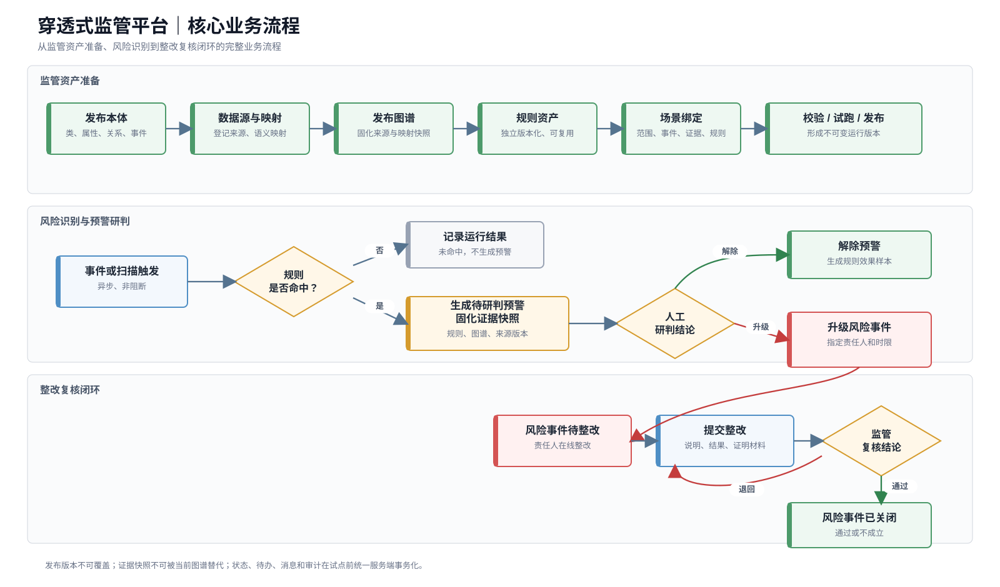

> 图10-2 核心业务流程图。以图形方式展示监管资产准备、规则命中、预警研判和风险事件整改复核闭环。

#### 10.1.3 核心数据模型

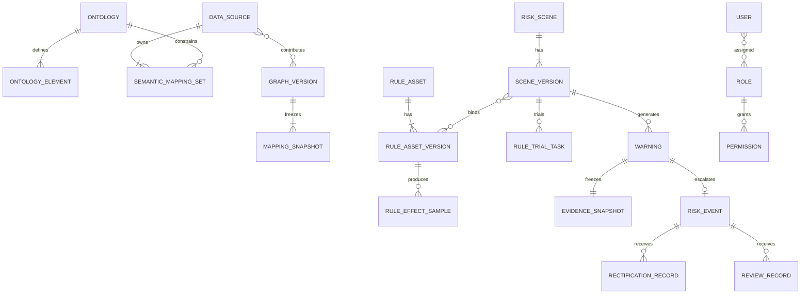

#### 10.1.4 核心状态机

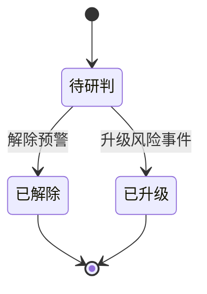

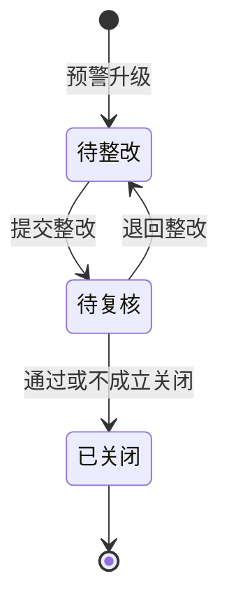

转派只改变处理人，不改变状态；事前、事中、事后是预警阶段字段；逾期由截止时间计算，不建立独立状态。

### 10.2 功能清单

> 图10-3 功能架构图。六个一级模块、页面和路由均与当前工程保持一致。

| 一级菜单 | 二级菜单 | 页面 | 路由 | 当前成熟度 |
| --- | --- | --- | --- | --- |
| 监管工作台 | — | 工作台首页 | `/workbench` | L2 |
| 监管态势 | — | 监管态势 | `/situation` | L2 |
| 风险监管 | 统一预警 | 预警列表、预警详情 | `/risk/warnings...` | L2 |
| 风险监管 | 风险事件 | 事件列表、事件详情 | `/risk/events...` | L2 |
| 场景与规则 | 风险场景 | 场景列表、场景编辑 | `/scenes...` | L3 |
| 场景与规则 | 规则管理 | 规则资产列表、规则编辑器 | `/rules...` | L3 |
| 本体与图谱 | 本体管理 | 本体列表、本体编辑 | `/ontology...` | L3 |
| 本体与图谱 | 数据接入 | 数据源与语义映射 | `/data-access...` | L3 |
| 本体与图谱 | 图谱管理 | 图谱列表、新建和编辑 | `/graphs...` | L3 |
| 系统管理 | 用户与组织 | 用户页 | `/system/users` | L2 |
| 系统管理 | 角色与权限 | 角色页 | `/system/roles` | L2 |
| 系统管理 | 审计日志 | 审计页 | `/system/audit` | L2 |

### 10.3 功能详细设计

通用页面交互规范：

> **v11.4合并与工程对齐说明：** 本章节以原始v10.6的页面布局、字段、操作、异常和业务规则为内容底座，并结合当前工程路由与数据边界修订。预警当前状态以“待研判、已解除、已升级”为准；风险事件当前状态以“待整改、待复核、已关闭”为准。原文中尚未落地的扩展研判动作标记为“目标态”并降为P1。规则资产独立版本化，可被多个场景版本引用。系统权限、风险闭环、证据快照和统一审计在试点前完成服务端化。

| 项目 | 统一规则 |
| --- | --- |
| 页面入口 | 一级或二级菜单进入列表/首页；详情、编辑、发布确认通过列表行或操作按钮进入 |
| 返回上下文 | 从列表进入详情后，返回时恢复查询条件、分页、排序和滚动位置 |
| 查询执行 | 点击“查询”或按Enter执行；条件变化不自动查询，避免大数据量页面频繁请求 |
| 查询重置 | 恢复页面默认条件并立即执行一次默认查询 |
| 分页 | 默认20条/页，可切换20、50、100；切换查询条件后回到第1页 |
| 排序 | 只允许对PRD明确标注的字段排序，默认使用业务优先级和更新时间倒序 |
| 抽屉 | 用于需要对照当前页面查看的详情、证据或轻量编辑 |
| 模态弹窗 | 用于二次确认、原因填写和不超过10个字段的操作表单 |
| 独立页面 | 用于字段多、步骤复杂、需要完整视野的编辑或详情场景 |
| 操作反馈 | 提交期间按钮加载并防重复；成功使用Toast并刷新相关区域；失败说明原因和恢复方式 |
| 高危操作 | 解除、升级、关闭、发布、实体合并拆分和权限调整必须二次确认、填写原因并记录审计 |
| 权限控制 | 菜单、按钮、字段、关系和证据均由服务端裁剪；前端不得先获取未授权明文 |
| 页面状态 | 每个页面至少说明加载中、空数据、无权限、加载失败、并发变化和部分数据不可用 |
| 时间展示 | 默认使用客户统一时区，展示到秒；业务时间与平台接收时间分别标识 |

#### 10.3.1 监管工作台

##### 10.3.1.1 功能介绍

| 项目 | 说明 |
| --- | --- |
| 功能目标 | 作为大多数用户登录后的默认入口，集中回答“我现在需要处理什么” |
| 使用角色 | 监管负责人、审计纪检人员、领域监管专员、业务责任人及管理类用户 |
| 触发条件 | 用户登录、点击一级菜单或从业务页面返回工作台 |
| 主要流程 | 见下方功能流程图 |
| 输入 | 当前用户、角色、组织权限、待办、业务对象状态和固定业务消息 |
| 输出 | 页面筛选上下文、来源对象跳转、待办处理结果和消息已读状态 |

**功能流程图**

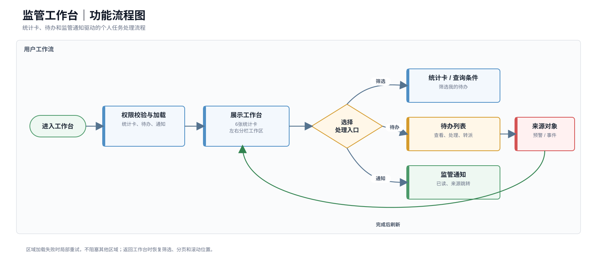

> 图10-4 监管工作台功能流程图。

##### 10.3.1.2 功能清单

| 页面/区域 | 功能 | 操作角色 | 优先级 |
| --- | --- | --- | --- |
| 工作台首页 | 展示待研判、待整改、待复核和逾期统计 | 全部授权用户 | P0 |
| 我的待办 | 查询、查看、处理和有权限转派待办 | 待办处理人、监管负责人 | P0 |
| 消息接收框 | 接收固定业务消息、标记已读并进入来源对象 | 全部授权用户 | P0 |

##### 10.3.1.3 功能详细设计

**（一）工作台首页**

**1. 页面布局**

1. 顶部为页面标题、数据更新时间和刷新按钮。
2. 第一行展示待研判、待整改、待复核、重大高风险、临期、已逾期6张统计卡。
3. 主体采用左右布局：左侧约70%展示“我的待办”，右侧约30%展示消息接收框。
4. 我的待办包含快捷筛选区、列表区和分页区；消息接收框包含未读数量、消息列表和全部已读按钮。
5. 点击统计卡只改变我的待办筛选条件，不跳转其他页面。
6. 从来源页面返回时恢复查询条件、分页、排序、滚动位置及消息展开位置。

**2. 查询条件与列表字段**

我的待办查询条件：

| 字段 | 控件 | 默认值 | 是否必填 | 可选范围/规则 |
| --- | --- | --- | --- | --- |
| 关键词 | 输入框 | 空 | 否 | 匹配待办编号、标题和来源对象名称 |
| 对象类型 | 多选下拉 | 全部 | 否 | 预警、核查任务、风险事件、整改复核 |
| 风险等级 | 多选下拉 | 全部 | 否 | 重大、高、中、低 |
| 当前环节 | 多选下拉 | 未结束环节 | 否 | 待研判、待整改、待复核 |
| 时限状态 | 单选下拉 | 全部 | 否 | 正常、临期、已逾期 |
| 截止时间 | 日期范围 | 不限 | 否 | 开始时间不得晚于结束时间 |

我的待办列表字段：

| 字段 | 数据来源 | 默认显示 | 排序 | 展示规则 |
| --- | --- | --- | --- | --- |
| 待办编号/标题 | 待办对象 | 是 | 否 | 标题最多两行，悬停显示全文 |
| 对象类型 | 来源对象 | 是 | 否 | 使用统一类型标签 |
| 风险等级 | 来源对象 | 是 | 是 | 重大、高、中、低统一颜色 |
| 当前环节 | 待办状态 | 是 | 否 | 展示业务状态，不展示技术状态码 |
| 处理截止时间 | 待办对象 | 是 | 是 | 临期橙色、逾期红色 |
| 当前处理人 | 待办对象 | 是 | 否 | 无处理人时显示“待分配” |
| 更新时间 | 待办对象 | 否 | 是 | 展示最近业务更新时间 |
| 操作 | 权限计算 | 是 | 否 | 查看、处理、按权限转派 |

消息接收框字段：

| 字段 | 展示规则 |
| --- | --- |
| 消息类型 | 预警、转派、退回、整改、复核、临期、逾期 |
| 消息摘要 | 展示不超过两行的业务摘要，按字段权限脱敏 |
| 来源对象 | 展示对象类型和编号，点击后进入来源页面 |
| 发送时间 | 相对时间与完整时间悬停提示 |
| 已读状态 | 未读使用醒目标识，已读弱化展示 |

**3. 操作交互**

| 操作 | 入口 | 前置条件 | 交互形式 | 成功反馈 | 失败处理 | 权限/审计 |
| --- | --- | --- | --- | --- | --- | --- |
| 点击统计卡 | 统计卡 | 卡片可见 | 刷新待办筛选和列表 | 高亮卡片并更新数量 | 保留原列表并提示重试 | 无独立审计 |
| 查询 | 查询区 | 条件合法 | 当前页刷新 | 更新列表和总数 | 保留条件并提示失败原因 | 按数据权限查询 |
| 重置 | 查询区 | 无 | 恢复默认条件并查询 | 返回默认列表 | 查询失败时保留默认条件 | 无独立审计 |
| 查看待办 | 列表标题/查看 | 有来源对象查看权限 | 跳转对应详情页 | 来源页加载成功 | 无权限或对象失效时明确提示 | 记录敏感对象访问 |
| 处理待办 | 行操作 | 当前用户为处理人且状态允许 | 跳转或打开对应办理表单 | 成功后返回并刷新该行及卡片 | 状态冲突时提示刷新 | 记录业务操作 |
| 转派 | 行操作 | 有转派权限且待办未结束 | 模态弹窗选择责任人并填写原因 | Toast提示成功，刷新处理人 | 候选人失效或并发时不提交 | 记录前后处理人和原因 |
| 点击消息 | 消息行 | 来源对象仍可访问 | 重新校验权限后跳转 | 自动标记已读 | 无权时只提示权限不足 | 记录敏感来源访问 |
| 单条已读 | 消息行 | 消息未读 | 局部更新 | 未读数减1 | 保持未读并提示重试 | 记录消息状态 |
| 全部已读 | 消息框顶部 | 存在未读消息 | 二次确认后批量更新 | 未读数清零 | 显示失败条数并可重试 | 记录批量操作 |

**4. 页面状态与异常**

| 状态/异常 | 触发条件 | 页面表现 | 可用操作 | 恢复方式 |
| --- | --- | --- | --- | --- |
| 初次加载 | 进入页面 | 卡片、列表和消息框分别显示骨架屏 | 暂不可处理 | 各区域独立加载完成 |
| 无待办 | 默认范围内无待办 | 展示“当前无待办事项” | 可调整筛选 | 修改条件后查询 |
| 无消息 | 无历史消息 | 展示空状态，不隐藏消息框 | 无 | 新消息到达后刷新 |
| 区域加载失败 | 待办或消息接口失败 | 失败区域显示错误，不影响其他区域 | 重试 | 单独重载失败区域 |
| 来源对象失效 | 消息或待办指向对象不存在 | 提示对象已失效，保留待办/消息元数据 | 返回 | 管理员处理异常数据 |
| 权限被收回 | 页面打开后权限变化 | 隐藏敏感摘要并阻止跳转 | 返回或刷新 | 刷新最新权限 |
| 并发处理 | 他人已完成或转派待办 | 行状态更新并提示已变化 | 查看最新状态 | 刷新当前行 |
| 数量不一致 | 卡片与列表汇总时间不同 | 展示最近更新时间并自动重算 | 刷新 | 重新获取同一统计快照 |

**模块业务规则与验收**

| 编号 | 类型 | 规则 |
| --- | --- | --- |
| WB-R1 | 事实 | 逾期由截止时间和当前时间计算，不作为独立状态 |
| WB-R2 | 约束 | 用户只能查看本人待办或授权组织范围内待办 |
| WB-R3 | 触发条件 | 来源对象完成当前环节后自动关闭待办并生成下一环节待办 |
| WB-R4 | 约束 | 停用用户前必须转派其未完成待办 |
| WB-R5 | 约束 | 消息不替代待办，不参与待办数量统计 |
| WB-R6 | 触发条件 | 点击消息时重新校验来源对象、字段和证据权限 |

验收要求：普通用户登录默认进入工作台；统计卡与待办列表使用同一统计快照；消息能够正确跳转授权来源对象；已读状态可保存；区域加载失败互不影响；无权限消息不得泄露敏感内容。

##### 10.3.1.4 应用操作

以下应用操作按当前工程活动路由、可见页面、真实字段、按钮、状态机和接口边界编写；同一页面内的连续操作合并为一条页面级评审记录。

| 功能名称 | 位置/用户路径 | 原型 | 产品逻辑（页面结构/交互/策略设计） | 对应文案 | 优先级 | 评审意见 | 备注 |
| --- | --- | --- | --- | --- | --- | --- | --- |
| 监管工作台 | 一级菜单“监管工作台” | [图片] | <strong>页面结构：</strong> 页面顶部展示统计快照时间和“刷新”按钮；主体上方横向展示“待研判预警、待整改事件、待复核事件、已逾期”4张统计卡。 图1 页面下方采用左右分栏：左侧为“我的待办”，右侧为“消息接收框”。待办区包含关键词、对象类型、状态、时限状态筛选项及查询、重置和分页控件。 图2 待办列表展示待办编号/标题、对象类型、风险等级、状态、截止时间、当前处理人和操作；消息区展示未读数量、消息标题、时间及来源对象入口。 图3 待办转派使用弹窗，展示当前处理人，并填写新处理人和转派原因；消息详情使用抽屉展示。 图4  <strong>交互逻辑：</strong> 1. 用户登录后进入监管工作台，系统按当前角色、监管范围和本人身份加载4张统计卡、本人待办和业务消息。 2. 用户点击任一统计卡，系统切换对应待办筛选条件并高亮当前卡片；再次点击同一卡片可取消卡片筛选。 图1 3. 用户可按关键词、对象类型、状态、时限状态查询待办；点击“重置”恢复默认条件，查询或重置后分页回到第1页。 图2 4. 用户点击待办标题，或点击行内“研判、整改、复核”，系统按待办route进入对应统一预警详情或风险事件详情。 图3 5. 用户点击“转派”，打开转派弹窗；选择不同于当前处理人的新处理人并填写原因后确认，系统仅更新当前处理人，不改变预警或风险事件业务状态。 图4 6. 用户点击消息打开消息抽屉；可将消息标记为未读、进入来源对象，或在消息区执行“全部已读”，未读数量同步更新。 图5 7. 用户点击页面“刷新”，系统重新加载工作台展示数据并更新最近刷新提示；任一区域为空时分别展示待办或消息空状态。  <strong>策略设计：</strong> 统计卡与待办列表使用同一待办任务对象计算，消息不计入待办数量。 转派同步更新对应待办处理人并记录操作留痕；页面只展示当前用户有权访问或处理的对象。  <strong>异常处理：</strong> 待办或来源对象不存在时阻止跳转并提示对象已失效或无权访问。 转派未选择新处理人、原因为空或新旧处理人相同时不提交，并保留弹窗内容。 当前工程刷新和部分待办、消息数据使用本地状态，刷新失败时保留当前页面数据。 | 页面标题：监管工作台； 卡片：待研判预警 / 待整改事件 / 待复核事件 / 已逾期； 空状态：暂无待办事项 / 暂无消息； 成功提示：待办已转派给{处理人} / 已全部标为已读。 | P0 | 待评审 | 与当前OverviewPages.tsx和store.ts一致；工作台业务状态当前主要由Zustand本地持久化维护，试点前需接入服务端统一待办与消息。 |

#### 10.3.2 监管态势

##### 10.3.2.1 功能介绍

| 项目 | 说明 |
| --- | --- |
| 功能目标 | 为集团领导、监管负责人、审计纪检和领域监管专员提供全局风险态势入口 |
| 使用角色 | 集团领导、监管负责人、审计纪检人员、领域监管专员 |
| 触发条件 | 用户点击“监管态势”一级菜单，或纯查看角色登录后按配置进入 |
| 主要流程 | 见下方功能流程图 |
| 输入 | 权限范围内的预警、风险事件、核查整改状态、组织和领域维度 |
| 输出 | 汇总指标、趋势分布、重点事项及带筛选条件的下钻链接 |

**功能流程图**

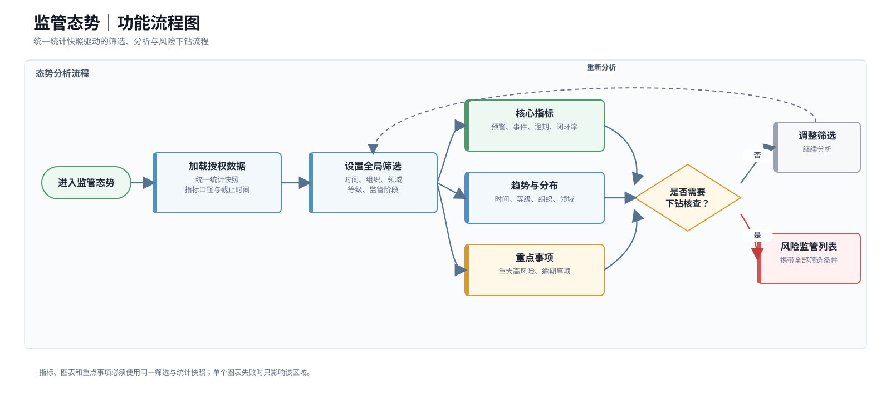

> 图10-5 监管态势功能流程图。

##### 10.3.2.2 功能清单

| 页面区域 | 功能 | 优先级 |
| --- | --- | --- |
| 全局筛选区 | 按时间、组织、监管领域、风险等级和预警阶段筛选 | P0 |
| 核心指标区 | 展示预警总量、重大高风险、待处置、风险事件、逾期事项和闭环率 | P0 |
| 态势分析区 | 展示预警趋势、风险等级分布、组织领域分布和整改状态 | P0 |
| 重点事项区 | 展示重大高风险预警、逾期风险事件和重点组织 | P0 |
| 指标下钻 | 从指标、图表或重点事项进入预警或风险事件列表 | P0 |

##### 10.3.2.3 功能详细设计

**（一）监管态势大盘**

**1. 页面布局**

1. 顶部为页面标题、全局筛选条件、数据最近更新时间和刷新按钮。
2. 第一屏展示6张核心指标卡，按风险重要程度排列。
3. 第二屏左侧展示预警趋势，右侧展示风险等级分布。
4. 第三屏左侧展示组织/领域风险分布，右侧展示风险处置状态。
5. 底部展示重大高风险事项、逾期事项和重点组织列表。
6. 综合态势、预警态势和风险处置态势使用页面内页签；切换页签保留全局筛选条件。

**2. 筛选条件、指标与列表字段**

全局筛选条件：

| 条件 | 控件 | 默认值 | 是否必填 | 规则 |
| --- | --- | --- | --- | --- |
| 时间范围 | 日期范围/快捷选项 | 最近30天 | 是 | 支持近7天、30天、90天和自定义 |
| 组织范围 | 组织树多选 | 当前授权组织 | 是 | 只能选择授权节点及下级 |
| 监管领域 | 多选下拉 | 全部授权领域 | 否 | 选项由用户领域权限裁剪 |
| 风险等级 | 多选下拉 | 全部 | 否 | 重大、高、中、低 |
| 预警阶段 | 多选下拉 | 全部 | 否 | 事前、事中、事后 |
| 数据口径时间 | 只读 | 最近成功统计时间 | — | 所有组件使用同一快照 |

核心指标：

| 指标 | 口径 | 点击下钻 |
| --- | --- | --- |
| 预警总量 | 筛选范围内去重预警数量 | 统一预警列表 |
| 重大高风险预警 | 风险等级为重大或高的预警数量 | 带等级筛选的预警列表 |
| 待处置预警 | 待研判预警数量 | 带状态筛选的预警列表 |
| 风险事件 | 筛选范围内风险事件数量 | 风险事件列表 |
| 逾期事项 | 截止时间早于当前时间且未结束的任务或风险事件数量 | 逾期对象列表 |
| 闭环率 | 已解除预警和已关闭风险事件/应处理对象 | 已结束对象列表 |

重点事项列表字段：

| 字段 | 数据来源 | 默认显示 | 排序 | 展示规则 |
| --- | --- | --- | --- | --- |
| 对象编号/标题 | 预警或风险事件 | 是 | 否 | 点击进入详情 |
| 对象类型 | 业务对象 | 是 | 否 | 预警、风险事件 |
| 风险等级 | 业务对象 | 是 | 是 | 默认重大、高优先 |
| 组织/领域 | 业务对象 | 是 | 否 | 按权限展示 |
| 当前状态 | 业务对象 | 是 | 否 | 使用统一状态标签 |
| 责任人 | 任务/风险事件 | 是 | 否 | 未分配显示“待分配” |
| 截止时间 | 任务/风险事件 | 是 | 是 | 逾期红色 |
| 生成时间 | 业务对象 | 否 | 是 | 默认倒序 |

**3. 操作交互**

| 操作 | 入口 | 前置条件 | 交互形式 | 成功反馈 | 失败处理 | 权限/审计 |
| --- | --- | --- | --- | --- | --- | --- |
| 查询 | 筛选区 | 时间和组织合法 | 刷新全部组件 | 更新数据口径时间 | 保留原图表并提示重试 | 按组织领域权限 |
| 重置 | 筛选区 | 无 | 恢复默认范围 | 重新加载默认态势 | 保留默认条件 | 无独立审计 |
| 手动刷新 | 顶部 | 无正在执行查询 | 获取最近统计快照 | 更新时间更新 | 显示最后成功时间 | 记录刷新性能 |
| 指标卡下钻 | 指标卡 | 卡片数量大于0 | 跳转对应列表并带筛选 | 列表展示相同数量范围 | 无权限时阻止跳转 | 记录下钻埋点 |
| 图表下钻 | 图形元素 | 当前维度可下钻 | 跳转列表或更新重点事项 | 保留筛选来源标签 | 维度无明细时提示 | 按数据权限 |
| 查看重点事项 | 列表标题 | 有对象权限 | 跳转详情 | 返回后恢复大盘上下文 | 对象失效时提示 | 敏感访问审计 |
| 切换页签 | 页签 | 页签有权限 | 保留筛选，切换组件 | 当前页签高亮 | 加载失败只影响页签 | 无独立审计 |
| 查看指标口径 | 指标卡说明 | 无 | 打开抽屉 | 展示公式、范围和更新时间 | 口径不可用时提示 | 无 |

**4. 页面状态与异常**

| 状态/异常 | 触发条件 | 页面表现 | 可用操作 | 恢复方式 |
| --- | --- | --- | --- | --- |
| 初次加载 | 进入大盘 | 筛选区可用，指标和图表显示骨架屏 | 修改筛选 | 加载完成 |
| 无数据 | 筛选范围无业务数据 | 指标显示0，图表和列表显示空状态 | 修改筛选 | 重新查询 |
| 部分数据延迟 | 某来源或汇总任务未完成 | 受影响组件标注延迟和最后成功时间 | 查看其他组件、重试 | 汇总完成后刷新 |
| 查询超时 | 组织或时间范围过大 | 保留上次成功结果并提示缩小范围 | 修改条件、重试 | 使用更小范围 |
| 无权限 | 无监管态势权限 | 展示无权限页，不请求汇总明细 | 返回工作台 | 管理员授权 |
| 下钻数量不一致 | 下钻时数据已变化 | 列表展示最新数量并提示统计时间差 | 查看列表 | 刷新大盘 |
| 组件加载失败 | 单个图表接口失败 | 失败组件显示重试，不影响其他区域 | 单独重试 | 重新加载组件 |
| 权限变化 | 页面打开后数据权限收回 | 立即清除受限组件和缓存 | 刷新 | 重新按权限加载 |

**模块业务规则与验收**

1. 所有指标、图表和重点事项必须使用同一筛选条件、权限范围和统计快照。
2. 下钻时必须携带来源组件、筛选条件和统计时间，列表页展示来源筛选标签。
3. 页面必须展示数据最近更新时间和指标口径，不使用模拟数据补齐空值。
4. 首批不支持用户自定义指标、拖拽报表、复杂专题大屏和跨页面自由分析。
5. 验收时大盘指标与同一统计时间点的下钻列表一致；越权组织和对象不可见；默认范围首屏P95不超过5秒。

##### 10.3.2.4 应用操作

以下应用操作按当前工程活动路由、可见页面、真实字段、按钮、状态机和接口边界编写；同一页面内的连续操作合并为一条页面级评审记录。

| 功能名称 | 位置/用户路径 | 原型 | 产品逻辑（页面结构/交互/策略设计） | 对应文案 | 优先级 | 评审意见 | 备注 |
| --- | --- | --- | --- | --- | --- | --- | --- |
| 监管态势 | 一级菜单“监管态势” | [图片] | <strong>页面结构：</strong> 页面头部展示“分析视图、BI大屏、统计快照、刷新”入口；筛选区包含时间范围、组织范围、监管领域、风险等级、预警阶段。 图1 页面提供“综合态势、预警态势、风险处置态势”3个页签，并展示本期预警总量、在办风险事件、重大风险事件、逾期风险事件、按期闭环率5项指标。 图2 图表区展示预警趋势、风险等级结构、组织风险排行和风险处置进展；下方展示重点事项列表。 图3 点击指标后使用抽屉展示指标口径和明细摘要，抽屉提供“进入明细”；BI大屏以覆盖层方式展示。 图4  <strong>交互逻辑：</strong> 1. 用户点击一级菜单“监管态势”进入页面，系统按当前监管范围加载默认时间段内的5项指标、4类图表和重点事项。 2. 用户调整时间范围、组织范围、监管领域、风险等级或预警阶段后执行查询，系统使用同一组筛选条件和统计快照刷新指标、图表及重点事项。 图1 3. 用户可切换“综合态势、预警态势、风险处置态势”页签，系统保留当前筛选条件，仅切换对应分析内容。 图2 4. 用户点击指标卡，打开指标明细抽屉；点击“进入明细”，系统携带指标类型、筛选条件和统计快照进入统一预警或风险事件列表。 图4 5. 用户点击图表数据点、等级结构、组织排行或处置进展项，系统将点击维度转换为列表查询参数并进入对应明细页。 图5 6. 用户点击“BI大屏”进入全屏态势覆盖层，关闭后返回原分析视图并保留筛选和页签状态。 图6 7. 用户点击“刷新”，系统重新计算当前条件下的态势数据；单个指标或图表加载失败时，仅在对应组件展示重试。  <strong>策略设计：</strong> 所有指标、图表、重点事项和下钻明细必须共享同一权限范围、筛选条件和统计快照。 下钻参数保留来源组件和快照时间，避免大盘数值与列表口径不一致。  <strong>异常处理：</strong> 无权组织或对象不参与统计，也不在下钻结果中显示。 单组件加载失败不阻塞其他组件；页面保留上次成功结果并提供局部重试。 当前工程态势数据为前端聚合演示，试点前需由服务端统计接口统一口径。 | 页面标题：监管态势； 页签：综合态势 / 预警态势 / 风险处置态势； 操作：进入明细 / BI大屏 / 刷新； 异常提示：该组件加载失败，请重试。 | P0 | 待评审 | 与当前SituationPage一致；图表下钻和BI大屏已具备交互，统计服务和快照一致性仍需服务端落地。 |

#### 10.3.3 风险监管

##### 10.3.3.1 功能介绍

| 项目 | 说明 |
| --- | --- |
| 功能目标 | 在同一能力域内完成预警研判、核查复核和确认风险后的整改关闭 |
| 使用角色 | 监管负责人、审计纪检人员、领域监管专员、业务责任人 |
| 业务对象 | 预警与风险事件保持独立编号、独立状态和完整追溯关系 |
| 主要流程 | 见下方功能流程图 |
| 输入 | 已发布场景规则、图谱事实、证据快照、研判结论和整改材料 |
| 输出 | 预警处置结论、风险事件、整改复核记录、审计记录和后台效果样本 |

**功能流程图**

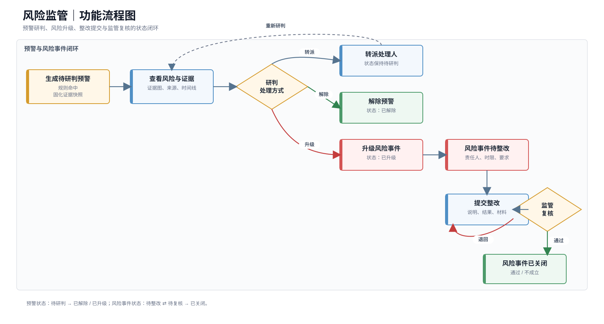

> 图10-6 风险监管功能流程图。

##### 10.3.3.2 功能清单

| 二级菜单 | 页面 | 功能 | 操作角色 | 优先级 |
| --- | --- | --- | --- | --- |
| 统一预警 | 预警列表页 | 查询事前、事中、事后预警并发起处置 | 监管人员 | P0 |
| 统一预警 | 预警详情页 | 查看规则解释、证据子图、时间轴、证据和版本 | 监管人员、授权审计人员 | P0 |
| 统一预警 | 预警列表、预警详情和处置表单 | 完成查询、证据查看、转派、解除和升级 | 监管人员、授权审计人员 | P0 |
| 风险事件 | 风险事件列表页 | 查询已确认风险和整改进度 | 监管人员 | P0 |
| 风险事件 | 风险事件详情页 | 查看风险事实、证据、整改反馈和复核记录 | 监管人员、业务责任人 | P0 |
| 风险事件 | 事件列表、事件详情和整改复核表单 | 完成责任转派、整改提交、退回和关闭 | 监管人员、业务责任人 | P0 |

##### 10.3.3.3 功能详细设计

**（一）统一预警列表页**

**1. 页面布局**

1. 页面顶部为标题、数据更新时间和刷新按钮。
2. 查询区默认展开常用条件，高级条件可折叠。
3. 列表区上方展示当前结果数量、已生效筛选标签和列设置入口。
4. 列表使用分页，不提供批量解除、批量升级和批量导出。
5. 点击预警编号或“查看”进入预警详情，返回后恢复列表上下文。

**2. 查询条件与列表字段**

查询条件：

| 字段 | 控件 | 默认值 | 是否必填 | 规则 |
| --- | --- | --- | --- | --- |
| 关键词 | 输入框 | 空 | 否 | 匹配预警编号、标题和目标对象名称 |
| 预警阶段 | 多选下拉 | 全部 | 否 | 事前、事中、事后 |
| 处理状态 | 多选下拉 | 待研判 | 否 | 待研判、已解除、已升级 |
| 风险等级 | 多选下拉 | 全部 | 否 | 重大、高、中、低 |
| 风险场景 | 搜索多选 | 全部授权场景 | 否 | 只返回用户可见场景 |
| 目标事件 | 搜索多选 | 全部 | 否 | 来自已发布本体事件 |
| 组织范围 | 组织树多选 | 当前授权组织 | 是 | 服务端按组织权限裁剪 |
| 生成时间 | 日期范围 | 最近30天 | 是 | 开始时间不得晚于结束时间 |
| 是否越过事前窗口 | 单选下拉 | 全部 | 否 | 是、否 |
| 证据状态 | 多选下拉 | 全部 | 否 | 完整、部分缺失、权限受限、快照异常 |

列表字段：

| 字段 | 数据来源 | 默认显示 | 排序 | 展示规则 |
| --- | --- | --- | --- | --- |
| 预警编号/标题 | 预警 | 是 | 否 | 点击进入详情，标题最多两行 |
| 预警阶段 | 系统计算 | 是 | 否 | 事前、事中、事后 |
| 风险场景 | 场景版本 | 是 | 否 | 展示名称和版本 |
| 目标对象/目标事件 | 图谱对象/事件 | 是 | 否 | 敏感名称按权限脱敏 |
| 风险等级 | 预警 | 是 | 是 | 使用统一等级标签 |
| 核心路径摘要 | 快照 | 是 | 否 | 展示排名第一的实际命中路径 |
| 处理状态 | 预警 | 是 | 否 | 使用统一状态标签 |
| 目标预计时间 | 事件 | 是 | 是 | 无预计时间时显示“未提供” |
| 提前量 | 系统计算 | 否 | 是 | 目标时间减预警生成时间 |
| 证据状态 | 快照 | 是 | 否 | 完整、缺失、受限、异常 |
| 生成时间 | 预警 | 是 | 是 | 默认倒序 |
| 操作 | 权限计算 | 是 | 否 | 查看、转派、观察、解除、升级 |

**3. 操作交互**

| 操作 | 入口 | 前置条件 | 交互形式 | 成功反馈 | 失败处理 | 权限/审计 |
| --- | --- | --- | --- | --- | --- | --- |
| 查询/重置 | 查询区 | 查询条件合法 | 刷新列表 | 更新数量和筛选标签 | 保留条件并提示原因 | 按数据权限 |
| 查看预警 | 编号/查看 | 有预警查看权限 | 跳转详情页 | 打开历史证据快照 | 无权时阻止跳转 | 敏感访问审计 |
| 转派 | 行操作 | 状态为待研判 | 打开转派弹窗 | 处理人更新，状态保持待研判并生成待办 | 并发变化时提示刷新 | 记录责任人、时限和要求 |
| 补充关注信息（目标态） | 行操作 | 状态允许且有处理权限 | 填写原因和下次关注时间 | 状态更新并生成关注记录 | 原因缺失不提交 | 记录原因 |
| 解除预警 | 行操作 | 状态允许且具备解除权限 | 高危确认弹窗 | 状态变为已解除 | 证据或原因不足时拦截 | 完整审计 |
| 升级风险事件 | 行操作 | 状态允许且具备升级权限 | 打开升级确认页 | 创建风险事件并更新预警状态 | 重复升级时返回已有事件 | 完整审计 |
| 刷新 | 页面顶部 | 无 | 保留筛选重新查询 | 更新时间更新 | 保留原列表 | 无独立审计 |

**4. 页面状态与异常**

| 状态/异常 | 触发条件 | 页面表现 | 可用操作 | 恢复方式 |
| --- | --- | --- | --- | --- |
| 初次加载 | 进入页面 | 查询区可用，列表骨架屏 | 修改条件 | 加载完成 |
| 无查询结果 | 当前条件无数据 | 展示空状态和已生效条件 | 重置、修改条件 | 重新查询 |
| 查询超时 | 范围过大或服务超时 | 保留原结果，提示缩小范围 | 修改条件、重试 | 再次查询 |
| 证据快照异常 | 预警快照失败 | 行内显示异常标签 | 查看详情 | 进入补偿流程 |
| 状态并发变化 | 他人已处理预警 | 当前行刷新并提示最新状态 | 查看最新详情 | 重新执行允许操作 |
| 权限变化 | 数据权限被收回 | 移除对应行和缓存 | 刷新 | 按最新权限查询 |
| 目标对象受限 | 仅有预警权限无对象权限 | 展示受限占位 | 查看允许摘要 | 管理员授权 |
| 数据量超限 | 结果超过平台上限 | 强制分页并提示增加条件 | 增加筛选 | 缩小结果范围 |

**（二）预警详情页**

**1. 页面布局**

**页面入口与上下文**

用户可从监管工作台待办、统一预警中心列表以及风险事件详情中的“来源预警”进入预警详情。

进入页面时，系统重新校验用户对预警、目标对象、关系、证据和附件的查看权限。用户从列表或工作台进入时，保留原查询条件、页码和滚动位置；点击“返回”后恢复进入前上下文。

风险事件中的来源预警入口默认打开预警生成时初始证据快照，不展示当前图谱或后续数据替代结果。

**页面整体布局**

PC端最低适配宽度为1366像素。页面由顶部摘要区、左侧风险解释区、中间证据工作区、右侧详情抽屉和底部操作栏组成。

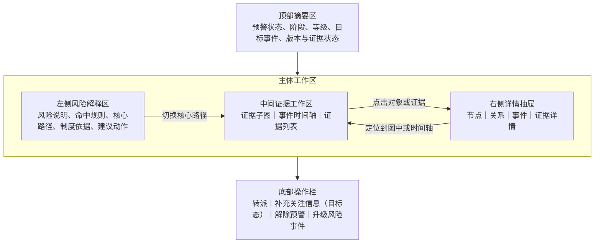

| 页面区域 | 建议尺寸/形态 | 默认内容 | 交互规则 |
| --- | --- | --- | --- |
| 顶部摘要区 | 全宽，高度自适应 | 预警编号、标题、阶段、状态、等级、目标事件、预计时间、提前量、证据状态 | 页面滚动时保持在顶部，信息过多时分两行展示 |
| 左侧风险解释区 | 280至320像素，可收起 | 风险说明、命中规则、实际命中字段、制度依据、建议动作、核心路径列表 | 默认展开；用户可收起以扩大证据区域 |
| 中间证据工作区 | 自适应，占主要宽度 | 证据子图、事件时间轴、证据列表三个页签 | 默认打开证据子图；切换页签不丢失当前路径和选中对象 |
| 右侧详情抽屉 | 480至560像素，按需打开 | 节点详情、关系详情、事件详情或证据详情 | 点击画布元素、时间轴事件或证据行后打开；同一时间只展示一个详情对象 |
| 底部操作栏 | 全宽固定，高度约64像素 | 转派、补充关注信息（目标态）、解除预警、升级风险事件 | 根据预警状态和权限动态展示；不随页面滚动消失 |

**顶部摘要区**

| 字段 | 展示规则 |
| --- | --- |
| 预警编号/标题 | 标题超过两行省略，悬停展示完整内容 |
| 预警阶段 | 事前、事中、事后；由系统计算 |
| 预警状态 | 待研判、已解除、已升级 |
| 风险等级 | 重大、高、中、低，使用统一风险等级标签 |
| 目标对象/目标事件 | 支持点击目标对象打开对象摘要抽屉 |
| 预计发生时间/提前量 | 已越过事前窗口时展示醒目标识和实际越过时间 |
| 版本信息 | 展示本体版本、图谱版本、规则版本和快照编号 |
| 证据状态 | 完整、部分缺失、权限受限、快照异常 |
| 最近处理信息 | 最近处理人、处理时间和当前责任人 |

顶部右侧提供“返回”“刷新”和“复制预警编号”。刷新只刷新预警状态、任务和权限，不使用当前图谱覆盖历史快照。

**左侧风险解释区**

左侧按以下顺序展示：

1. 风险说明：业务化描述风险事实和可能影响。
2. 命中规则：规则名称、编码、版本、实际命中值和判断结果。
3. 核心路径列表：最多2条，展示路径摘要、跳数、关联规则和证据完整度。
4. 制度依据：制度名称、版本、条款编号和适用说明。
5. 建议动作：核查建议、材料要求和默认处理时限。

用户切换核心路径时，中间证据子图高亮对应路径，事件时间轴和证据列表自动增加当前路径筛选标签。路径切换不重新查询图谱。

**2. 页面展示字段**

**证据子图页签**

证据子图用于展示本次规则实际命中的实体、关系、事件及必要上下文。

子图工具栏：

| 控件 | 功能 | 首批边界 |
| --- | --- | --- |
| 核心路径切换 | 在最多2条核心路径之间切换 | 不支持查询新路径 |
| 关系类型筛选 | 仅隐藏或显示快照内已有关系 | 不触发后台扩图 |
| 有效时间筛选 | 过滤快照内指定有效时间范围的关系和事件 | 不查询当前图谱 |
| 放大/缩小 | 调整画布比例 | 不改变数据范围 |
| 适配画布 | 将当前全部可见节点适配到画布 | — |
| 图例 | 展示节点角色、关系样式、受限对象和低置信样式 | — |
| 全屏查看 | 全屏展示当前快照和筛选条件 | 退出后恢复详情页上下文 |
| 重置视图 | 恢复默认路径、比例和筛选 | — |

节点展示语义：

| 节点角色 | 展示要求 |
| --- | --- |
| 目标对象 | 使用主对象样式，始终显示名称和类型 |
| 直接命中对象 | 使用风险命中样式，显示命中规则数量 |
| 关联对象 | 使用普通关联样式，弱化展示 |
| 事件节点 | 展示事件名称和事件时间 |
| 证据节点 | 展示证据类型和可用状态 |
| 受限对象 | 仅展示“受限对象”占位，不泄露名称、类型、属性和来源 |

关系展示语义：

- 直接参与规则判断的关系使用命中样式；
- 仅用于理解上下文的关系使用弱化样式；
- 低置信关系使用待核查样式，并展示置信度提示；
- 关系标签显示业务名称，悬停展示方向、有效时间和来源摘要；
- 用户点击节点或关系后打开对应详情抽屉，并在画布中保持选中状态。

首批不支持节点展开、自由路径查询、编辑关系、发起纠错、当前图谱对比和子图导出。

**事件时间轴页签**

事件时间轴默认按业务事件时间升序排列，目标事件使用独立标识，预计事件和已发生事件在样式上区分。

时间轴事件字段：

| 字段 | 说明 |
| --- | --- |
| 事件名称/类型 | 本体事件业务名称和编码 |
| 事件时间 | 业务实际发生时间；预计事件展示预计时间 |
| 事件主体/客体 | 关联的实体名称和类型 |
| 状态前值/后值 | 状态变化事件展示 |
| 关键属性 | 金额、数量、审批结论、操作人等 |
| 来源系统 | 事件来源系统和来源记录编号 |
| 时间质量 | 准时、迟到、预计、时间缺失 |
| 关联路径/规则 | 该事件参与的核心路径和规则 |
| 证据数量 | 关联证据条数及可用状态 |

时间轴交互：

1. 点击事件卡片打开事件详情抽屉。
2. 点击“定位到图中”切换到证据子图页签并高亮关联节点和关系。
3. 点击证据数量切换到证据列表页签并按当前事件过滤。
4. 迟到事件展示平台接收时间和延迟时长。
5. 时间缺失事件只能作为辅助信息，不得显示为确定的时序依据。

**证据列表页签**

证据列表用于查看支撑规则、关系和事件的来源记录、附件、制度依据和运行明细。

查询条件：

| 条件 | 类型 | 默认值 |
| --- | --- | --- |
| 证据类型 | 多选 | 全部 |
| 关联对象 | 搜索选择 | 全部 |
| 关联路径 | 单选 | 当前路径或全部路径 |
| 来源系统 | 多选 | 全部 |
| 证据状态 | 多选 | 可用、缺失、失效、权限受限 |
| 形成时间 | 日期范围 | 不限 |

列表字段：

| 字段 | 默认显示 | 说明 |
| --- | --- | --- |
| 证据编号/名称 | 是 | 点击打开证据详情与预览抽屉 |
| 证据类型 | 是 | 来源记录、审批记录、合同单据、资金记录、附件、外部数据、制度条款、规则运行 |
| 关联对象 | 是 | 关联实体、关系或事件 |
| 关联路径/规则 | 是 | 参与的path_id和规则名称 |
| 来源系统 | 是 | 来源系统和来源记录编号 |
| 业务发生时间 | 是 | 证据对应业务时间 |
| 版本/内容哈希 | 否 | 附件版本、来源快照版本和内容校验值 |
| 证据状态 | 是 | 可用、缺失、失效、权限受限 |
| 密级 | 是 | 普通、内部、敏感、强敏感 |
| 操作 | 是 | 查看、定位、来源追溯、单项下载 |

操作规则：

- 查看：打开证据详情与预览抽屉；
- 定位：根据证据关联类型定位到图谱节点、关系或时间轴事件；
- 来源追溯：二次权限校验后打开来源记录摘要；允许项目配置跳转源系统；
- 单项下载：仅附件类证据且用户具备下载权限时展示，记录审计日志；
- 首批不提供批量下载和证据包导出。

**节点详情抽屉**

| 字段分组 | 展示内容 |
| --- | --- |
| 基本信息 | 本体类、对象名称、实体ID、风险标签、归属组织 |
| 关键属性 | 本体配置的默认展示属性及本次规则命中字段 |
| 时间信息 | 实体有效时间、平台发现时间、最近更新时间 |
| 来源信息 | 来源系统、来源实体、来源主键和实体识别方式 |
| 版本信息 | 本体版本、映射版本和图谱版本 |
| 关联规则 | 节点参与的规则、路径和命中角色 |
| 关联证据 | 证据数量、证据状态和查看入口 |

敏感属性根据权限显示明文、脱敏值或隐藏占位。来源记录超过5条时默认折叠，支持在抽屉内展开查看。

**关系详情抽屉**

| 字段分组 | 展示内容 |
| --- | --- |
| 关系信息 | 关系名称、编码、方向、源对象和目标对象 |
| 关系属性 | 比例、金额、角色、状态等本体定义属性 |
| 时间信息 | 有效开始、有效结束、平台发现时间 |
| 可信信息 | 置信度、识别方式和待核查标识 |
| 来源信息 | 来源系统、来源记录和映射版本 |
| 命中作用 | 是否直接参与规则判断、关联规则和path_id |
| 关联证据 | 支撑该关系的来源记录、附件和外部数据 |

用户点击源对象或目标对象时，在当前抽屉内切换到对应节点详情，并提供返回关系详情入口。

**事件详情抽屉**

展示事件名称、事件编码、主体、客体、事件时间、预计时间、状态前后值、事件属性、来源系统、接收时间、去重键、关联规则、关联路径和证据。

**证据详情与预览抽屉**

抽屉顶部展示证据名称、类型、状态、密级、来源系统、来源记录、版本和形成时间。

预览规则：

| 证据类型 | 预览方式 |
| --- | --- |
| 业务来源记录 | 结构化字段摘要，支持查看来源记录 |
| 审批记录 | 展示节点、审批人、意见、时间和结论 |
| PDF/图片/文本附件 | 抽屉内预览；复杂文件支持全屏预览 |
| 不支持在线预览的附件 | 展示文件元数据，具备权限时允许单项下载 |
| 外部数据 | 展示查询来源、查询时间、有效期和结果摘要 |
| 制度条款 | 展示制度名称、版本、条款编号和条款内容 |
| 规则运行明细 | 展示规则条件、实际值、计算过程和运行时间 |

预览抽屉提供“定位到图中/时间轴”“来源追溯”“单项下载”操作。附件失效或来源不可访问时保留元数据和历史状态，不显示空白预览。

**预警证据子图规则**

| 项目 | 首批规则 |
| --- | --- |
| 数据范围 | 只包含本次规则实际命中的实体、关系、事件及必要上下文 |
| 路径数量 | 默认最多2条，按规则权重、证据完整度和路径长度排序 |
| 跳数和规模 | 默认最多2跳、30节点、50关系，超限裁剪并提示 |
| 历史快照 | 预警生成时固化，不支持覆盖 |
| 当前图谱对比 | 首批不支持 |
| 自由探索/纠错/导出 | 首批不支持 |
| 权限 | 服务端按组织、字段、关系、证据和密级裁剪后返回 |

**3. 操作交互**

**底部操作栏**

| 按钮 | 显示条件 | 操作反馈 |
| --- | --- | --- |
| 转派 | 待研判且有转派权限 | 打开转派弹窗；成功后处理人更新，状态保持待研判 |
| 补充关注信息（目标态） | 待研判且有处理权限 | 二次确认并填写观察原因和下次关注时间 |
| 解除预警 | 待研判且有解除权限 | 打开解除表单；重大和高风险仅监管负责人可操作 |
| 升级风险事件 | 待研判且有升级权限 | 打开升级确认页，展示将复制的事实、快照和责任信息 |
| 返回 | 全部状态 | 返回来源列表并恢复筛选和滚动位置 |

提交期间按钮进入加载状态并禁止重复点击。状态被他人改变时停止提交，提示刷新最新状态。

**转派表单**

| 字段 | 必填 | 规则 |
| --- | --- | --- |
| 核查对象 | 是 | 默认当前目标对象，可补充关联对象 |
| 责任组织/责任人 | 是 | 候选范围受组织和角色权限过滤 |
| 核查要求 | 是 | 不得只填写“请处理” |
| 所需材料 | 否 | 合同、审批、验收、账户说明等 |
| 完成时限 | 是 | 按风险等级默认带出，允许有权限用户调整 |
| 抄送人 | 否 | 只接收通知，不生成待办 |

**研判补充说明表单（目标态）**

| 字段 | 必填 | 规则 |
| --- | --- | --- |
| 核查结论 | 是 | 风险存在、风险不存在、暂无法判断 |
| 事实说明 | 是 | 说明业务事实和判断依据 |
| 补充材料 | 条件必填 | 风险不存在或需补证时至少上传或引用一项材料 |
| 建议是否采纳 | 是 | 已采纳、部分采纳、未采纳、不适用 |
| 未采纳原因 | 条件必填 | 部分采纳或未采纳时必填 |
| 后续计划 | 条件必填 | 暂无法判断时填写计划和预计时间 |

**研判扩展动作（目标态）**

| 动作 | 适用状态 | 结果 |
| --- | --- | --- |
| 退回补充 | 待研判 | 核查任务回到处理中，保留退回原因 |
| 补充关注信息（目标态） | 待研判/待研判 | 预警进入补充关注信息（目标态），新证据可重新发起核查 |
| 解除预警 | 待研判 | 必填解除原因和引用证据，生成规则效果样本 |
| 升级风险事件 | 待研判 | 创建风险事件，复制确认时事实和快照引用 |

**4. 页面状态与异常**

**页面状态与异常反馈**

| 场景 | 页面反馈 |
| --- | --- |
| 页面初次加载 | 顶部摘要和三个页签使用骨架屏，不展示空白画布 |
| 图谱加载超过5秒 | 先展示风险说明、路径摘要和证据列表，图谱区域提示继续加载 |
| 无关系路径 | 展示实际命中字段、事件和证据，不强制生成空图 |
| 节点关系超限 | 按核心路径裁剪，提示未展示节点和关系数量 |
| 部分内容受限 | 使用受限占位并提示权限原因，不泄露对象类型和来源 |
| 初始快照缺失 | 展示“证据快照异常”，禁用以当前图谱替代，允许查看已有规则和证据 |
| 来源系统不可用 | 展示最近可用来源摘要、失败时间和重试入口 |
| 附件失效 | 保留附件元数据、内容哈希和失效状态，提示联系数据责任人 |
| 权限被收回 | 立即关闭详情抽屉或预览，并提示权限已变化 |
| 预警已被他人处理 | 刷新状态和处理时间线，隐藏不再允许的操作按钮 |

**预警业务规则**

| 编号 | 类型 | 规则 |
| --- | --- | --- |
| WA-R1 | 计算 | 预警阶段根据目标事件状态计算，不由用户手工修改 |
| WA-R2 | 计算 | 提前量=目标事件实际或预计时间-预警生成时间 |
| WA-R3 | 约束 | 目标事件完成后不复制普通预警，只更新阶段和越过窗口标签 |
| WA-R4 | 约束 | 重大和高风险预警解除必须由监管负责人操作 |
| WA-R5 | 触发条件 | 解除、升级或核查复核完成后生成规则效果样本 |
| WA-R6 | 约束 | 快照失败时标记证据异常，不允许以当前图谱冒充历史快照 |

**页面级验收标准**

1. 用户可从工作台、预警列表和风险事件来源预警进入详情，并正确返回原上下文。
2. 顶部摘要、左侧解释、三个证据页签、右侧抽屉和底部操作栏均按权限和状态展示。
3. 证据子图首屏在默认规模下P95不超过5秒，路径切换不重新查询图谱。
4. 图谱节点、关系、时间轴事件和证据列表之间可以相互定位。
5. 证据详情能够展示来源、版本、业务时间、密级和可用状态。
6. 初始快照只读不可覆盖，刷新页面不得切换为当前图谱。
7. 受限内容由服务端裁剪，不得在前端网络响应中出现未授权明文。
8. 证据缺失、快照异常、来源不可用和附件失效均有明确页面反馈。
9. 高危处理动作需要二次确认、原因说明和审计记录。
10. 首批不出现自由扩图、当前图谱对比、图谱纠错和批量证据导出入口。

**（三）风险事件列表页**

**1. 页面布局**

1. 页面顶部为标题、刷新按钮和当前统计时间。
2. 查询区默认展示关键词、等级、状态、责任组织和是否逾期。
3. 列表区显示风险事件及整改进度，不提供批量关闭。
4. 点击风险事件编号进入详情，点击来源预警在新路由打开原预警历史快照。

**2. 查询条件与列表字段**

查询条件：

| 字段 | 控件 | 默认值 | 是否必填 | 规则 |
| --- | --- | --- | --- | --- |
| 关键词 | 输入框 | 空 | 否 | 匹配事件编号、标题和主对象 |
| 风险等级 | 多选下拉 | 全部 | 否 | 重大、高、中、低 |
| 风险场景 | 搜索多选 | 全部 | 否 | 按场景权限过滤 |
| 责任组织 | 组织树多选 | 当前授权组织 | 是 | 只选择授权组织 |
| 责任人 | 搜索选择 | 全部 | 否 | 候选人来自责任组织 |
| 状态 | 多选下拉 | 未关闭 | 否 | 待整改、待复核、已关闭 |
| 截止时间 | 日期范围 | 不限 | 否 | 开始时间不得晚于结束时间 |
| 是否逾期 | 单选下拉 | 全部 | 否 | 是、否 |
| 创建时间 | 日期范围 | 最近90天 | 是 | 用于控制查询范围 |

列表字段：

| 字段 | 默认显示 | 排序 | 展示规则 |
| --- | --- | --- | --- |
| 风险事件编号/标题 | 是 | 否 | 点击进入详情 |
| 来源预警 | 是 | 否 | 点击进入原预警历史快照 |
| 风险等级/场景 | 是 | 是 | 展示当前等级及来源场景 |
| 主对象/关联对象 | 是 | 否 | 一个主对象，关联对象显示数量 |
| 责任组织/责任人 | 是 | 否 | 未指定责任人时显示“待分配” |
| 当前状态 | 是 | 否 | 待整改、待复核、已关闭 |
| 截止时间 | 是 | 是 | 逾期红色 |
| 最近反馈时间 | 否 | 是 | 无反馈显示“—” |
| 操作 | 是 | 否 | 查看、转派、整改、复核 |

**3. 操作交互**

| 操作 | 入口 | 前置条件 | 交互形式 | 成功反馈 | 失败处理 | 权限/审计 |
| --- | --- | --- | --- | --- | --- | --- |
| 查看详情 | 编号/查看 | 有事件权限 | 跳转详情页 | 展示完整处置记录 | 无权限时阻止 | 敏感访问审计 |
| 查看来源预警 | 来源预警 | 有预警权限 | 打开原预警详情 | 默认历史快照 | 仅显示受限提示 | 记录访问 |
| 转派 | 行操作 | 待整改且有转派权限 | 转派弹窗 | 状态变为待整改 | 候选人失效时不提交 | 记录责任人和时限 |
| 提交整改 | 行操作 | 当前用户为责任人且状态允许 | 进入详情反馈区 | 提交后变为待复核 | 材料不足时拦截 | 记录反馈和附件 |
| 复核 | 行操作 | 待复核且有权限 | 复核弹窗 | 通过关闭或退回整改 | 并发变化时提示 | 完整审计 |
| 查询/重置 | 查询区 | 条件合法 | 刷新列表 | 更新列表和数量 | 保留条件 | 按数据权限 |

**4. 页面状态与异常**

| 状态/异常 | 触发条件 | 页面表现 | 可用操作 | 恢复方式 |
| --- | --- | --- | --- | --- |
| 无风险事件 | 默认条件无数据 | 展示空状态 | 修改条件 | 重新查询 |
| 待整改超时 | 长时间无责任人 | 显示逾期及待分配标签 | 转派 | 指定责任人 |
| 责任人失效 | 用户停用或离职 | 显示责任人异常 | 重新转派 | 管理员或负责人转派 |
| 状态并发变化 | 他人已反馈或复核 | 当前行更新 | 查看详情 | 按最新状态处理 |
| 来源预警受限 | 无原预警权限 | 来源字段显示受限 | 无 | 申请权限 |
| 查询失败 | 服务异常 | 保留原列表并提示 | 重试 | 重新查询 |

**（四）风险事件详情页**

**1. 页面布局**

1. 顶部摘要区展示事件编号、标题、等级、状态、来源预警、主对象、责任人、截止时间和逾期标签。
2. 主体按“风险事实、证据材料、处理时间线、整改反馈、复核记录”五个页签展示。
3. 风险事实和初始证据快照只读；补充证据以新增记录保存。
4. 右侧可打开证据预览抽屉，底部固定展示当前状态允许的业务操作。
5. 从列表返回时恢复风险事件列表查询上下文。

**2. 页面展示字段与表单字段**

顶部摘要字段：

| 字段 | 展示规则 |
| --- | --- |
| 风险事件编号/标题 | 标题最多两行，悬停显示全文 |
| 来源预警 | 点击进入原预警初始快照 |
| 风险等级/场景 | 展示当前值和升级来源版本 |
| 主对象/关联对象 | 主对象可打开摘要抽屉 |
| 责任组织/责任人 | 展示当前责任方及变更记录入口 |
| 状态 | 待整改、待复核、已关闭 |
| 截止时间/逾期 | 逾期为计算标签 |
| 版本信息 | 原预警、本体、图谱和规则版本 |

转派表单：

| 字段 | 必填 | 控件 | 规则 |
| --- | --- | --- | --- |
| 责任组织 | 是 | 组织树 | 必须在授权范围内 |
| 责任人 | 是 | 搜索选择 | 必须具备风险事件处理权限 |
| 核查整改要求 | 是 | 多行文本 | 明确事实、整改内容和材料要求 |
| 完成时限 | 是 | 日期时间 | 按等级默认带出，可按权限调整 |
| 协同人 | 否 | 多选搜索 | 可补充材料，不作为主责任人 |

核查整改反馈表单：

| 字段 | 必填 | 控件 | 规则 |
| --- | --- | --- | --- |
| 风险事实确认 | 是 | 单选 | 确认、部分确认、不成立 |
| 原因分析 | 是 | 多行文本 | 说明形成原因和责任边界 |
| 整改措施 | 条件必填 | 多行文本 | 确认或部分确认时必填 |
| 整改结果 | 是 | 单选 | 已完成、部分完成、无法完成、无需整改 |
| 证明材料 | 条件必填 | 上传/引用证据 | 已完成或部分完成时至少一项 |
| 遗留风险 | 否 | 多行文本 | 说明持续观察事项 |

复核表单：

| 字段 | 必填 | 控件 | 规则 |
| --- | --- | --- | --- |
| 复核结论 | 是 | 单选 | 通过、退回整改、不成立关闭 |
| 复核说明 | 是 | 多行文本 | 说明依据和未完成项 |
| 引用证据 | 条件必填 | 证据选择 | 通过和不成立关闭时至少一项 |
| 制度/规则建议 | 是 | 单选+文本 | 选择“是”时填写建议内容 |

**3. 操作交互**

| 操作 | 显示条件 | 交互形式 | 成功结果 | 失败处理 | 权限/审计 |
| --- | --- | --- | --- | --- | --- |
| 指定或转派责任人 | 待整改 | 模态表单 | 状态变为待整改并生成待办 | 候选人或时限失效时拦截 | 记录责任人和要求 |
| 转派 | 待整改且有权限 | 模态表单 | 更新责任人和待办 | 并发提交时刷新 | 记录前后值和原因 |
| 提交整改 | 责任人且状态为待整改 | 页面内表单 | 状态变为待复核 | 材料不足或附件失败时不提交 | 记录全部反馈 |
| 退回整改 | 待复核且有复核权限 | 复核弹窗 | 状态回到待整改 | 说明缺失时拦截 | 完整审计 |
| 复核关闭 | 待复核且材料完整 | 高危确认弹窗 | 状态变为已关闭，关闭待办 | 状态冲突时不提交 | 完整审计 |
| 不成立关闭 | 待整改或待复核且有权限 | 高危确认弹窗 | 已关闭并保留原因证据 | 引用证据缺失时拦截 | 完整审计 |
| 查看证据 | 任意状态且有证据权限 | 右侧抽屉 | 展示证据详情 | 失效时展示元数据 | 记录敏感访问 |
| 查看时间线 | 任意状态 | 页签 | 展示转派、反馈、退回和关闭记录 | 加载失败可重试 | 只读 |

**4. 页面状态与异常**

| 状态/异常 | 触发条件 | 页面表现 | 可用操作 | 恢复方式 |
| --- | --- | --- | --- | --- |
| 初次加载 | 进入详情 | 摘要和页签骨架屏 | 返回 | 加载完成 |
| 来源预警不可访问 | 权限不足或对象失效 | 展示来源受限占位 | 查看当前风险事件 | 管理员授权 |
| 证明材料失效 | 附件被删除或来源不可用 | 保留元数据和失效状态 | 补充新材料 | 重新上传或引用 |
| 并发复核 | 他人已完成复核 | 停止提交并显示最新状态 | 刷新 | 按最新状态处理 |
| 责任人离职 | 当前责任账号失效 | 顶部显示责任人异常 | 转派 | 指定新责任人 |
| 整改逾期 | 当前时间超过截止时间 | 展示逾期时长和提醒记录 | 提交整改、转派 | 完成或调整时限 |
| 部分证据受限 | 用户无部分证据权限 | 使用受限占位 | 查看授权证据 | 申请权限 |
| 提交网络失败 | 表单提交失败 | 保留已填写内容 | 重试 | 成功回执后清空草稿 |

**模块业务规则与验收**

| 编号 | 类型 | 规则 |
| --- | --- | --- |
| RE-R1 | 事实 | 风险事件来源预警、初始证据快照和版本不可覆盖 |
| RE-R2 | 约束 | 待整改状态必须指定责任人后才能进入待整改 |
| RE-R3 | 约束 | 证明材料不完整时不得提交“整改完成” |
| RE-R4 | 触发条件 | 复核通过后关闭事件、关闭待办并生成后台效果样本 |
| RE-R5 | 触发条件 | 复核退回后恢复待整改并生成责任人待办 |

1. 预警和风险事件共享一级菜单，但列表、编号、状态和权限保持独立。
2. 一条预警最多升级为一个主风险事件，风险事件可返回查看原预警和初始证据快照。
3. 预警详情的证据子图、时间轴、证据列表和详情抽屉联动规则保持不变。
4. 列表、详情、转派、反馈和复核均覆盖加载、空数据、无权限、并发和来源失效状态。
5. 工作台和监管态势下钻进入风险监管后能够正确恢复来源上下文。

##### 10.3.3.4 应用操作

以下应用操作按当前工程活动路由、可见页面、真实字段、按钮、状态机和接口边界编写；同一页面内的连续操作合并为一条页面级评审记录。

| 功能名称 | 位置/用户路径 | 原型 | 产品逻辑（页面结构/交互/策略设计） | 对应文案 | 优先级 | 评审意见 | 备注 |
| --- | --- | --- | --- | --- | --- | --- | --- |
| 统一预警列表 | 一级菜单“风险监管” → 二级菜单“统一预警” | [图片] | <strong>页面结构：</strong> 页面头部展示数据来源、当前角色和“刷新”；查询区包含关键词、预警阶段、处理状态、风险等级、风险场景、组织范围、证据状态。 图1 列表上方展示已生效筛选、等级/时间排序和列设置；列表展示预警编号/标题、阶段、风险场景、目标对象/事件、等级、核心路径、状态、证据、生成时间和操作。 图2 转派、解除和升级分别使用业务弹窗；列设置使用抽屉配置阶段、场景、对象、等级、路径、状态、证据、时间列。 图3  <strong>交互逻辑：</strong> 1. 用户进入统一预警页面，系统默认查询“待研判”预警，并按当前角色和监管范围展示可访问数据。 2. 用户可按7类条件查询，点击“重置”恢复默认待研判范围；用户可切换等级排序或时间排序，并通过“列设置”控制列表显示列。 图1 3. 用户点击预警标题、证据状态或“查看”进入预警详情；已升级预警可点击“查看风险事件”进入关联事件。 图2 4. 待研判预警可点击“转派”，选择新处理人并填写转派原因；转派后预警仍保持“待研判”，工作台待办同步转给新处理人。 图3 5. 待研判预警可点击“解除”，选择解除原因并填写引用证据；重大、高风险预警仅“监管负责人”可解除，解除成功后状态变为“已解除”并关闭对应待办。 图4 6. 待研判预警可点击“升级”，填写整改责任人、完成时限、整改要求和不少于8个字的风险确认说明；确认后预警变为“已升级”，系统创建“待整改”风险事件并跳转或提供事件入口。 图5 7. 用户点击“刷新”时系统优先加载MySQL预警；加载失败则保留本地演示数据并明确提示当前数据来源。  <strong>策略设计：</strong> 预警状态仅允许“待研判、已解除、已升级”，解除和升级不可重复执行。 列表操作按钮随状态和角色动态显示；处置同时更新工作台待办、消息和审计记录。  <strong>异常处理：</strong> 转派缺少处理人或原因、新旧处理人相同，不提交。 解除缺少原因或引用证据、角色无权解除重大高风险预警时，阻止操作并提示原因。 升级缺少责任人、时限、整改要求或风险说明时不创建风险事件；已存在关联事件时直接返回已有事件编号。 | 页面标题：统一预警； 默认状态：待研判； 操作：查看 / 转派 / 解除 / 升级 / 查看风险事件； 成功提示：预警已转派给{处理人} / 预警已解除，相关待办已关闭 / 已升级为风险事件{编号}。 | P0 | 待评审 | 预警证据支持MySQL读取，处置工作流当前由Zustand本地状态维护；字段和按钮与RiskPages.tsx、store.ts一致。 |
| 预警详情 | 统一预警列表 → 点击预警标题或“查看” | [图片] | <strong>页面结构：</strong> 顶部展示返回预警列表、预警编号/标题、刷新和复制编号；摘要条展示阶段、处理状态、风险等级、目标事件、提前量、证据状态和版本。 图1 主体左侧展示风险说明、命中规则、核心路径、制度依据和处理记录；右侧提供证据子图、事件时间轴、制度依据、实际证据页签，数据库存在明细时增加智能评标和循环贸易页签。 图2 证据子图支持风险链/完整本体视图、关系筛选、显示事件、缩放、重置和全屏；点击节点、关系或事件打开证据详情抽屉。 图3 底部固定操作栏展示当前处理人及“返回、转派、解除预警、升级风险事件”或“查看风险事件”。 图4  <strong>交互逻辑：</strong> 1. 用户从统一预警列表进入详情，系统加载预警状态和对应MySQL证据详情；加载期间显示“正在从MySQL加载预警详情”。 2. 用户切换证据子图、事件时间轴、制度依据、实际证据等页签；在时间轴点击事件时，系统切回证据子图并定位相应事件节点。 图2 3. 用户在证据子图切换风险链或完整本体视图，按核心证据链、仅命中关系、隐藏辅助关系、全部关系筛选，并可显示事件、缩放、重置或全屏。 图3 4. 用户点击节点、关系、事件或证据行，打开详情抽屉查看本体定义、来源系统、扩展属性、附件摘要等信息；点击“来源追溯”展示来源记录摘要。 图3 5. 待研判预警可在底部执行转派、解除或升级；表单校验、角色限制和状态流转与统一预警列表一致。 图4 6. 用户升级成功后直接进入新建风险事件详情；已升级预警展示关联风险事件提示和“查看风险事件”。 图5 7. 证据快照异常时页面仅允许查看预警信息，不展示补偿为处置动作；点击“刷新”只刷新状态、任务和权限，不覆盖历史证据快照。  <strong>策略设计：</strong> 预警生成时的本体、图谱、场景和规则版本随证据快照展示，历史快照不可被当前图谱覆盖。 重大、高风险解除权限在详情页与列表页保持一致；敏感节点和证据按当前权限脱敏。  <strong>异常处理：</strong> 预警不存在或无权访问时展示空状态并要求返回列表。 MySQL证据加载失败时保留可用的预警业务信息和本地证据视图，不影响已有处置状态展示。 快照异常时禁止将补证或重建快照误作为解除、升级之外的正式处置动作。 | 返回：返回预警列表； 页签：证据子图 / 事件时间轴 / 制度依据 / 实际证据； 视图：风险链 / 完整本体； 提示：该预警已转入风险事件{编号}。 | P0 | 待评审 | 证据详情已对接演示MySQL接口，预警业务动作仍为前端状态；页面交互与当前高保真实现一致。 |
| 风险事件列表 | 一级菜单“风险监管” → 二级菜单“风险事件” | [图片] | <strong>页面结构：</strong> 页面头部展示标题和“刷新”；查询区包含关键词、风险等级、责任组织、状态、是否逾期。 图1 列表展示风险事件编号/标题、来源预警、等级/场景、主对象、责任组织/当前处理人、状态、截止时间、最近更新和操作，并提供分页。 图2 转派、提交整改结果和监管复核均使用弹窗，表单字段随当前事件状态变化。 图3  <strong>交互逻辑：</strong> 1. 用户进入风险事件页面，系统默认查询“未关闭”事件；用户可按关键词、风险等级、责任组织、状态和是否逾期查询或重置。 2. 用户点击事件标题或“查看”进入风险事件详情；点击来源预警编号进入对应预警详情。 图2 3. 未关闭事件可点击“转派”，选择不同于当前处理人的新处理人并填写原因；转派只变更当前任务处理人，不改变事件状态。 图3 4. “待整改”事件可点击“整改”，选择整改结果并填写不少于10个字的整改措施；结果为“已完成”或“部分完成”时至少上传一项证明材料。 图4 5. 整改提交成功后事件进入“待复核”，当前处理人切换为监管复核人，并生成新的复核待办。 6. “待复核”事件可点击“复核”，选择“通过、退回整改、不成立关闭”并填写复核说明；通过或不成立关闭时必须引用至少一项证据。 图5 7. 复核通过或不成立关闭后事件进入“已关闭”并关闭待办；退回整改后事件回到“待整改”，并恢复原整改责任人的待办。  <strong>策略设计：</strong> 风险事件由已升级预警创建，状态仅允许“待整改、待复核、已关闭”。 逾期由截止时间和当前时间计算；处置动作同步更新待办、消息和审计记录。  <strong>异常处理：</strong> 已关闭事件不可转派、整改或复核。 整改或复核表单不满足必填和证据要求时不提交，并保留用户填写内容。 事件状态已变化时，后端状态校验失败并提示刷新后重新操作。 | 页面标题：风险事件； 默认状态：未关闭； 操作：查看 / 转派 / 整改 / 复核； 成功提示：整改结果已提交，事件进入待复核 / 风险事件已关闭，闭环完成 / 已退回责任人继续整改。 | P0 | 待评审 | 风险事件工作流当前由Zustand本地状态实现，列表字段和状态约束与RiskPages.tsx、store.ts一致。 |
| 风险事件详情 | 风险事件列表 → 点击事件标题或“查看” | [图片] | <strong>页面结构：</strong> 顶部展示返回风险事件列表、事件编号/标题和刷新；摘要条展示风险等级、当前状态、来源预警、主对象、责任组织/当前处理人和截止时间。 图1 主体页签包含风险事实、证据子图、实际证据、处理时间线、整改反馈、复核记录。 图2 证据子图只读复用来源预警升级时固化的证据快照，支持风险链/完整本体视图、关系筛选、显示事件、缩放、重置、全屏和节点详情抽屉。 图3 底部固定操作栏根据状态展示“返回、转派、整改、复核”。 图4  <strong>交互逻辑：</strong> 1. 用户从风险事件列表或工作台待办进入详情，系统加载事件信息，并按来源预警编号加载对应证据快照。 2. 用户在“风险事实”查看场景、主对象、来源预警、本体/图谱/规则版本和处置要求；点击来源预警编号或“查看来源预警”返回预警证据详情。 图1 3. 用户切换证据子图、实际证据、处理时间线、整改反馈和复核记录；整改前显示未提交空状态，提交后展示整改结果、措施和证明材料。 图2 4. 用户在证据子图切换视图、关系过滤和显示事件，点击节点、关系、事件或证据打开只读详情抽屉并执行来源追溯。 图3 5. 未关闭事件可执行转派；待整改事件可提交整改；待复核事件可执行通过、退回整改或不成立关闭，校验和状态流转与列表一致。 图4 6. 事件逾期且未关闭时页面展示优先处理提示；点击刷新同时刷新事件状态、待办和来源预警证据。 7. 事件关闭后底部显示“事件已闭环”，所有证据、整改和复核记录只读保留。  <strong>策略设计：</strong> 来源预警初始证据快照不可修改；整改证明作为补充证据单独保存，不覆盖初始风险事实。 所有业务动作同步工作台待办、消息和审计日志，事件详情与列表操作使用同一状态校验。  <strong>异常处理：</strong> 事件不存在或无权访问时展示空状态。 来源预警证据加载失败时仍展示事件事实、时间线和可用处置动作，证据区显示降级视图。 并发状态变化导致操作不适用时关闭弹窗、刷新事件状态后重新计算按钮。 | 返回：返回风险事件列表； 页签：风险事实 / 证据子图 / 实际证据 / 处理时间线 / 整改反馈 / 复核记录； 逾期提示：当前风险事件已逾期，请优先完成转派、整改或复核； 闭环提示：事件已闭环。 | P0 | 待评审 | 详情证据可读取来源预警MySQL快照，整改复核状态当前由前端工作流维护。 |

#### 10.3.4 场景与规则

##### 10.3.4.1 功能介绍

| 项目 | 说明 |
| --- | --- |
| 功能目标 | 配置可复用的风险场景及其确定性判断规则 |
| 使用角色 | 规则管理员、监管负责人、领域业务专家 |
| 主要流程 | 见下方功能流程图 |
| 输入 | 已发布本体、图谱版本、制度条款、阈值和例外 |
| 输出 | 不可变场景版本、规则版本和运行依赖 |

**功能流程图**

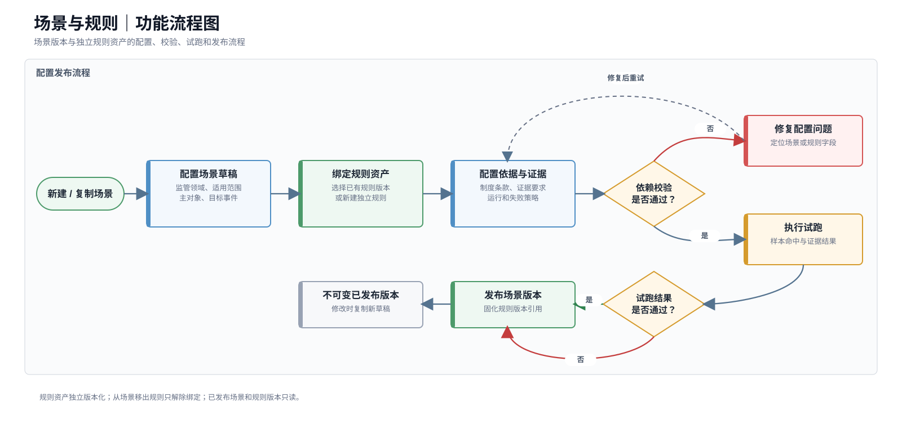

> 图10-7 场景与规则功能流程图。

##### 10.3.4.2 功能清单

| 二级菜单 | 页面 | 功能 | 优先级 |
| --- | --- | --- | --- |
| 风险场景 | 风险场景列表页 | 查询、新建、复制版本、停用和查看引用 | P0 |
| 风险场景 | 风险场景详情/编辑页 | 配置目标事件、范围、证据、核查模板和关联规则 | P0 |
| 规则管理 | 规则编辑器 | 编辑条件、关系路径、时序、聚合、例外和命中输出 | P0 |
| 规则管理 | 试跑结果抽屉、发布确认弹窗 | 校验样本结果并发布不可变版本 | P0 |

##### 10.3.4.3 功能详细设计

> **工程对齐：** 规则资产不再从属于单一场景版本，而是独立版本化并通过绑定关系被场景版本引用；从场景移出规则仅解除绑定，不删除规则资产。

**（一）风险场景列表页**

**1. 页面布局**

1. 顶部为页面标题、新建场景按钮和刷新按钮。
2. 查询区展示常用筛选条件，高级条件包括本体版本和更新时间。
3. 列表区展示场景当前版本和引用状态，底部为分页。
4. 已发布场景只能查看、复制新版本或停用，不允许直接编辑。
5. 点击场景名称进入详情；点击版本号打开版本记录抽屉。

**2. 查询条件与列表字段**

查询条件：

| 字段 | 控件 | 默认值 | 是否必填 | 规则 |
| --- | --- | --- | --- | --- |
| 关键词 | 输入框 | 空 | 否 | 匹配场景名称和编码 |
| 监管领域 | 多选下拉 | 全部授权领域 | 否 | 按领域权限裁剪 |
| 主对象 | 搜索多选 | 全部 | 否 | 来自已发布本体类 |
| 目标事件 | 搜索多选 | 全部 | 否 | 来自本体目标事件 |
| 默认风险等级 | 多选下拉 | 全部 | 否 | 重大、高、中、低 |
| 状态 | 多选下拉 | 草稿、待试跑、待发布、已发布 | 否 | 可包含已停用 |
| 当前版本 | 输入框 | 空 | 否 | 精确或前缀匹配 |
| 更新时间 | 日期范围 | 不限 | 否 | 开始不得晚于结束 |

列表字段：

| 字段 | 默认显示 | 排序 | 展示规则 |
| --- | --- | --- | --- |
| 场景名称/编码 | 是 | 否 | 点击进入当前版本详情 |
| 监管领域 | 是 | 否 | 展示领域名称 |
| 主对象/目标事件 | 是 | 否 | 目标事件为空时标记非事前场景 |
| 默认等级 | 是 | 是 | 使用统一风险标签 |
| 规则数量 | 是 | 是 | 仅统计当前版本 |
| 当前版本 | 是 | 否 | 点击打开版本记录 |
| 状态 | 是 | 否 | 草稿、待试跑、待发布、已发布、已停用 |
| 引用情况 | 是 | 否 | 展示运行预警数量和图谱依赖摘要，不展示规则效果页面 |
| 更新人/时间 | 是 | 是 | 默认按更新时间倒序 |
| 操作 | 是 | 否 | 查看、编辑、复制新版本、试跑、发布、停用 |

**3. 操作交互**

| 操作 | 前置条件 | 交互形式 | 成功结果 | 失败处理 | 权限/审计 |
| --- | --- | --- | --- | --- | --- |
| 新建场景 | 有新建权限 | 进入场景编辑页 | 创建草稿版本 | 本体不可用时提示依赖 | 记录创建人 |
| 查看详情 | 有查看权限 | 跳转详情页 | 展示当前版本 | 无权时阻止 | 无敏感字段时不单独审计 |
| 编辑草稿 | 状态为草稿或待试跑 | 进入编辑页 | 保存草稿 | 版本冲突时提示刷新 | 记录字段变更 |
| 复制新版本 | 已发布或已停用 | 确认弹窗 | 生成继承全部配置的新草稿 | 已有未发布版本时提示 | 记录来源版本 |
| 发起试跑 | 配置完整 | 试跑参数弹窗 | 生成试跑任务 | 校验不通过时展示问题 | 记录任务与样本范围 |
| 发布 | 试跑通过且有发布权限 | 高危确认弹窗 | 生成不可变发布版本 | 依赖变化时重新校验 | 完整审计 |
| 停用 | 已发布且无阻断约束 | 填写原因并确认 | 状态变为已停用 | 正在运行任务时提示影响 | 完整审计 |
| 查询/重置 | 条件合法 | 刷新列表 | 更新结果 | 保留条件并提示 | 按权限查询 |

**4. 页面状态与异常**

| 状态/异常 | 触发条件 | 页面表现 | 可用操作 | 恢复方式 |
| --- | --- | --- | --- | --- |
| 无场景 | 首次使用或无权限数据 | 空状态展示新建入口 | 新建 | 创建场景 |
| 本体不可用 | 无已发布本体版本 | 顶部依赖提示 | 查看依赖 | 先发布本体 |
| 版本冲突 | 同一草稿被他人更新 | 提示版本已变化 | 查看差异、刷新 | 基于最新版本编辑 |
| 引用阻断 | 场景被运行任务或历史对象引用 | 停用确认展示影响 | 取消或确认停用 | 保留历史引用 |
| 查询失败 | 服务异常 | 保留原列表 | 重试 | 重新查询 |
| 权限变化 | 领域或按钮权限收回 | 移除无权数据和操作 | 刷新 | 重新授权 |

**（二）风险场景详情/编辑页**

**1. 页面布局**

1. 顶部摘要区展示场景名称、编码、版本、状态、领域和最近更新信息。
2. 主体使用“基本信息、规则配置、证据与制度、适用范围、版本记录”页签。
3. 页面底部固定展示保存草稿、校验、试跑、发布、返回按钮。
4. 已发布版本进入只读模式，编辑操作替换为“复制新版本”。
5. 离开存在未保存内容的页面时弹出离开确认。

**2. 页面字段**

基本信息字段：

| 字段 | 必填 | 控件 | 规则 |
| --- | --- | --- | --- |
| 场景名称 | 是 | 输入框 | 产品内名称可重复但编码唯一 |
| 场景编码 | 是 | 输入框 | 创建后不可修改 |
| 监管领域 | 是 | 搜索单选 | 决定可选择本体和数据范围 |
| 场景说明 | 是 | 多行文本 | 描述风险、适用边界和不适用情形 |
| 主对象 | 是 | 本体类选择 | 来自已发布本体 |
| 目标事件 | 事前场景必填 | 本体事件选择 | 必须标记为目标事件 |
| 默认风险等级 | 是 | 单选 | 重大、高、中、低 |
| 观察窗口 | 是 | 数字+单位 | 支持小时、天、月 |
| 状态 | 系统生成 | 只读 | 草稿、待试跑、待发布、已发布、已停用 |

适用范围和证据字段：

| 字段 | 必填 | 控件 | 规则 |
| --- | --- | --- | --- |
| 适用组织 | 是 | 组织树多选 | 支持全局或指定组织 |
| 适用对象条件 | 否 | 条件编辑 | 只使用本体属性 |
| 例外范围 | 否 | 白名单/条件 | 记录制度依据和有效期 |
| 必备证据 | 是 | 证据类型多选 | 至少一种来源记录、附件或事件 |
| 制度依据 | 是 | 制度条款选择 | 记录制度名称、版本、条款 |
| 核查模板 | 是 | 表单配置 | 默认核查要求、材料和处理时限 |
| 关联规则 | 是 | 规则列表 | 至少一条启用规则 |

**3. 操作交互**

| 操作 | 前置条件 | 交互形式 | 成功反馈 | 失败处理 | 权限/审计 |
| --- | --- | --- | --- | --- | --- |
| 保存草稿 | 必填字段基本合法 | 局部保存 | Toast并更新保存时间 | 保留未保存内容 | 记录变更人 |
| 新建规则 | 草稿可编辑 | 打开规则编辑器 | 返回后加入规则列表 | 放弃时不新增 | 记录创建 |
| 编辑规则 | 规则可编辑 | 打开规则编辑器 | 更新规则摘要 | 并发时提示 | 记录前后值 |
| 移出场景规则 | 未发布且未被组合引用 | 二次确认 | 仅解除当前场景绑定 | 有引用时阻止 | 记录删除 |
| 校验 | 草稿已保存 | 校验面板 | 显示通过或问题清单 | 问题可定位字段 | 记录校验结果 |
| 试跑 | 校验通过 | 试跑参数弹窗 | 进入试跑结果抽屉 | 超时可重新运行 | 记录样本和结果 |
| 发布 | 试跑通过 | 高危确认弹窗 | 生成已发布版本 | 依赖变化则阻止 | 完整审计 |
| 复制新版本 | 当前版本只读 | 确认弹窗 | 创建新草稿 | 已有草稿时提示 | 记录继承关系 |

**4. 页面状态与异常**

| 状态/异常 | 触发条件 | 页面表现 | 可用操作 | 恢复方式 |
| --- | --- | --- | --- | --- |
| 草稿编辑 | 当前版本为草稿 | 字段可编辑 | 保存、校验 | 正常流程 |
| 已发布只读 | 当前版本已发布 | 字段只读并显示发布信息 | 复制新版本 | 新版本编辑 |
| 未保存离开 | 存在本地修改 | 离开确认 | 保存、放弃、取消 | 用户选择 |
| 依赖已废止 | 引用本体或图谱版本废止 | 显示依赖风险 | 复制新版本 | 选择有效依赖 |
| 校验失败 | 必填、关系或证据不完整 | 问题清单定位到页签和字段 | 修改 | 重新校验 |
| 试跑失败 | 无命中、执行错误或证据缺失 | 展示失败步骤和样本 | 调整规则、重跑 | 修复配置 |
| 发布并发 | 依赖在确认期间变化 | 停止发布 | 刷新依赖 | 重新校验试跑 |
| 权限不足 | 无编辑或发布权限 | 只读或隐藏按钮 | 查看 | 管理员授权 |

**（三）规则编辑器**

**1. 页面布局**

1. 顶部展示规则名称、类型、状态、所属场景和保存状态。
2. 左侧为当前本体版本的对象、属性、关系和事件树。
3. 中间为条件组编辑区，支持AND、OR和嵌套条件组。
4. 右侧为命中输出、证据要求、制度依据和预览摘要。
5. 底部为保存、校验、试跑和返回场景按钮。

**2. 页面字段**

| 字段 | 必填 | 控件 | 规则 |
| --- | --- | --- | --- |
| 规则名称/编码 | 是 | 输入框 | 规则资产范围内唯一 |
| 规则类型 | 是 | 单选 | 属性、字段比对、关系路径、时序、聚合 |
| 本体对象/属性 | 条件必填 | 树选择 | 只能选择当前本体版本元素 |
| 关系路径 | 条件必填 | 路径编辑 | 明确方向和目标，最多两跳 |
| 事件类型 | 条件必填 | 事件选择 | 时序或目标事件规则使用 |
| 条件表达式 | 是 | 条件组编辑器 | 支持AND、OR和条件组 |
| 阈值/时间窗口 | 条件必填 | 数字、金额、时间 | 按规则类型校验 |
| 例外条件 | 否 | 条件组/白名单 | 支持特殊授权和组织例外 |
| 实际命中输出 | 是 | 多选 | 指定保存字段、关系、事件和证据 |
| 制度依据 | 是 | 条款选择 | 记录版本和条款 |
| 失败策略 | 是 | 单选 | 不生成、生成低置信线索、进入异常队列 |

**3. 操作交互**

| 操作 | 前置条件 | 交互形式 | 成功反馈 | 失败处理 | 权限/审计 |
| --- | --- | --- | --- | --- | --- |
| 选择本体元素 | 元素可用 | 拖入或点击加入条件 | 生成条件项 | 类型不兼容时提示 | 无独立审计 |
| 新增条件组 | 规则可编辑 | 行内新增 | 展示AND/OR组 | 层级超限时阻止 | 无 |
| 配置路径 | 关系规则 | 路径编辑器 | 展示路径摘要 | 超过两跳时阻止 | 保存路径版本 |
| 保存 | 基本字段合法 | 保存草稿 | 更新保存状态 | 保留内容并提示 | 记录变更 |
| 校验 | 草稿已保存 | 右侧问题面板 | 定位问题或通过 | 展示具体字段 | 记录结果 |
| 试跑 | 校验通过 | 试跑弹窗和结果抽屉 | 展示命中、未命中、错误样本 | 超时可取消重试 | 记录样本范围 |
| 返回场景 | 无未保存修改 | 返回详情 | 场景规则列表更新 | 有修改时离开确认 | 无 |

**4. 页面状态与异常**

| 状态/异常 | 触发条件 | 页面表现 | 可用操作 | 恢复方式 |
| --- | --- | --- | --- | --- |
| 本体元素变更 | 引用元素在新版本中删除或改名 | 标记失效条件 | 替换元素 | 重新选择 |
| 路径超过边界 | 配置三跳以上关系 | 实时提示并禁止保存 | 缩短路径 | 修改配置 |
| 类型不匹配 | 字段与运算符不兼容 | 条件项标红 | 修改字段或运算符 | 重新校验 |
| 试跑超时 | 查询超过限制 | 展示超时步骤 | 缩小样本、重试 | 调整参数 |
| 图谱依赖不可用 | 试跑图谱版本失效 | 阻止试跑 | 选择有效版本 | 返回场景设置 |
| 并发编辑 | 草稿被其他人保存 | 显示冲突差异 | 刷新或另存新版本 | 用户选择 |
| 未保存离开 | 存在修改 | 离开确认 | 保存、放弃、取消 | 用户选择 |

**模块业务规则与验收**

1. 已发布场景和规则版本不可直接编辑，修改时复制新版本。
2. 场景发布前必须通过本体、图谱、事件、证据、权限和试跑校验。
3. 规则只引用本体编码和标准化事实，不绑定固定业务链路。
4. 首批不支持自由数据库语句、三跳以上路径、社区发现、中心性、相似度和文档大模型规则。
5. 处置结果继续形成结构化效果样本，但不提供菜单、页面、查询和分析入口。
6. 列表、详情和编辑器均需覆盖无数据、只读版本、依赖失效、并发编辑、校验失败和试跑失败。

##### 10.3.4.4 应用操作

以下应用操作按当前工程活动路由、可见页面、真实字段、按钮、状态机和接口边界编写；同一页面内的连续操作合并为一条页面级评审记录。

| 功能名称 | 位置/用户路径 | 原型 | 产品逻辑（页面结构/交互/策略设计） | 对应文案 | 优先级 | 评审意见 | 备注 |
| --- | --- | --- | --- | --- | --- | --- | --- |
| 风险场景列表 | 一级菜单“场景与规则” → 二级菜单“风险场景” | [图片] | <strong>页面结构：</strong> 页面头部展示“刷新、新建场景”；筛选区包含关键词、监管领域和状态。 图1 场景版本列表展示场景名称/编码、监管领域、默认等级、风险规则数量、版本、状态、运行记录、更新时间和操作。 图2 新建场景、停用场景和删除草稿使用弹窗；运行记录和操作审计使用“引用与审计”抽屉。 图3  <strong>交互逻辑：</strong> 1. 用户进入风险场景页面，系统加载当前可访问的全部场景版本；用户可按名称/编码、监管领域、状态查询或重置。 2. 用户点击“新建场景”，填写场景名称、场景编码、监管领域、默认风险等级和场景说明，点击“创建并进入编辑”后进入新场景草稿。 图3 3. 用户点击场景名称或“编辑/查看”进入场景编辑页；点击版本号直接进入版本记录页签。 图2 4. 已发布或已停用版本可点击“复制版本”，确认后生成新草稿并进入编辑；已发布版本不可原地编辑。 5. 已发布版本可点击“停用”，填写停用原因后确认；停用仅影响后续运行，历史预警和运行记录继续引用原版本。 图4 6. 待发布版本点击“发布”进入场景编辑页完成发布；仅canDelete为真的新建草稿显示“删除”，删除前再次确认。 图5 7. 用户点击“运行记录”打开引用与审计抽屉，查看运行对象、命中结果、预警编号及场景操作审计。 图6  <strong>策略设计：</strong> 场景以版本为单位管理，状态为草稿、待试跑、待发布、已发布、已停用。 已发布版本不可变；复制版本继承上一版本配置但生成独立草稿。  <strong>异常处理：</strong> 创建字段校验失败时停留弹窗并提示服务端返回原因。 仅无历史版本且无运行记录的新建草稿可删除；不满足条件时服务端拒绝删除。 加载失败时列表区域展示错误和“重试”，不清空用户筛选条件。 | 页面标题：风险场景； 操作：新建场景 / 编辑 / 查看 / 复制版本 / 停用 / 发布 / 删除； 成功提示：场景草稿已创建 / 已创建{版本}草稿 / 场景版本已停用； 空状态：没有符合条件的场景。 | P0 | 待评审 | 场景列表与sceneRuleApi一致，已接入Node.js和MySQL场景规则服务。 |
| 风险场景编辑 | 风险场景列表 → 点击场景名称或“编辑/查看” | [图片] | <strong>页面结构：</strong> 页面头部展示返回场景列表、场景编码、名称、状态、版本、领域、保存状态，以及保存草稿、校验、发起试跑、发布版本或复制新版本。 图1 状态步骤条展示“草稿、待试跑、待发布、已发布”；主体页签包含基本信息、风险规则、适用范围、核查模板、版本记录。 图2 风险规则页签展示已关联规则及数据语义、类型、命中等级、制度依据、证据要求和状态，并提供“选择已有规则、新建规则、编辑/查看、移出场景”。 图3 校验结果和试跑结果使用抽屉；发起试跑和发布版本使用弹窗。 图4  <strong>交互逻辑：</strong> 1. 用户进入场景版本后，系统加载当前版本和锁版本号；编辑草稿时修改基本信息、适用组织、例外范围、核查要求和时限，页面标记“存在未保存修改”。 2. 用户在“风险规则”页签点击“选择已有规则”，打开规则库选择弹窗；勾选一个或多个未关联规则并确认后建立引用，不复制规则内容。 图3 3. 用户点击“新建规则”，进入规则管理新建流程并自动携带当前sceneId；配置完成后规则自动关联当前场景。 4. 用户点击关联规则“编辑/查看”进入规则编辑器；草稿场景可点击“移出场景”，确认后仅解除引用，不删除规则资产。 5. 用户点击“保存草稿”提交当前修改；点击“校验”时系统先静默保存，再检查场景基本信息和关联规则，校验结果抽屉支持点击问题定位。 图4 6. 校验无阻断后场景进入“待试跑”；用户点击“发起试跑”，设置样本时间范围、最大样本数、超时时间和组织范围，完成后查看命中、未命中、错误、证据完整率和耗时。 图5 7. 试跑通过后场景进入“待发布”；用户点击“发布版本”，填写版本说明和发布原因，确认后固化场景、关联规则、制度依据和证据要求快照。 图6 8. 已发布或已停用版本全页只读，仅提供“复制新版本”；用户离开存在未保存修改的页面时必须确认。  <strong>策略设计：</strong> 场景与规则为多对多引用，移出场景和删除规则是两个独立操作。 发布前必须完成校验和试跑；发布后版本不可修改，后续变更通过复制新版本实现。  <strong>异常处理：</strong> 锁版本冲突时保存失败，保留当前草稿并提示重新加载最新版本。 存在校验阻断项时不能发起试跑；试跑未通过时不能发布。 没有可编辑场景或可选择规则时展示空状态，并引导先新建场景版本或规则资产。 | 返回：返回场景列表； 页签：基本信息 / 风险规则 / 适用范围 / 核查模板 / 版本记录； 操作：选择已有规则 / 新建规则 / 保存草稿 / 校验 / 试跑 / 发布； 成功提示：场景草稿已保存 / 试跑完成，场景已进入待发布 / 场景版本已发布并生成运行快照。 | P0 | 待评审 | 与SceneEditorWithRuleSelection、SceneEditorPage和sceneRuleApi一致，场景、规则引用、校验、试跑和发布已形成服务端闭环。 |
| 规则资产列表 | 一级菜单“场景与规则” → 二级菜单“规则管理” | [图片] | <strong>页面结构：</strong> 页面头部展示“刷新、新增规则”；筛选区按规则名称、编码或领域查询。 图1 规则资产列表展示规则名称/编码/版本、检测范围、判断类型、命中等级、制度依据与证据、场景引用、状态、更新时间和操作。 图2 新增规则使用弹窗，配置规则名称、编码、规则类型、命中风险等级、监管领域、主对象、已发布图谱；时序规则额外选择目标事件。 图3  <strong>交互逻辑：</strong> 1. 用户进入规则管理页面，系统加载独立规则资产；用户可按规则名称、编码或监管领域查询，刷新时重新获取规则库。 2. 用户点击“新增规则”，填写规则基本信息并选择已发布图谱；适用本体由图谱自动带出，主对象来自该本体。 图3 3. 从风险场景携带sceneId进入时，新增弹窗提示创建后自动关联当前场景；直接从规则管理进入时，创建独立规则，可被多个场景引用。 4. 用户点击“下一步：完善规则”，系统创建规则草稿并进入规则编辑器。 5. 用户点击“编辑/查看”进入规则编辑器；已发布或已停用规则只读展示。 图2 6. 仅草稿且场景引用数为0的规则可删除；已发布、已停用或被一个及以上场景版本引用的规则，删除按钮禁用并显示原因。 图4  <strong>策略设计：</strong> 规则是可复用独立资产，场景只保存对规则版本的引用。 命中风险等级可继承场景默认等级或固定覆盖；图谱必须为已发布版本。  <strong>异常处理：</strong> 规则名称为空或无可用图谱、主对象时不创建草稿。 被场景引用的规则必须先在对应场景版本中解除关联后才能删除。 加载失败时保留查询条件并展示“规则加载失败”和重试入口。 | 页面标题：规则管理； 操作：刷新 / 新增规则 / 编辑 / 查看 / 删除； 删除提示：已被{数量}个场景版本引用，请先解除关联； 空状态：暂无规则资产。 | P0 | 待评审 | 规则资产列表使用RuleAssetManagementPage和sceneRuleApi，已对接Node.js与MySQL规则服务。 |
| 规则编辑器 | 规则资产列表或风险场景 → 点击规则“编辑/查看” | [图片] | <strong>页面结构：</strong> 页面头部展示返回规则管理/风险场景、规则编码、版本、名称、当前状态、规则类型、场景引用数和保存状态。 图1 顶部步骤导航包含“基本信息、检测口径、依据与证据”3步；校验问题以横幅展示并可点击定位。 图2 检测口径区包含图谱版本、由图谱带出的适用本体、主对象；时序/聚合规则增加计算基准、目标事件和观察窗口。 图3 判定方式支持属性、字段比对、关系路径、时序、聚合，并自动生成业务表达和机器表达；依据与证据包含制度依据和证据要求子页签。 图4 底部固定操作栏提供取消、上一步、保存草稿、下一步和完成规则配置。 图5  <strong>交互逻辑：</strong> 1. 用户进入规则编辑器，系统加载规则草稿、可用已发布图谱及对应本体元素；从场景进入时保留sceneId作为返回路径。 2. 用户在“基本信息”维护规则名称、监管领域和命中风险等级；规则编码和版本只读。 3. 用户在“检测口径”选择已发布图谱，系统自动带出本体并重置不兼容的主对象和条件；选择主对象后配置判断类型。 图3 4. 属性/字段比对规则可新增多条条件并选择AND或OR；关系路径最多配置2跳并最多增加10个路径约束；时序规则最多10个事件条件；聚合规则最多3个统计指标。 图4 5. 时序或聚合规则选择以目标事件发生时间或规则运行时间为基准，并配置之前/之后、数值及小时/天/月观察窗口。 6. 用户在“依据与证据”新增、编辑或删除制度名称、版本、条款、原文，以及证据名称、数据来源、来源字段、附件要求和完整性要求。 图5 7. 用户点击“保存草稿”保存当前配置；点击“下一步”前系统检查当前步骤完整性；最后点击“完成规则配置”，系统先保存并执行规则校验。 8. 校验通过后从场景进入则返回场景并保留关联，从规则管理进入则返回规则列表；存在阻断项时停留编辑器并定位第一项问题。 9. 已发布或已停用规则只读；存在未保存修改时点击返回或取消需二次确认。  <strong>策略设计：</strong> 规则必须绑定一套已发布图谱、一个主对象和与规则类型匹配的判断配置。 至少配置一条制度依据和一项完整证据要求后，规则才可完成配置。 规则表达由当前结构化配置自动生成，用于业务确认和系统执行。  <strong>异常处理：</strong> 图谱切换导致本体元素不兼容时清空原条件，避免保留失效编码。 超出关系、时序或聚合数量上限时不新增并明确提示。 保存失败或锁版本冲突时保留未保存内容；规则不存在时提供返回规则库入口。 | 步骤：基本信息 / 检测口径 / 依据与证据； 操作：保存草稿 / 上一步 / 下一步 / 完成规则配置； 校验提示：还有{数量}项需要完成； 成功提示：规则配置完成，现在可以在多个场景中引用。 | P0 | 待评审 | 与RuleAssetEditorPage和当前规则服务一致；规则结构化配置、治理信息及引用关系已服务端持久化。 |

#### 10.3.5 本体与图谱

##### 10.3.5.1 功能介绍

| 项目 | 说明 |
| --- | --- |
| 功能目标 | 在同一能力域内完成语义定义、来源映射、实体治理和图谱版本发布 |
| 使用角色 | 本体管理员、数据管理员、领域业务专家 |
| 能力边界 | 本体定义语义约束，数据接入完成映射，图谱管理形成实例版本；三者分别授权和版本化 |
| 主要流程 | 见下方功能流程图 |
| 输入 | 领域语义、源系统元数据、业务数据、事件和证据 |
| 输出 | 本体版本、映射版本、实体关系事件和图谱版本 |

**功能流程图**

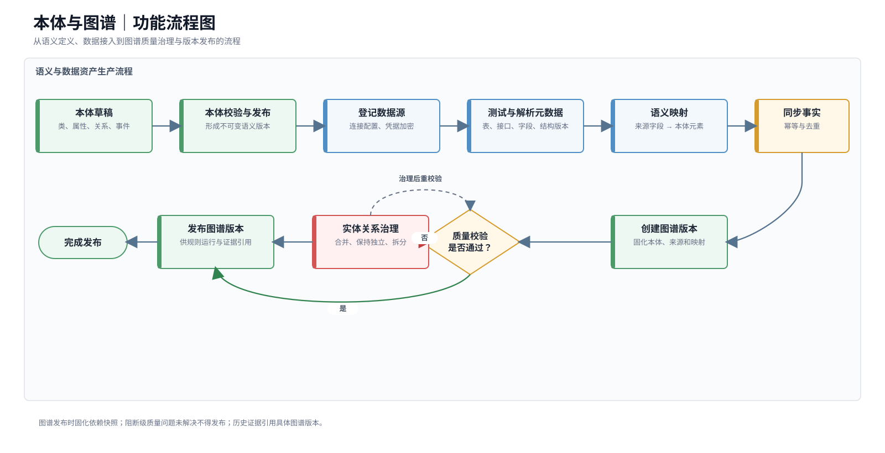

> 图10-8 本体与图谱功能流程图。

##### 10.3.5.2 功能清单

| 二级菜单 | 页面 | 功能 | 优先级 |
| --- | --- | --- | --- |
| 本体管理 | 本体列表页 | 查询、新建、复制版本、校验、发布和查看引用 | P0 |
| 本体管理 | 本体版本编辑页 | 编辑类、属性、关系、事件和版本差异 | P0 |
| 数据接入 | 数据源列表/详情页 | 数据源登记、连接测试、元数据解析和同步配置 | P0 |
| 数据接入 | 语义映射页 | 类属性映射、实体识别、关系事件映射 | P0 |
| 图谱管理 | 图谱版本与质量页 | 图谱版本查询、质量校验和发布 | P0 |
| 图谱管理 | 实体治理页及对比抽屉 | 实体确认、合并、保持独立和拆分 | P0 |

##### 10.3.5.3 功能详细设计

> **工程对齐：** 本体、数据源、映射和图谱配置已具备Node.js + MySQL持久化基线；真实来源适配器、不可覆盖证据快照及生产级同步任务仍属于试点前置。

**（一）本体列表页**

**1. 页面布局**

1. 顶部为页面标题、新建本体按钮和刷新按钮。
2. 查询区展示名称编码、适用范围、状态和更新时间。
3. 列表区展示当前发布版本、元素数量和引用情况。
4. 点击本体名称进入当前版本详情；点击版本号打开版本记录抽屉。
5. 已发布版本不允许直接删除或编辑。

**2. 查询条件与列表字段**

查询条件：

| 字段 | 控件 | 默认值 | 是否必填 | 规则 |
| --- | --- | --- | --- | --- |
| 关键词 | 输入框 | 空 | 否 | 匹配本体名称和编码 |
| 适用范围 | 多选下拉 | 全部 | 否 | 监管基础本体、领域扩展本体 |
| 监管领域 | 多选下拉 | 全部授权领域 | 否 | 基础本体不受单一领域限制 |
| 状态 | 多选下拉 | 草稿、待校验、已发布 | 否 | 可选择已废止 |
| 当前版本 | 输入框 | 空 | 否 | 精确或前缀匹配 |
| 更新时间 | 日期范围 | 不限 | 否 | 开始不得晚于结束 |

列表字段：

| 字段 | 默认显示 | 排序 | 展示规则 |
| --- | --- | --- | --- |
| 本体名称/编码 | 是 | 否 | 点击进入当前版本 |
| 适用范围/领域 | 是 | 否 | 基础本体或领域扩展 |
| 当前版本 | 是 | 否 | 点击打开版本记录 |
| 类/属性/关系/事件数量 | 是 | 是 | 当前版本元素统计 |
| 状态 | 是 | 否 | 草稿、待校验、已发布、已废止 |
| 引用情况 | 是 | 否 | 映射、图谱、场景和历史预警数量 |
| 发布人/时间 | 否 | 是 | 未发布显示“—” |
| 更新人/时间 | 是 | 是 | 默认按更新时间倒序 |
| 操作 | 是 | 否 | 查看、编辑、复制新版本、校验、发布、废止 |

**3. 操作交互**

| 操作 | 前置条件 | 交互形式 | 成功反馈 | 失败处理 | 权限/审计 |
| --- | --- | --- | --- | --- | --- |
| 新建本体 | 有新建权限 | 新建弹窗后进入编辑页 | 创建草稿 | 编码重复时阻止 | 记录创建 |
| 查看 | 有查看权限 | 跳转详情 | 展示版本内容 | 无权时阻止 | 无 |
| 编辑草稿 | 草稿可编辑 | 跳转编辑页 | 保存内容 | 并发时提示 | 记录变更 |
| 复制新版本 | 已发布/已废止 | 确认弹窗 | 创建继承版本 | 已有草稿时提示 | 记录来源版本 |
| 校验 | 草稿已保存 | 校验抽屉 | 展示问题清单 | 可定位元素 | 记录校验结果 |
| 发布 | 校验通过 | 高危确认弹窗 | 生成不可变版本 | 引用或权限异常时阻止 | 完整审计 |
| 废止 | 已发布且有权限 | 填写原因并确认 | 状态变为已废止 | 展示受影响依赖 | 完整审计 |

**4. 页面状态与异常**

| 状态/异常 | 触发条件 | 页面表现 | 可用操作 | 恢复方式 |
| --- | --- | --- | --- | --- |
| 无本体 | 首次初始化 | 空状态和新建入口 | 新建 | 创建本体 |
| 编码冲突 | 新建或复制后编码重复 | 字段错误提示 | 修改编码 | 重新提交 |
| 引用阻断 | 废止版本被生产场景使用 | 展示影响对象 | 取消或确认新版本替代 | 完成迁移 |
| 并发修改 | 草稿被他人更新 | 提示版本冲突 | 查看差异、刷新 | 基于最新版本编辑 |
| 权限变化 | 本体范围权限收回 | 移除数据和按钮 | 刷新 | 管理员授权 |
| 查询失败 | 服务异常 | 保留原列表 | 重试 | 重新查询 |

**（二）本体版本编辑页**

**1. 页面布局**

1. 顶部展示本体名称、版本、状态、适用范围、保存状态和版本操作。
2. 左侧为类树，支持按名称和编码搜索。
3. 中间为当前元素列表，按类、属性、关系、事件页签切换。
4. 右侧为元素编辑抽屉或属性面板。
5. 页面底部提供保存草稿、校验、发布、版本差异和返回按钮。
6. 已发布版本只读，编辑按钮替换为复制新版本。

**2. 页面字段**

本体类字段：

| 字段 | 必填 | 控件 | 规则 |
| --- | --- | --- | --- |
| 类编码 | 是 | 输入框 | 本体版本内唯一，发布后不可修改 |
| 中文名称 | 是 | 输入框 | 面向业务用户展示 |
| 别名 | 否 | 标签输入 | 来源系统或领域常用名称 |
| 类说明 | 是 | 多行文本 | 说明业务含义和适用边界 |
| 主识别属性 | 是 | 属性多选 | 至少一个，可为组合标识 |
| 默认显示属性 | 是 | 属性选择 | 用于图谱节点和列表标题 |
| 默认敏感等级 | 是 | 单选 | 普通、内部、敏感、强敏感 |

属性字段：

| 字段 | 必填 | 控件 | 规则 |
| --- | --- | --- | --- |
| 属性编码/名称 | 是 | 输入框 | 同一类下唯一 |
| 数据类型 | 是 | 单选 | 文本、数字、金额、日期、枚举、组织、人员、文件等 |
| 是否必填 | 是 | 开关 | 用于映射和发布校验 |
| 是否主标识 | 是 | 开关 | 主标识必须配置质量要求 |
| 业务口径 | 是 | 多行文本 | 描述含义、单位、取值和边界 |
| 枚举/单位 | 条件必填 | 枚举或单位选择 | 按数据类型显示 |
| 敏感等级 | 是 | 单选 | 可继承类默认值 |
| 质量要求 | 否 | 规则配置 | 非空、唯一、范围、及时性 |

关系字段：

| 字段 | 必填 | 控件 | 规则 |
| --- | --- | --- | --- |
| 关系编码/名称 | 是 | 输入框 | 本体版本内唯一 |
| 源类/目标类 | 是 | 类选择 | 必须来自当前版本 |
| 方向 | 是 | 单选 | 单向、双向 |
| 基数 | 是 | 单选 | 一对一、一对多、多对多 |
| 是否具备有效期 | 是 | 开关 | 任职、控制等默认开启 |
| 关系属性 | 否 | 属性配置 | 比例、金额、角色、状态等 |
| 敏感等级 | 是 | 单选 | 可独立于实体控制 |
| 业务说明 | 是 | 多行文本 | 说明建立关系的事实依据 |

事件字段：

| 字段 | 必填 | 控件 | 规则 |
| --- | --- | --- | --- |
| 事件编码/名称 | 是 | 输入框 | 本体版本内唯一 |
| 事件主体类 | 是 | 类选择 | 事件主要发生对象 |
| 事件客体类 | 否 | 类选择 | 被影响对象 |
| 事件时间属性 | 是 | 属性选择 | 所有生产事件必须可获取 |
| 状态前值/后值 | 否 | 属性选择 | 状态变化事件使用 |
| 是否目标事件 | 是 | 开关 | 可作为事前预警目标 |
| 是否需要预计时间 | 是 | 开关 | 目标事件通常开启 |
| 去重规则 | 是 | 规则配置 | 事件ID或组合键 |

**3. 操作交互**

| 操作 | 前置条件 | 交互形式 | 成功反馈 | 失败处理 | 权限/审计 |
| --- | --- | --- | --- | --- | --- |
| 新增元素 | 草稿可编辑 | 右侧抽屉 | 加入元素列表 | 编码重复时阻止 | 记录新增 |
| 编辑元素 | 草稿可编辑 | 右侧抽屉 | 局部刷新元素 | 引用冲突时提示 | 记录前后值 |
| 删除元素 | 草稿且无当前版本引用 | 二次确认 | 从草稿移除 | 有关系/事件引用时阻止 | 记录删除 |
| 保存草稿 | 字段基本合法 | 保存当前版本 | 更新保存状态 | 保留未保存内容 | 记录变更人 |
| 查看关系视图 | 有查看权限 | 切换关系视图 | 展示类与关系 | 图过大时按类型过滤 | 无 |
| 查看版本差异 | 存在来源版本 | 差异抽屉 | 展示新增、修改、删除 | 加载失败可重试 | 无 |
| 校验 | 草稿已保存 | 问题面板 | 定位元素问题 | 阻断项不可发布 | 记录结果 |
| 发布 | 校验通过 | 高危确认 | 生成发布版本 | 依赖变化时重新校验 | 完整审计 |

**4. 页面状态与异常**

| 状态/异常 | 触发条件 | 页面表现 | 可用操作 | 恢复方式 |
| --- | --- | --- | --- | --- |
| 已发布只读 | 当前版本已发布 | 全部字段只读 | 复制新版本 | 新草稿编辑 |
| 未保存离开 | 存在修改 | 离开确认 | 保存、放弃、取消 | 用户选择 |
| 元素引用冲突 | 删除被关系/事件引用的类或属性 | 展示引用清单 | 取消或先删除依赖 | 修复引用 |
| 校验失败 | 编码、基数、主标识等不合法 | 问题定位到元素 | 修改 | 重新校验 |
| 类树加载失败 | 元素服务异常 | 保留顶部信息，左侧可重试 | 重试 | 重新加载 |
| 大量元素 | 元素超过页面阈值 | 分页和按类型搜索 | 筛选 | 缩小范围 |
| 并发编辑 | 草稿被他人保存 | 提示差异 | 刷新、另存新版本 | 用户选择 |

**（三）数据接入与语义映射页**

**1. 页面布局**

1. 二级菜单“数据接入”进入数据源列表。
2. 列表页顶部提供新建数据源、刷新和同步状态汇总。
3. 点击数据源进入详情，主体使用“基本配置、元数据、类属性映射、关系映射、事件映射、同步记录”页签。
4. 映射页左侧展示来源表或接口字段，中间展示转换规则，右侧展示目标本体元素和校验结果。
5. 凭据仅允许重新填写，不在页面回显明文。

**2. 查询条件、列表与映射字段**

数据源查询条件：

| 字段 | 控件 | 默认值 | 规则 |
| --- | --- | --- | --- |
| 关键词 | 输入框 | 空 | 匹配来源名称和编码 |
| 来源方式 | 多选下拉 | 全部 | 数据库视图、API、消息、批量文件 |
| 状态 | 多选下拉 | 启用、异常 | 草稿、启用、停用、异常 |
| 责任人 | 搜索选择 | 全部 | 按组织权限过滤 |
| 同步方式 | 多选下拉 | 全部 | 全量、增量、事件 |
| 更新时间 | 日期范围 | 不限 | 开始不得晚于结束 |

数据源列表字段：

| 字段 | 默认显示 | 排序 | 展示规则 |
| --- | --- | --- | --- |
| 来源名称/编码 | 是 | 否 | 点击进入详情 |
| 来源方式 | 是 | 否 | 使用统一标签 |
| 数据范围 | 是 | 否 | 对象、时间和组织摘要 |
| 责任人 | 是 | 否 | 展示当前数据责任人 |
| 同步方式 | 是 | 否 | 全量、增量、事件 |
| 最近成功时间 | 是 | 是 | 无成功记录显示“未同步” |
| 状态 | 是 | 否 | 草稿、启用、停用、异常 |
| 操作 | 是 | 否 | 查看、编辑、测试、解析、停用 |

基本配置字段：

| 字段 | 必填 | 规则 |
| --- | --- | --- |
| 来源系统名称/编码 | 是 | 客户环境内唯一 |
| 来源方式 | 是 | 数据库视图、API、消息、批量文件 |
| 责任人 | 是 | 来源数据和结构变化责任人 |
| 数据范围 | 是 | 说明对象、时间和组织范围 |
| 连接或接口配置 | 是 | 凭据加密，默认只读 |
| 敏感等级 | 是 | 决定样例展示和权限 |
| 同步方式 | 是 | 全量、增量、事件 |

映射字段：

| 映射内容 | 必填 | 规则 |
| --- | --- | --- |
| 来源实体到本体类 | 是 | 每个生产来源实体至少映射一个类或明确不适用 |
| 来源字段到本体属性 | 是 | 记录转换、空值、枚举和单位规则 |
| 主标识 | 是 | 满足本体类主识别属性 |
| 主来源优先级 | 多来源时必填 | 指定冲突处理 |
| 实体识别策略 | 是 | 自动合并、待确认、保持独立 |
| 关系映射 | 条件必填 | 配置两端、方向、关联键和有效时间 |
| 事件映射 | 条件必填 | 配置主体、客体、事件时间、预计时间和去重键 |
| 触发场景 | 生产事件必填 | 选择已发布或待校验场景 |
| 失败策略 | 是 | 重试、补偿队列、记录异常 |

**3. 操作交互**

| 操作 | 前置条件 | 交互形式 | 成功反馈 | 失败处理 | 权限/审计 |
| --- | --- | --- | --- | --- | --- |
| 新建数据源 | 有数据源权限 | 新建向导 | 创建草稿 | 编码重复时阻止 | 记录创建 |
| 测试连接 | 基本连接配置完整 | 异步测试 | 展示连通性和耗时 | 显示错误类型，不泄露凭据 | 记录测试结果 |
| 解析元数据 | 连接测试成功 | 异步任务 | 展示表、接口和字段 | 支持重试 | 记录结构版本 |
| 保存映射 | 映射字段合法 | 保存草稿 | 更新保存时间 | 保留未保存内容 | 记录变更 |
| 自动建议映射 | 已解析元数据 | 生成建议，不自动生效 | 展示建议和置信度 | 无建议时允许手工配置 | 记录采纳结果 |
| 提交校验 | 映射保存 | 校验面板 | 展示通过或问题 | 定位来源字段和本体元素 | 记录结果 |
| 启用同步 | 校验通过 | 确认弹窗 | 生成同步任务 | 依赖异常时阻止 | 完整审计 |
| 停用数据源 | 有停用权限 | 影响确认弹窗 | 停止后续同步 | 展示受影响图谱和场景 | 完整审计 |

**4. 页面状态与异常**

| 状态/异常 | 触发条件 | 页面表现 | 可用操作 | 恢复方式 |
| --- | --- | --- | --- | --- |
| 连接失败 | 网络、地址或认证错误 | 展示错误类别和trace_id | 修改、重试 | 修正配置 |
| 凭据过期 | 认证失效 | 状态标记异常 | 重新填写凭据 | 测试连接 |
| 来源结构变化 | 表或字段新增、删除、改类型 | 展示结构差异并暂停受影响映射 | 查看差异、复制映射版本 | 重新校验 |
| 主标识缺失 | 关键字段为空 | 阻断生产映射 | 修改映射或质量规则 | 重新校验 |
| 映射冲突 | 多来源值冲突 | 展示来源和优先级 | 调整优先级 | 保存新版本 |
| 事件重复 | 去重键重复 | 显示合并结果和次数 | 查看记录 | 调整去重规则 |
| 同步任务失败 | 运行异常 | 展示失败批次和重试入口 | 重试、查看日志 | 补偿成功 |
| 权限不足 | 无敏感来源权限 | 隐藏样例值和凭据配置 | 查看摘要 | 管理员授权 |

**（四）图谱管理页**

**1. 页面布局**

1. 二级菜单“图谱管理”进入图谱版本列表。
2. 顶部展示当前生产版本、最近发布时间、质量摘要和新建发布任务按钮。
3. 主体使用“图谱版本、实体治理、质量问题、发布记录”页签。
4. 实体治理页左侧为待确认列表，右侧为候选对象对比抽屉。
5. 图谱版本详情只展示质量、依赖、数量和来源摘要，不提供自由图谱探索。

**2. 查询条件与列表字段**

图谱版本查询条件：

| 字段 | 控件 | 默认值 | 规则 |
| --- | --- | --- | --- |
| 版本号 | 输入框 | 空 | 精确或前缀匹配 |
| 状态 | 多选下拉 | 校验中、待发布、已发布 | 可选失败、已归档 |
| 本体版本 | 搜索选择 | 全部 | 只展示有权限版本 |
| 数据源 | 多选下拉 | 全部 | 按数据源权限 |
| 数据时间范围 | 日期范围 | 不限 | 查询版本覆盖范围 |
| 发布时间 | 日期范围 | 最近90天 | 默认倒序 |

图谱版本列表字段：

| 字段 | 默认显示 | 排序 | 展示规则 |
| --- | --- | --- | --- |
| 图谱版本号 | 是 | 否 | 点击进入版本详情 |
| 本体/映射版本 | 是 | 否 | 展示依赖版本 |
| 数据批次/时间范围 | 是 | 否 | 展示数据边界 |
| 实体/关系/事件数量 | 是 | 是 | 版本内统计 |
| 质量摘要 | 是 | 否 | 阻断、警告、提示数量 |
| 状态 | 是 | 否 | 校验中、待发布、已发布、失败、已归档 |
| 发布人/时间 | 是 | 是 | 默认时间倒序 |
| 操作 | 是 | 否 | 查看、校验、发布、查看问题 |

实体治理列表字段：

| 字段 | 说明 |
| --- | --- |
| 治理任务编号 | 唯一编号 |
| 对象类型 | 人员、账户、供应商、合同相对方等 |
| 候选实体 | 待合并或拆分对象 |
| 识别依据 | 主标识、辅助标识和冲突字段 |
| 建议结果 | 自动合并、待确认、保持独立、拆分 |
| 风险等级 | 高风险对象优先 |
| 操作 | 确认合并、保持独立、拆分、查看来源 |

**3. 操作交互**

| 操作 | 前置条件 | 交互形式 | 成功反馈 | 失败处理 | 权限/审计 |
| --- | --- | --- | --- | --- | --- |
| 创建图谱版本 | 有有效本体和映射版本 | 发布任务向导 | 生成待校验版本 | 依赖缺失时阻止 | 记录依赖 |
| 运行校验 | 图谱构建完成 | 异步任务 | 更新质量摘要 | 显示失败步骤 | 记录结果 |
| 查看质量问题 | 有查看权限 | 问题列表/抽屉 | 定位到来源、映射或实体 | 无权内容裁剪 | 记录敏感访问 |
| 确认实体合并 | 待确认且强标识充分 | 高危对比弹窗 | 生成合并记录 | 冲突未解决时阻止 | 完整审计 |
| 保持独立 | 待确认 | 填写原因 | 关闭治理任务 | 原因缺失不提交 | 记录原因 |
| 拆分实体 | 历史错误合并且有权限 | 高危向导 | 生成拆分和影响记录 | 影响无法计算时阻止 | 完整审计 |
| 发布图谱版本 | 无阻断质量问题 | 高危确认 | 生成不可变发布版本 | 依赖变化时重新校验 | 完整审计 |
| 查看版本详情 | 有版本权限 | 跳转详情 | 展示依赖和质量 | 部分来源受限时裁剪 | 按敏感级别审计 |

**4. 页面状态与异常**

| 状态/异常 | 触发条件 | 页面表现 | 可用操作 | 恢复方式 |
| --- | --- | --- | --- | --- |
| 构建中 | 图谱任务运行 | 展示进度、批次和已处理数量 | 离开页面 | 后台完成通知 |
| 校验失败 | 存在阻断问题 | 版本状态失败，展示问题清单 | 查看问题、重建 | 修复后新建版本 |
| 部分来源失败 | 多来源中部分异常 | 标记不完整，不允许发布P0依赖版本 | 查看来源 | 补偿后重建 |
| 节点关系超量 | 超过版本统计或页面限制 | 列表分页，不渲染全量图 | 筛选 | 缩小范围 |
| 实体治理并发 | 同一任务被他人处理 | 显示最新结果 | 查看记录 | 刷新任务 |
| 发布并发 | 依赖版本在确认时变化 | 停止发布 | 刷新依赖 | 重新校验 |
| 敏感来源受限 | 无来源权限 | 隐藏样例和明文 | 查看质量摘要 | 申请权限 |
| 服务不可用 | 图谱服务异常 | 保留版本元数据，禁用发布 | 重试 | 服务恢复 |

**模块业务规则与验收**

1. 本体、映射和图谱均生成不可变发布版本，历史预警继续引用原版本。
2. 本体管理员、数据管理员使用不同按钮权限和数据范围。
3. 人员、账户、供应商和合同相对方等高风险对象仅名称相似时不得自动合并。
4. 图谱发布必须固化本体版本、映射版本、数据批次、时间范围、质量摘要、发布人和发布时间。
5. 图谱管理不提供企业全量图谱自由探索，证据图谱仍从预警详情进入。
6. 本体、数据接入和图谱页面均覆盖无数据、只读版本、依赖失效、结构变化、并发操作、构建失败和权限受限状态。

##### 10.3.5.4 应用操作

以下应用操作按当前工程活动路由、可见页面、真实字段、按钮、状态机和接口边界编写；同一页面内的连续操作合并为一条页面级评审记录。

| 功能名称 | 位置/用户路径 | 原型 | 产品逻辑（页面结构/交互/策略设计） | 对应文案 | 优先级 | 评审意见 | 备注 |
| --- | --- | --- | --- | --- | --- | --- | --- |
| 本体列表 | 一级菜单“本体与图谱” → 二级菜单“本体管理” | [图片] | <strong>页面结构：</strong> 页面头部展示“刷新、新建本体”；筛选区包含关键词和状态。 图1 本体列表展示本体名称/编码、范围/领域、版本、类/属性/关系/事件数量、状态、更新时间和操作。 图2 新建本体、校验/发布/复制版本和删除草稿使用弹窗。 图3  <strong>交互逻辑：</strong> 1. 用户进入本体管理页面，系统加载MySQL中的本体版本；用户可按名称/编码和状态查询或重置。 2. 用户点击“新建本体”，填写本体名称、编码、适用范围、监管领域和说明，点击“创建并编辑”后进入独立草稿。 图3 3. 用户点击名称或“编辑/查看”进入本体编辑器。 4. 草稿状态点击“校验”，系统检查基本信息、至少一个本体类以及属性、关系、事件引用；通过后进入“待校验”。 5. 待校验状态点击“发布”，确认检查项后发布为只读版本；已发布状态点击“复制版本”，生成继承原版本的新草稿。 图4 6. 未发布版本显示“删除”；仅未被场景、规则或图谱引用的本体版本可以确认删除。 图5  <strong>策略设计：</strong> 本体状态采用草稿、待校验、已发布；已发布版本不可原地编辑。 本体编码作为稳定引用标识，复制版本保留语义继承关系。  <strong>异常处理：</strong> 名称或编码为空、编码重复时不创建。 存在校验阻断项时不能发布；被规则、场景或图谱引用时不能删除。 MySQL加载失败时保留页面错误提示，不回退为伪造本体数据。 | 页面标题：本体管理； 操作：新建本体 / 编辑 / 查看 / 校验 / 发布 / 复制版本 / 删除； 删除提示：仅未发布且未被场景、规则或图谱引用的本体版本可以删除； 空状态：没有符合条件的本体。 | P0 | 待评审 | 与OntologyLocalPages.tsx和ontologyMysqlStore一致，本体列表及版本操作使用MySQL持久化。 |
| 本体编辑器 | 本体列表 → 点击本体名称或“编辑/查看” | [图片] | <strong>页面结构：</strong> 页面头部展示返回本体列表、本体编码、名称、状态、版本、范围和最近保存时间，并提供结构化配置/可视化建模切换。 图1 草稿提供保存草稿、校验、发布；已发布版本提供复制新版本。 图1 结构化配置页签包含基本信息、本体类、属性、关系、事件、版本记录；各元素列表展示编码/名称、数据类型或方向、约束、说明和操作。 图2 新增或编辑类、属性、关系、事件使用元素抽屉；删除元素和发布版本使用确认弹窗。 图3  <strong>交互逻辑：</strong> 1. 用户进入本体版本后，系统默认展示结构化配置；可切换“可视化建模”，切换前保留当前版本和编辑状态。 2. 用户在“基本信息”维护本体名称、范围、领域和说明；在类、属性、关系、事件页签点击“新增{元素类型}”打开元素抽屉。 图2 3. 用户填写稳定编码、中文名称、数据类型或关系方向、约束和说明后保存；编辑已有元素时沿用原编码，避免破坏引用。 图3 4. 用户点击元素“删除”并确认后，仅更新当前草稿版本；已发布历史版本不受影响。 5. 用户点击“保存草稿”保存当前版本；点击“校验”检查类、属性、关系和事件的引用完整性，校验通过后状态进入待校验。 6. 用户点击“发布”，系统检查已完成校验、至少一个本体类和无引用阻断项，确认后发布为只读版本。 图4 7. 已发布版本只能查看元素或点击“复制新版本”；复制后进入新草稿继续编辑。 8. 用户点击“返回本体列表”离开编辑器，列表展示最新状态和元素数量。  <strong>策略设计：</strong> 元素使用稳定编码供映射、图谱和规则引用；发布后版本及元素不可原地修改。 结构化和可视化编辑是同一本体草稿的两种视图，不能产生两套独立数据。  <strong>异常处理：</strong> 编码重复、关系端点不存在、事件主体不存在或类型不兼容时阻止保存或校验。 发布条件不满足时保留草稿并展示未通过检查项。 本体不存在或加载失败时提供返回列表入口。 | 返回：返回本体列表； 编辑方式：结构化配置 / 可视化建模； 页签：基本信息 / 本体类 / 属性 / 关系 / 事件 / 版本记录； 操作：保存草稿 / 校验 / 发布 / 复制新版本。 | P0 | 待评审 | 与当前OntologyEditorPage一致；可视化建模为同版本编辑模式，发布与元素维护均受MySQL版本约束。 |
| 数据源管理 | 一级菜单“本体与图谱” → 二级菜单“图谱管理” → “数据源”页签 | [图片] | <strong>页面结构：</strong> 页面展示关键词、状态筛选和“新建数据源”入口；上方统计数据源总数、启用数据源、异常数据源、近期处理数据4项指标。 图1 数据源列表展示来源名称/编码、来源方式、数据范围、责任人、同步方式、最近成功时间、状态和操作。 图1 新增数据源使用右侧抽屉，展示“基本配置、连接测试、元数据解析”步骤提示，并填写来源系统名称、来源方式、责任人、同步方式、数据范围。 图2 删除数据源使用高危确认弹窗。 图4  <strong>交互逻辑：</strong> 1. 用户从“图谱管理”切换到“数据源”页签进入页面；旧路由“数据接入”访问时自动重定向到该页签。 2. 系统默认加载全部数据源和同步记录，并计算数据源总数、启用数量、异常数量及近期处理数据量；用户可按关键词和状态查询或重置。 图1 3. 用户点击“新建数据源”，打开新增数据源抽屉；填写来源系统名称和数据范围必填项，并选择来源方式、责任人、同步方式。 图2 4. 用户点击“保存并继续”，系统创建“草稿”数据源并进入数据源详情“基本配置”页签，提示继续测试连接。 5. 用户点击来源名称或“进入详情”进入数据源详情；点击“测试”执行连接测试；点击“启用/停用”切换状态。 图3 6. 仅非“启用”数据源展示“删除”；用户点击删除并确认后，服务端再次校验该数据源没有同步记录，才删除数据源及其元数据、映射草稿。 图4 7. 用户切换回“图谱版本”页签返回图谱版本管理，当前数据源查询条件按页面状态保留。 图5  <strong>策略设计：</strong> 数据源可被多个图谱版本复用；公共语义映射按“数据源 + 本体”维护。 数据源状态为草稿、启用、停用、异常；列表不提供不存在于当前工程的“登记状态、解析状态、被对象使用情况”字段。  <strong>异常处理：</strong> 来源系统名称或数据范围为空时不创建，并提示“请填写数据源名称和数据范围”。 启用中的数据源不可删除；非启用数据源如已有同步记录，服务端拒绝删除。 加载失败时保留筛选条件并提示“数据源加载失败”；列表为空时区分暂无数据源和未找到匹配数据源。 | 页签：图谱版本 / 数据源； 指标：数据源总数 / 启用数据源 / 异常数据源 / 近期处理数据； 操作：新建数据源 / 进入详情 / 测试 / 启用 / 停用 / 删除； 成功提示：数据源草稿{编号}已创建，请继续测试连接。 | P0 | 待评审 | 已按当前GraphManagementPage内嵌DataAccessPage重写；数据源列表、状态和删除条件来自dataGraphApi，未沿用旧PRD的数据适配对象字段。 |
| 数据源详情 | 图谱管理“数据源”页签 → 点击来源名称或“进入详情” | [图片] | <strong>页面结构：</strong> 页面头部展示返回数据源列表、数据源编号/名称、状态、来源方式、同步方式、责任人、最近成功时间，以及“测试连接、启用数据源/停用数据源”。 图1 页面展示元数据对象、映射建议、有效映射、同步批次4项指标；主体页签包含基本配置、元数据、语义映射、同步管理。 图2 基本配置展示来源基本信息和接入流程清单；元数据页展示解析控制与已解析对象；语义映射页提供类与属性、关系、事件分段切换；同步管理展示同步配置和批次记录。 图3  <strong>交互逻辑：</strong> 1. 用户进入数据源详情，系统并行加载当前数据源、元数据、公共映射和同步记录；默认打开URL指定页签或“基本配置”。 2. 用户点击“测试连接”，系统执行当前数据源连接测试并更新最近成功时间或异常状态。 图1 3. 用户进入“元数据”页签，先执行测试连接，再点击“解析元数据”或“重新解析元数据”；解析完成后系统生成映射建议，并可点击“进入语义映射”。 图3 4. 用户进入“语义映射”，切换类与属性、关系、事件，查看来源字段、转换规则和目标本体元素；点击“校验公共映射”更新映射有效状态。 图4 5. 至少存在1条“有效”映射后，“启用数据源”按钮才可用；用户启用后数据源可参与图谱选择和同步，停用后停止后续同步。 图5 6. 用户进入“同步管理”，仅启用状态可点击“立即同步”；同步完成后刷新最近成功时间和当前数据源批次记录。 图6 7. 用户点击“返回数据源列表”，回到图谱管理“数据源”页签。  <strong>策略设计：</strong> 接入顺序为基本配置、连接测试、元数据解析、公共映射校验、启用、同步。 公共映射可被多个图谱复用；立即同步只作用于当前数据源。  <strong>异常处理：</strong> 数据源不存在或已删除时展示“数据源不可访问”并提供返回列表。 没有有效映射时禁用“启用数据源”；未启用时禁用“立即同步”。 连接、解析、映射校验或同步失败时保留当前页签和已有数据，仅提示对应失败原因。 | 返回：返回数据源列表； 页签：基本配置 / 元数据 / 语义映射 / 同步管理； 操作：测试连接 / 解析元数据 / 校验公共映射 / 启用数据源 / 停用数据源 / 立即同步； 提示：请先解析元数据并完成映射校验。 | P0 | 待评审 | 与DataSourceDetailPage和dataGraphApi一致；当前基本配置为信息展示，工程未提供旧稿所述的通用“编辑数据源”动作。 |
| 图谱版本管理 | 一级菜单“本体与图谱” → 二级菜单“图谱管理” → “图谱版本”页签 | [图片] | <strong>页面结构：</strong> 图谱管理页面包含“图谱版本、数据源”页签；图谱版本页提供关键词、状态筛选和“新建图谱”。 图1 列表展示图谱/版本、本体与数据源、数据范围、实体/关系/事件数量、状态、发布时间和操作。 图2 版本记录使用抽屉；发布图谱和删除图谱任务使用确认弹窗；新建/编辑图谱使用构建向导弹窗。 图3  <strong>交互逻辑：</strong> 1. 用户进入图谱管理默认打开“图谱版本”，系统加载全部图谱版本；用户可按图谱名称、编码、版本、本体、数据源和状态查询或重置。 2. 用户点击“新建图谱”，打开图谱构建向导；对“校验中、待发布、失败”状态可点击“编辑”，加载原构建配置重新构建。 图3 3. 用户点击“版本记录”，打开抽屉查看同一图谱编码下的版本数量、当前发布版本、关联本体和全部版本时间线。 图4 4. 仅“待发布”版本展示“发布”；用户确认后系统发布当前版本，并将同一图谱原生产版本归档。 图5 5. “校验中、待发布、失败”版本展示“删除”；仅待发布或失败且未被规则引用的图谱任务可实际删除。 图6 6. 用户切换“数据源”页签进入数据源管理，图谱页签由URL参数保持。  <strong>策略设计：</strong> 图谱状态为校验中、待发布、已发布、已归档、失败；规则只能选择已发布图谱。 发布图谱固化本体版本、数据源集合和公共映射快照；同一图谱编码只保留一个生产版本。  <strong>异常处理：</strong> 存在构建阻断项的历史版本不能发布，需重新构建。 被规则引用的版本或不符合状态条件的图谱任务不能删除。 列表加载失败时保留筛选条件并提示图谱版本加载失败。 | 页面标题：图谱管理； 页签：图谱版本 / 数据源； 状态：校验中 / 待发布 / 已发布 / 已归档 / 失败； 操作：新建图谱 / 编辑 / 发布 / 版本记录 / 删除。 | P0 | 待评审 | 与GraphManagementPage和dataGraphApi一致；图谱发布、归档、引用删除约束均由服务端接口处理。 |
| 新建/编辑图谱 | 图谱版本管理 → 点击“新建图谱”或可编辑版本“编辑” | [图片] | <strong>页面结构：</strong> 构建向导包含“基本信息、选择本体、选择数据源、确认构建”4步，并在顶部展示步骤进度。 图1 基本信息填写图谱名称、图谱编码和数据范围；选择本体仅展示已发布本体；选择数据源仅允许勾选启用数据源。 图2 选择数据源步骤展示公共映射自动检查；映射未就绪时可进入公共映射维护界面生成建议、调整目标本体元素并“保存并校验”。 图3 确认构建展示图谱、本体版本、数据源、公共映射快照和数据范围摘要；底部提供保存草稿、上一步、下一步、构建图谱版本或保存并重新构建。 图4  <strong>交互逻辑：</strong> 1. 用户点击“新建图谱”进入第1步，填写图谱名称、符合大写字母/数字/下划线/短横线规则的图谱编码和数据范围。 2. 用户点击“下一步”选择一个已发布本体版本；没有已发布本体时不能继续，并引导先完成本体发布。 图2 3. 用户继续选择一个或多个“启用”数据源，系统自动检查每个数据源与当前本体的公共映射状态。 4. 公共映射未就绪时用户点击“维护公共映射”，进入全屏映射工作区；无映射时先“生成映射建议”，有映射时调整目标本体元素后点击“保存并校验”。 图3 5. 全部所选数据源公共映射状态为ready后，用户进入“确认构建”，核对本体、数据源、公共映射版本和数据范围。 6. 新建模式可点击“保存草稿”将当前步骤和表单暂存到会话；点击“构建图谱版本”后服务端创建构建任务和映射快照。 图4 7. 编辑模式加载原图谱配置，不提供新建草稿按钮；完成后点击“保存并重新构建”更新当前可编辑版本。 8. 用户点击返回、退出或关闭时，如存在未保存内容，系统弹出确认；新建非弹窗模式的草稿可在当前会话恢复。  <strong>策略设计：</strong> 图谱构建必须绑定一个已发布本体、至少一个启用数据源，并确保全部公共映射已校验。 构建时保存公共映射快照，后续公共映射修改不影响已构建图谱版本。  <strong>异常处理：</strong> 任一步必填项不完整时停留当前步骤并提示具体缺项。 数据源停用或公共映射状态变化时重新检查依赖，未就绪不得进入确认构建。 构建失败时保留当前配置并在图谱列表形成“失败”版本，可重新编辑构建。 | 步骤：基本信息 / 选择本体 / 选择数据源 / 确认构建； 操作：保存草稿 / 上一步 / 下一步 / 维护公共映射 / 构建图谱版本 / 保存并重新构建； 校验提示：请至少选择一个已启用数据源 / 所选数据源的公共映射尚未就绪； 离开提示：当前内容尚未保存，确认退出吗？ | P0 | 待评审 | 与GraphCreateWizard.tsx一致；公共映射依赖检查、映射维护和图谱构建均使用dataGraphApi。 |

#### 10.3.6 系统管理

##### 10.3.6.1 功能介绍

| 项目 | 说明 |
| --- | --- |
| 功能目标 | 提供平台用户组织、角色权限和审计追溯能力 |
| 使用角色 | 系统管理员、安全管理员和审计人员 |
| 主要流程 | 见下方功能流程图 |
| 输入 | IAM组织用户、角色授权、敏感等级和业务操作日志 |
| 输出 | 有效账号、权限策略和只读审计记录 |

**功能流程图**

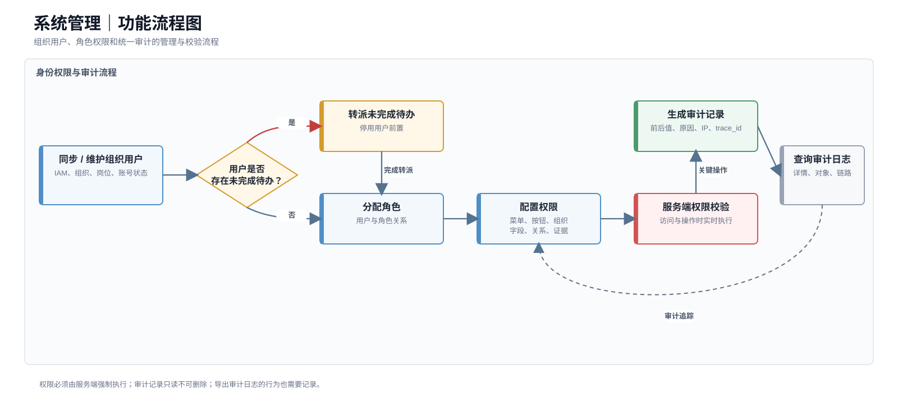

> 图10-9 系统管理功能流程图。

##### 10.3.6.2 功能清单

| 二级菜单 | 页面 | 功能 | 优先级 |
| --- | --- | --- | --- |
| 用户与组织 | 用户与组织页、用户详情抽屉 | 用户、账号、组织、岗位、账号状态和待办转派 | P0 |
| 角色与权限 | 角色与权限页、角色用户抽屉 | 菜单、页面、按钮、组织、字段、关系和证据权限 | P0 |
| 审计日志 | 审计日志页、日志详情抽屉 | 查询高危操作、数据访问和业务处置记录 | P0 |

##### 10.3.6.3 功能详细设计

> **工程对齐：** 用户、角色和审计页面已具备高保真交互，但当前部分状态仍在浏览器侧；试点前必须接入真实认证、服务端RBAC、数据权限裁剪和统一审计存储。

**（一）用户与组织页**

**1. 页面布局**

1. 页面左侧为组织树，右侧为当前组织用户列表。
2. 顶部提供组织搜索、同步组织、新建用户和刷新按钮。
3. 用户列表上方为查询条件，底部为分页。
4. 点击用户姓名打开详情抽屉，编辑、停用和任务转派在抽屉内完成。
5. 组织树选中节点后刷新用户列表，并保留节点展开状态。

**2. 查询条件与列表字段**

查询条件：

| 字段 | 控件 | 默认值 | 规则 |
| --- | --- | --- | --- |
| 关键词 | 输入框 | 空 | 匹配姓名、账号、人员编码和联系方式 |
| 所属组织 | 组织树 | 当前选中节点 | 支持是否包含下级 |
| 岗位 | 搜索多选 | 全部 | 按组织范围过滤 |
| 角色 | 搜索多选 | 全部 | 展示当前有效角色 |
| 账号状态 | 多选下拉 | 启用 | 启用、锁定、停用 |
| 用户来源 | 单选下拉 | 全部 | IAM同步、平台创建 |
| 更新时间 | 日期范围 | 不限 | 查询变更时间 |

列表字段：

| 字段 | 默认显示 | 排序 | 展示规则 |
| --- | --- | --- | --- |
| 姓名/账号 | 是 | 否 | 点击打开详情抽屉 |
| 人员编码 | 是 | 否 | 来源系统唯一标识 |
| 所属组织/岗位 | 是 | 否 | 多岗位展示主岗位和数量 |
| 当前角色 | 是 | 否 | 展示角色名称，超过3个折叠 |
| 账号状态 | 是 | 否 | 启用、锁定、停用 |
| 未完成待办数 | 是 | 是 | 大于0可点击查看待办摘要 |
| 最后登录时间 | 否 | 是 | 从未登录显示“—” |
| 更新时间 | 是 | 是 | 默认倒序 |
| 操作 | 是 | 否 | 查看、编辑、重置状态、停用、转派待办 |

**3. 操作交互**

| 操作 | 前置条件 | 交互形式 | 成功反馈 | 失败处理 | 权限/审计 |
| --- | --- | --- | --- | --- | --- |
| 选择组织 | 有组织权限 | 刷新右侧列表 | 展示当前组织用户 | 加载失败保留树 | 无 |
| 同步组织用户 | 有同步权限 | 异步确认任务 | 展示同步进度和结果 | 失败展示差异清单 | 完整审计 |
| 新建用户 | 允许平台创建 | 抽屉表单 | 新增启用或待激活账号 | 账号重复时阻止 | 记录创建 |
| 编辑用户 | 有编辑权限 | 详情抽屉 | 更新用户信息 | IAM字段只读 | 记录前后值 |
| 分配角色 | 有授权权限 | 角色选择弹窗 | 权限即时生效 | 角色失效时提示 | 完整审计 |
| 停用账号 | 有停用权限 | 高危确认 | 无待办时停用 | 有未完成待办时阻止 | 完整审计 |
| 转派待办 | 未完成待办大于0 | 转派向导 | 待办转给有效用户 | 候选人失效或并发时回滚 | 记录逐项结果 |
| 解锁账号 | 状态为锁定 | 确认操作 | 状态恢复启用 | 安全策略不允许时提示 | 记录操作 |

**4. 页面状态与异常**

| 状态/异常 | 触发条件 | 页面表现 | 可用操作 | 恢复方式 |
| --- | --- | --- | --- | --- |
| 组织树加载失败 | IAM或组织服务异常 | 右侧禁用并显示重试 | 重试 | 服务恢复 |
| 同步差异 | IAM删除或移动用户 | 展示新增、更新、停用差异 | 确认同步 | 完成差异处理 |
| 存在未完成待办 | 尝试停用用户 | 显示待办数量和转派入口 | 转派、取消 | 转派完成后停用 |
| 用户并发修改 | 他人更新同一用户 | 提示版本冲突 | 刷新 | 基于最新信息编辑 |
| 角色已失效 | 用户引用停用角色 | 展示异常角色标签 | 重新分配 | 保存有效角色 |
| 无用户数据 | 当前组织无用户 | 空状态 | 新建或同步 | 获取用户 |
| 权限变化 | 管理权限收回 | 关闭编辑抽屉并隐藏按钮 | 返回 | 管理员授权 |

**（二）角色与权限页**

**1. 页面布局**

1. 页面左侧为角色列表和角色搜索，右侧为角色详情和权限配置。
2. 右侧顶部展示角色名称、编码、状态、用户数量和保存状态。
3. 权限配置使用“菜单按钮、组织数据、字段属性、关系、证据、高危操作”页签。
4. 右侧底部固定展示保存、取消和查看变更按钮。
5. 系统预置角色可复制但不能删除；有用户引用的角色停用前展示影响。

**2. 查询条件与权限字段**

角色查询条件：

| 字段 | 控件 | 默认值 | 规则 |
| --- | --- | --- | --- |
| 关键词 | 输入框 | 空 | 匹配角色名称和编码 |
| 角色类型 | 多选下拉 | 全部 | 预置、自定义 |
| 状态 | 多选下拉 | 启用 | 草稿、启用、停用 |
| 使用组织 | 组织树 | 全部授权组织 | 按管理员范围 |
| 更新时间 | 日期范围 | 不限 | 查询变更时间 |

角色列表字段：

| 字段 | 展示规则 |
| --- | --- |
| 角色名称/编码 | 点击加载右侧详情 |
| 角色类型 | 预置、自定义 |
| 用户数量 | 点击查看用户摘要 |
| 数据范围摘要 | 本组织、授权下级、自定义组织 |
| 状态 | 草稿、启用、停用 |
| 更新时间 | 最近保存时间 |

权限配置字段：

| 权限类型 | 配置内容 | 规则 |
| --- | --- | --- |
| 菜单与页面 | 一级菜单、二级菜单和页面访问 | 无页面权限时菜单不可见 |
| 按钮权限 | 新建、编辑、发布、解除、升级、关闭等 | 高危按钮单独授权 |
| 组织数据 | 当前组织、授权下级、自定义节点 | 不得超出管理员授权范围 |
| 字段属性 | 明文、脱敏、隐藏 | 强敏感默认隐藏 |
| 关系权限 | 可查看的本体关系类型 | 实体可见不代表关系可见 |
| 证据权限 | 摘要、详情、预览、下载 | 下载权限独立控制 |
| 高危操作 | 发布、合并拆分、重大解除、关闭 | 必须明确勾选并二次确认 |

**3. 操作交互**

| 操作 | 前置条件 | 交互形式 | 成功反馈 | 失败处理 | 权限/审计 |
| --- | --- | --- | --- | --- | --- |
| 新建角色 | 有角色管理权限 | 新建弹窗 | 创建草稿角色 | 编码重复时阻止 | 记录创建 |
| 复制角色 | 有查看和新建权限 | 确认弹窗 | 复制权限为新草稿 | 超出授权范围的权限自动移除并提示 | 记录来源角色 |
| 编辑权限 | 角色可编辑 | 权限树/矩阵 | 标记未保存变化 | 越权配置立即阻止 | 暂存本地变化 |
| 保存角色 | 配置合法 | 高危确认 | 权限生效并刷新用户访问 | 并发冲突时不覆盖 | 完整审计 |
| 停用角色 | 无关键预置约束 | 影响确认弹窗 | 角色停用 | 有用户引用时要求替代角色 | 完整审计 |
| 查看变更 | 存在历史版本 | 差异抽屉 | 展示前后权限 | 加载失败可重试 | 无 |
| 查看角色用户 | 用户数量大于0 | 用户抽屉 | 展示引用用户 | 按组织权限裁剪 | 敏感访问审计 |

**4. 页面状态与异常**

| 状态/异常 | 触发条件 | 页面表现 | 可用操作 | 恢复方式 |
| --- | --- | --- | --- | --- |
| 无角色 | 无自定义角色 | 展示预置角色或新建入口 | 新建 | 创建角色 |
| 未保存切换 | 切换角色前存在修改 | 切换确认 | 保存、放弃、取消 | 用户选择 |
| 权限越界 | 配置超过管理员自身权限 | 对应节点不可选并说明原因 | 修改 | 选择允许范围 |
| 并发保存 | 他人修改同一角色 | 显示冲突差异 | 刷新、复制新角色 | 用户选择 |
| 引用用户存在 | 停用角色时仍有用户 | 展示用户数量和替代角色 | 批量替换 | 完成后停用 |
| 权限立即收回 | 当前管理员修改自身角色 | 提示可能退出页面 | 确认 | 重新登录 |
| 权限树加载失败 | 权限服务异常 | 禁止保存 | 重试 | 服务恢复 |

**（三）审计日志页**

**1. 页面布局**

1. 顶部为页面标题、数据保留说明和刷新按钮。
2. 查询区默认展示操作时间、操作人、对象类型、操作类型和结果。
3. 列表区展示审计记录，点击trace_id或“详情”打开只读抽屉。
4. 详情抽屉按基础信息、操作对象、前后值、原因、结果和链路信息分区。
5. 审计记录不可编辑、删除和物理覆盖。

**2. 查询条件与列表字段**

查询条件：

| 字段 | 控件 | 默认值 | 规则 |
| --- | --- | --- | --- |
| 操作时间 | 日期时间范围 | 最近7天 | 最大查询跨度按项目配置 |
| 操作人 | 搜索多选 | 全部 | 按组织权限裁剪 |
| 操作类型 | 多选下拉 | 全部 | 创建、修改、发布、查看、下载、处置、权限调整等 |
| 对象类型 | 多选下拉 | 全部 | 本体、规则、图谱、预警、任务、风险事件、用户、角色、证据 |
| 对象编号 | 输入框 | 空 | 精确或前缀匹配 |
| 操作结果 | 多选下拉 | 全部 | 成功、失败、部分成功 |
| 风险级别 | 多选下拉 | 全部 | 普通、高危、敏感访问 |
| trace_id | 输入框 | 空 | 精确匹配 |

列表字段：

| 字段 | 默认显示 | 排序 | 展示规则 |
| --- | --- | --- | --- |
| 操作时间 | 是 | 是 | 默认倒序 |
| 操作人/组织 | 是 | 否 | 按权限展示 |
| 操作类型 | 是 | 否 | 使用业务操作名称 |
| 对象类型/编号 | 是 | 否 | 点击可查看允许的对象摘要 |
| 操作摘要 | 是 | 否 | 敏感内容脱敏 |
| 操作结果 | 是 | 否 | 成功、失败、部分成功 |
| 风险级别 | 是 | 否 | 高危和敏感访问醒目标识 |
| IP | 否 | 否 | 按安全权限展示 |
| trace_id | 是 | 否 | 点击打开链路详情 |
| 操作 | 是 | 否 | 查看详情、复制trace_id |

**3. 操作交互**

| 操作 | 前置条件 | 交互形式 | 成功反馈 | 失败处理 | 权限/审计 |
| --- | --- | --- | --- | --- | --- |
| 查询/重置 | 条件合法 | 刷新列表 | 更新结果数量 | 范围过大时提示缩小 | 查询本身记录管理员访问 |
| 查看详情 | 有日志详情权限 | 只读抽屉 | 展示前后值和链路 | 敏感字段裁剪 | 记录审计日志查看 |
| 查看对象摘要 | 有来源对象权限 | 抽屉或跳转 | 展示允许内容 | 对象失效时显示元数据 | 记录敏感访问 |
| 复制trace_id | trace_id存在 | 复制到剪贴板 | Toast提示成功 | 浏览器禁止时提示手工复制 | 无 |
| 刷新 | 无 | 保留条件重新查询 | 更新时间更新 | 保留原列表 | 无独立审计 |

**4. 页面状态与异常**

| 状态/异常 | 触发条件 | 页面表现 | 可用操作 | 恢复方式 |
| --- | --- | --- | --- | --- |
| 无日志 | 当前条件无记录 | 展示空状态 | 修改条件 | 重新查询 |
| 查询范围过大 | 时间跨度或结果超限 | 阻止查询并提示最大范围 | 缩小范围 | 重新查询 |
| 敏感字段受限 | 无字段权限 | 前后值显示脱敏或隐藏 | 查看允许摘要 | 管理员授权 |
| 来源对象已删除 | 对象不存在 | 保留审计元数据 | 查看日志 | 无需恢复 |
| 日志服务延迟 | 写入或索引延迟 | 展示最后索引时间 | 刷新 | 索引完成 |
| 查询超时 | 大范围复杂查询 | 保留原结果 | 修改条件、重试 | 缩小范围 |
| 权限变化 | 审计权限被收回 | 关闭详情并清除数据 | 返回 | 管理员授权 |

**固定业务消息规则**

首批不提供独立消息中心和通知配置页面。预警生成、任务转派、退回补充、风险事件转派、整改提交、复核结果、临期和逾期等消息由对应业务模块按固定规则生成，并统一进入监管工作台消息接收框。

**模块业务规则与验收**

1. 停用用户前必须完成未办任务转派。
2. 权限调整立即影响菜单、按钮、字段、关系和证据访问。
3. 审计日志记录操作人、时间、对象、前后值、原因、结果、IP和trace_id，只读不可修改。
4. 用户与组织、角色权限和审计日志均覆盖无数据、服务失败、权限变化和并发修改状态。
5. 系统管理菜单中不出现消息中心、通知配置和规则效果入口。

##### 10.3.6.4 应用操作

以下应用操作按当前工程活动路由、可见页面、真实字段、按钮、状态机和接口边界编写；同一页面内的连续操作合并为一条页面级评审记录。

| 功能名称 | 位置/用户路径 | 原型 | 产品逻辑（页面结构/交互/策略设计） | 对应文案 | 优先级 | 评审意见 | 备注 |
| --- | --- | --- | --- | --- | --- | --- | --- |
| 用户与组织 | 一级菜单“系统管理” → 二级菜单“用户与组织” | [图片] | <strong>页面结构：</strong> 页面头部展示“同步组织用户、新建用户”；主体左侧为组织树，右侧为用户列表。 图1 用户列表筛选项包含关键词和账号状态；列包括姓名/账号、所属组织/岗位、当前角色、状态、未完成待办、最后登录和操作。 图2 用户详情使用抽屉维护账号状态和角色分配；批量转派、新建用户和删除未登录用户使用弹窗。 图3  <strong>交互逻辑：</strong> 1. 用户进入页面，系统默认加载组织树和当前组织下的用户；点击组织节点后右侧列表切换，并按用户数量更新组织节点统计。 2. 用户可按姓名、账号、人员编码和账号状态查询；点击姓名或“查看”打开用户详情抽屉。 图2 3. 管理员在详情抽屉调整启用、锁定、停用状态及角色分配，点击“保存”后即时更新当前用户权限。 4. 用户存在未完成待办且拟停用时，页面展示阻断提示；管理员点击未完成待办数量或“转派”，选择接收人并填写原因后批量转派。 图3 5. 待办全部转派后，管理员再次保存“停用”状态；停用用户不再作为新任务处理人。 6. 管理员点击“新建用户”，填写姓名、登录账号、所属组织、岗位、初始角色和账号状态后确认创建。 图4 7. 仅“从未登录”且未完成待办为0的用户显示“删除”；确认后删除本地新增账号，已有活动记录的账号只能停用。 图5 8. 管理员点击“同步组织用户”创建组织用户同步任务并显示成功提示。  <strong>策略设计：</strong> 用户状态和角色共同决定菜单、数据范围和高危操作按钮。 停用前必须完成未办任务转派，避免形成无处理人的业务任务。  <strong>异常处理：</strong> 账号重复、姓名或组织为空时不创建。 存在未完成待办时阻止停用；接收人或转派原因为空时不执行批量转派。 已登录或存在待办的用户不可删除。 | 页面标题：用户与组织； 操作：同步组织用户 / 新建用户 / 查看 / 保存 / 转派 / 删除； 阻断提示：该用户存在{数量}项未完成待办，停用前必须完成转派； 删除提示：仅从未登录且没有未完成待办的新增用户可以删除。 | P0 | 待评审 | 当前UsersPage使用Zustand本地状态模拟用户、角色和待办联动；试点前需接入统一身份、组织同步和服务端授权。 |
| 角色与权限 | 一级菜单“系统管理” → 二级菜单“角色与权限” | [图片] | <strong>页面结构：</strong> 页面左侧为角色列表，展示角色名称、编码、类型、使用人数和状态；右侧为当前角色权限编辑区。 图1 权限页签包含菜单与按钮、组织数据、字段属性、关系权限、证据权限、高危操作。 图2 页面提供新建角色、查看变更、保存权限；无人使用的自定义角色额外提供删除。新建、保存和删除使用确认弹窗。 图3  <strong>交互逻辑：</strong> 1. 管理员进入页面，系统默认选中一个角色并加载其权限；点击左侧其他角色切换当前编辑对象。 2. 管理员在“菜单与按钮”勾选功能权限，在“组织数据”选择当前组织、授权下级或自定义节点，在“字段属性”设置明文/脱敏/隐藏。 图2 3. 管理员在“关系权限、证据权限、高危操作”页签配置对应访问和执行权限；页面暂存当前调整项。 4. 管理员点击“查看变更”，系统提示当前调整权限数量与原配置数量，便于保存前核对。 5. 管理员点击“保存权限”，打开高危确认弹窗，说明将影响的用户数量；确认后更新角色权限并重新计算菜单、按钮、字段、关系和证据权限。 图3 6. 管理员点击“新建角色”，填写角色名称、角色编码和数据范围，创建后自动选中新角色继续配置。 图4 7. 仅类型为“自定义”且使用人数为0的角色可点击“删除角色”；预置角色或已分配用户的角色不显示删除入口。 图5  <strong>策略设计：</strong> 权限调整即时影响当前角色用户，在线用户可能需要刷新页面。 字段权限以明文、脱敏、隐藏三选一表达；高危操作必须独立授权并记录审计。  <strong>异常处理：</strong> 角色名称或编码为空、编码重复时不创建。 预置角色、已分配用户角色不可删除；保存失败时保留当前勾选内容。 权限冲突或越权配置由服务端校验，失败时不覆盖原角色权限。 | 页面标题：角色与权限； 页签：菜单与按钮 / 组织数据 / 字段属性 / 关系权限 / 证据权限 / 高危操作； 操作：新建角色 / 查看变更 / 保存权限 / 删除角色； 提示：权限调整将立即影响{数量}名用户。 | P0 | 待评审 | 当前RolesPage为前端权限模型演示，菜单显隐已联动当前角色；试点前需实现服务端RBAC、会话刷新和高危授权审计。 |
| 审计日志 | 一级菜单“系统管理” → 二级菜单“审计日志” | [图片] | <strong>页面结构：</strong> 页面头部展示动态记录数量和“刷新”；筛选区包含关键词、操作结果和风险级别。 图1 审计列表展示操作时间、操作人/组织、操作类型、对象类型/编号、操作摘要、结果、风险级别、trace_id和操作。 图2 点击trace_id或“详情”打开审计日志详情抽屉，展示IP地址、操作原因和“网关接入、权限校验、业务服务、审计落库”链路，并提供复制trace_id。 图3  <strong>交互逻辑：</strong> 1. 用户进入审计日志页面，系统默认按操作时间倒序展示当前可访问的审计记录。 2. 用户可按关键词匹配操作人、组织、动作、对象编号、摘要或trace_id，并按操作结果、风险级别筛选；点击查询或重置更新列表。 图1 3. 用户点击trace_id或“详情”，打开只读详情抽屉，查看操作时间、操作人、对象、结果、风险级别、IP地址、操作原因和调用链路。 图3 4. 用户点击“复制 trace_id”，系统调用浏览器剪贴板并提示复制成功。 5. 用户点击“刷新”，系统刷新审计索引提示和当前列表，不提供新增、编辑或删除操作。  <strong>策略设计：</strong> 审计记录只读、不可删除和物理覆盖；高危操作、敏感访问和业务处置应写入trace_id。 审计列表按当前用户审计权限裁剪，详情不得扩大字段和对象访问范围。  <strong>异常处理：</strong> 浏览器不允许访问剪贴板时提示用户复制失败，不影响详情查看。 目标业务对象已删除时仍保留审计元数据和操作摘要。 当前工程审计记录来自Zustand本地状态，刷新仅提示索引已刷新；生产环境需使用不可篡改服务端审计存储。 | 页面标题：审计日志； 操作：查询 / 重置 / 详情 / 复制 trace_id / 刷新； 成功提示：trace_id 已复制 / 审计索引已刷新； 只读说明：记录只读、不可删除和物理覆盖。 | P0 | 待评审 | 与当前AuditPage一致；页面只读交互已实现，服务端不可篡改审计、检索索引和长期留存仍为试点前能力。 |

### 10.4 平台监管本体框架

平台采用“监管基础本体 + 领域扩展本体”。基础本体定义跨领域共享对象，领域扩展本体按采购、合同、财务、投资和产权等场景增加专业语义。

#### 10.4.1 监管基础本体类

| 本体类 | 主识别属性 | 说明 |
| --- | --- | --- |
| 组织 | 组织编码/统一社会信用代码 | 集团、企业和部门 |
| 人员 | 员工编码/证件哈希 | 经办、审批和责任人员 |
| 主体 | 统一社会信用代码/主体编码 | 供应商、客户和相对方 |
| 业务事项 | 事项编号/项目编号 | 采购、投资、产权等事项 |
| 合同/单据 | 合同编号/单据编号 | 合同、申请、发票和凭证 |
| 资金/账户 | 流水号/账户哈希 | 支付、收款、融资和担保 |
| 文档/证据 | 文件ID/内容哈希 | 制度、合同和证明材料 |
| 预警/风险事件 | 业务编号 | 风险研判和整改对象 |

#### 10.4.2 基础关系类型

组织关系、人员关系、主体控制关系、业务参与关系、资金支付关系、资产持有关系、证据来源关系和风险升级/整改关系。

#### 10.4.3 基础事件类型

对象创建和状态变化、提交审批、合同签订变更、履约验收、支付收款、融资担保、投资产权变化、人员组织变化和外部主体状态变化。

### 10.5 演示验证场景候选

| 候选场景 | 目标事件 | 验证能力 |
| --- | --- | --- |
| 供应商异常关联 | 入围或中标确认 | 主体关系、路径规则和证据子图 |
| 合同签订风险 | 合同签订 | 审批、主体风险和事前预警 |
| 付款执行风险 | 付款执行 | 合同、验收、账户和金额比对 |
| 担保链风险 | 担保生效或债务到期 | 关系传导、时序和聚合 |
| 投资决策合规 | 投资立项或审批 | 授权、决策记录和跨域证据 |

### 10.6 异常处理

| 异常 | 处理 |
| --- | --- |
| 网络中断 | 保留表单，允许重试，以服务端回执为准 |
| 并发处理 | 乐观锁拦截，展示最新状态和操作人 |
| 重复请求 | 幂等键和唯一约束，返回已有结果 |
| 来源结构变化 | 暂停受影响映射并生成差异任务 |
| 图谱不可用 | 关系规则失败不产生无依据预警 |
| 快照失败 | 标记异常并补偿，不用当前图谱替代 |
| 附件失效 | 保留元数据和哈希，允许补充材料 |
| 权限收回 | 清除敏感内容并终止写操作 |
| AI不可用 | 降级为静态帮助，不影响核心业务 |

### 10.7 非功能要求

| 类别 | 目标 |
| --- | --- |
| 普通列表 | 默认范围P95不超过2秒 |
| 监管态势首屏 | P95不超过5秒 |
| 预警详情非图谱 | P95不超过3秒 |
| 证据子图 | 30节点/50关系P95不超过5秒 |
| 异步预警 | 事件到达后P95不超过60秒 |
| 可用性 | 试点核心服务不低于99.5% |
| 并发 | [TODO: 建议至少100并发在线用户] |
| 安全 | HTTPS、凭据加密、脱敏和服务端授权 |
| 审计 | 高危操作和敏感访问100%记录 |
| 备份恢复 | RPO不超过24小时，RTO不超过4小时 |

---

## 11、数据埋点

### 11.1 埋点目标

监控核心页面采纳率、风险闭环效率、证据图使用情况、版本发布质量和智能体辅助效果。埋点工具沿用客户或公司统一方案。

### 11.2 核心页面与行为埋点

| 页面/操作 | 事件 | 参数 |
| --- | --- | --- |
| 工作台曝光/消息点击 | workbench_view/message_click | role、todo_count、message_type |
| 态势曝光/下钻 | situation_view/drill | scope、time_range、widget、target |
| 预警详情/证据图 | warning_view/evidence_graph_view | stage、level、scene、load_time |
| 解除/升级 | warning_release/escalate | level、scene、reason_type |
| 整改/复核 | rectification_submit/risk_review | result、duration、material_count |
| 发布版本 | version_publish | version_type、result、duration |
| 智能体使用 | agent_question | page、question_type、resolved |

### 11.3 业务指标

预警有效率、误报率、平均提前量、平均研判耗时、平均整改耗时、闭环完成率、逾期率、证据图使用率、态势下钻率和消息跳转成功率。

---

## 12、角色和权限

### 12.1 角色定义

| 角色 | 职责 | 数据范围 |
| --- | --- | --- |
| 集团领导 | 查看态势和重大事项 | 授权汇总范围 |
| 监管负责人 | 转派、重大解除、升级和复核 | 授权组织和领域 |
| 审计纪检 | 查看证据并参与复核 | 授权审计范围 |
| 领域监管专员 | 处理本领域预警和整改跟踪 | 授权领域/场景 |
| 业务责任人 | 提交整改结果和材料 | 本人任务必要数据 |
| 本体/规则/数据管理员 | 管理对应配置资产 | 授权资产范围 |
| 安全/系统管理员 | 用户、权限和审计 | 管理范围，不默认看业务明文 |

### 12.2 功能权限矩阵

| 操作 | 领导 | 监管负责人 | 审计纪检 | 监管专员 | 业务责任人 | 配置管理员 |
| --- | --- | --- | --- | --- | --- | --- |
| 查看态势 | 是 | 是 | 是 | 按授权 | 否 | 否 |
| 查看预警证据 | 下钻只读 | 是 | 是 | 是 | 任务必要 | 依赖只读 |
| 转派预警/事件 | 否 | 是 | 按授权 | 按授权 | 否 | 否 |
| 解除重大/高预警 | 否 | 是 | 否 | 否 | 否 | 否 |
| 升级风险事件 | 否 | 是 | 按授权 | 按授权 | 否 | 否 |
| 提交整改 | 否 | 否 | 否 | 否 | 是 | 否 |
| 复核关闭 | 否 | 是 | 按授权 | 按授权 | 否 | 否 |
| 发布配置版本 | 否 | 审批/查看 | 查看 | 查看 | 否 | 对应管理员 |

### 12.3 数据权限

组织权限按组织树控制；字段支持明文、脱敏、隐藏；关系权限独立于实体；证据权限区分摘要、详情、预览和下载。权限裁剪必须在服务端完成。

---

## 13、运营计划

### 13.1 上线计划

| 阶段 | 范围 | 目标 | 回滚 |
| --- | --- | --- | --- |
| 工程内测 | 产品研发测试 | 跑通当前工程和接口 | 恢复演示数据 |
| 业务验证 | 业务专家+脱敏数据 | 验证规则、证据和状态 | 停用场景版本 |
| 种子客户试点 | 1个单位、1至3个场景 | 验证真实数据、权限、闭环和性能 | 回退上一规则/图谱版本 |
| 扩大验证 | 更多组织和场景 | 验证复用、运营和容量 | 按组织停用场景 |

### 13.2 基础运营闭环

| 动作 | 频率 | 负责人 | 产出 |
| --- | --- | --- | --- |
| 未处理和逾期跟踪 | 每日 | 监管负责人 | 催办和转派 |
| 预警效果复盘 | 每周 | 监管负责人、规则管理员 | 有效、误报和提前量样本 |
| 数据质量复盘 | 每周 | 数据管理员 | 来源、映射和治理问题 |
| 本体规则变更评审 | 双周/按需 | 业务专家和配置管理员 | 版本变更说明 |
| 权限和审计抽查 | 每月 | 安全管理员 | 越权和高危操作报告 |

### 13.3 规则优化流程

解除、升级和关闭结果形成规则效果样本。规则管理员基于复盘结论复制规则或场景新版本，完成编辑、校验、试跑和发布，不直接修改生产版本。

### 13.4 培训与支持

培训分别面向监管人员、业务责任人、配置管理员和安全管理员。问题统一进入项目支持入口；P0闭环阻断问题建议4小时内响应，最终SLA由合同确认。

---

## 14、待决事项

| 编号 | 待决事项 | 负责人 | 时限 |
| --- | --- | --- | --- |
| TBD-1 | 确认试点单位、组织、角色和用户范围 | [TODO] | 研发评审前 |
| TBD-2 | 选择1至3个试点场景及目标事件 | [TODO] | 数据联调前 |
| TBD-3 | 确认本体、主标识、敏感等级和映射范围 | [TODO] | 本体开发前 |
| TBD-4 | 确认规则、阈值、例外、制度和证据 | [TODO] | 试跑前 |
| TBD-5 | 确认真实来源接入方式、频率和责任人 | [TODO] | 联调前 |
| TBD-6 | 确认服务端认证、RBAC和组织权限方案 | [TODO] | 试点开发前 |
| TBD-7 | 确认证据快照和附件存储方案 | [TODO] | 试点开发前 |
| TBD-8 | 确认并发、可用性、RPO/RTO和数据保留期 | [TODO] | 上线前 |
| TBD-9 | 确认商业目标、价格和试运行指标目标值 | [TODO] | 试点启动前 |

---

## 附录A、首批闭环验收用例

| 编号 | 验收链路 | 通过标准 |
| --- | --- | --- |
| AC-01 | 工程构建与路由 | 构建通过，六大模块和详情编辑路由可访问 |
| AC-02 | 本体发布 | 草稿、校验、发布和复制版本正确 |
| AC-03 | 数据与图谱 | 来源、映射、质量、治理和发布可追溯 |
| AC-04 | 场景规则 | 规则资产可复用绑定，场景可校验试跑发布 |
| AC-05 | 预警详情 | 规则、证据图、来源和版本联动正确 |
| AC-06 | 预警解除/升级 | 权限、原因、证据、唯一事件和样本正确 |
| AC-07 | 整改复核 | 提交、退回、关闭、责任人和材料规则正确 |
| AC-08 | 权限安全 | 未授权字段、关系和证据不出现在响应中 |
| AC-09 | 并发幂等 | 重复请求不产生重复事件或记录 |
| AC-10 | 快照一致性 | 历史预警不被当前图谱覆盖 |
| AC-11 | 异常降级 | 来源、图谱、附件或AI异常不产生无依据结论 |
| AC-12 | 试点准入 | 第4.2节试点条件满足后方可真实数据试运行 |

## 附录B、自检与待完善清单

### 重大风险项快扫

| 风险项 | 状态 | 说明 |
| --- | --- | --- |
| 产品定位 | 已覆盖 | 客户、问题和价值明确 |
| 核心流程 | 已覆盖 | 配置、预警、整改、复核和样本闭环完整 |
| ER模型 | 已覆盖 | 目标模型与已落库模型已区分 |
| 角色权限 | 已设计待实现 | 服务端RBAC尚未完成 |
| 功能断裂 | 演示可闭环 | 真实试点需服务端持久化 |
| 业务适配 | 待验证 | 需确认真实事件、规则和证据 |
| 合规风险 | 待确认 | 安全等级、法规和保留期未定 |
| 多租户 | 不适用 | 本期私有化/混合部署 |

### 必须补充

1. 风险闭环、待办、消息和统一审计的服务端模型及接口。
2. 服务端RBAC、字段/关系/证据权限和真实认证方案。
3. 证据快照、附件存储、内容哈希和不可覆盖机制。
4. 真实数据源适配器、事件时效、规则阈值和制度依据。
5. 商业目标、试运行指标、安全等级和数据保留周期。

### 后续版本建议

1. P1：版本差异与引用影响、效果样本查询、数据质量复盘和消息SLA。
2. P1：证据导出、同步预检查和多渠道通知。
3. P2：AI辅助填充、当前图谱对比和高级图谱算法，仅在试点验证后立项。

